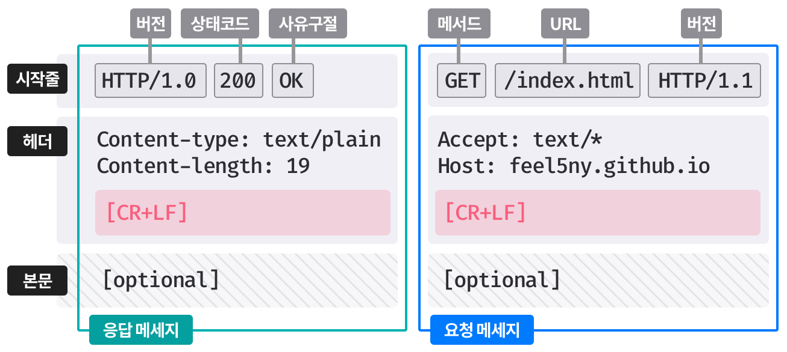
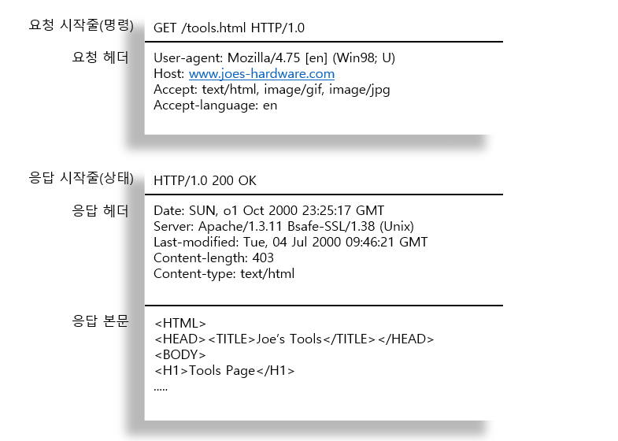
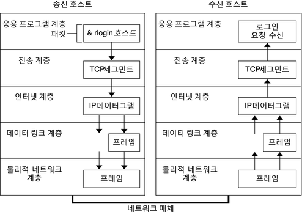

# 1장 HTTP 개관

## 1.1 HTTP: 인터넷의 멀티 미디어 배달부

- HTTP는 웹 서버로 부터 JPEG, HTML, MPEG, WAV, Java 애플릿 등의 정보를 대량으로 빠르고, 간편하고, 정확하게 사람들의 PC에 설치된 웹 브라우저로 옮겨준다.
- HTTP는 전송 중 손상되거나 꼬이지 않음을 보장하여 신뢰성 있는 데이터 전송 프로토콜을 사용한다.
- 덕분에, 사용자는 인터넷에서 얻은 정보가 손상된 게 아닌지 염려하지 않아도 되고, 개발자는 HTTP 통신이 전송 중 파괴되거나, 중복되거나, 왜곡되는 것을 걱정하지 않아도 된다.

## 1.2 웹 클라이언트와 서버

- 웹 서버(HTTP 서버)는 인터넷의 데이터를 저장하고 HTTP 클라이언트가 요청한 데이터를 제공한다.
- 웹 클라이언트(HTTP 클라이언트)는 서버에게 HTTP 요청을 보내고 서버는 요청된 데이터를 HTTP 응답으로 돌려준다.

## 1.3 리소스

- 웹 서버가 관리하고 제공하는 웹 리소스는 정적 리소스일 수도 있고, 요청에 따라 콘텐츠를 생산하는 동적 리소스일 수도 있다.
- 정적 리소스는 텍스트 파일, HTML 파일, 이미지 파일, 동영상 파일 등 모든 종류의 파일을 의미한다.
- 동적 리소스는 데이터 베이스 검색이나 전자상거래 처리와 같이 요청에 따라 콘텐츠를 생산하는 프로그램을 의미한다.

### 1.3.1 미디어 타입

- 인터넷 상에서 다양한 데이터를 용도에 따라 관리하기 위해 HTTP는 웹에서 전송되는 객체 각각에 MIME 타입이라는 데이터 포맷 라벨을 붙인다.
  - MIME(Multipurpose Internet Mail Extensions)은 원래 이메일을 위한 인터넷 표준으로 인터넷상에서 파일의 형식과 내용이 무엇인지를 나타내는 식별자이다.
  - MIME 타입은 주 타입과 부 타입으로 구성된다. 예를 들어, JPEG 이미지는 MIME 타입은 image/jpeg이다.

### 1.3.2 URI

- HTTP는 웹 서버 리소스를 고유하게 식별하고 위치를 지정하는 URI(Uniform Resource Identifier)를 통해 객체를 찾아온다.
- URI에는 URL과 URN이 있다.

### 1.3.3 URL

- URL(Uniform Resource Locator)은 특정 서버의 특정 리소스에 대한 구체적인 위치를 서술한다.
- URL(`http://www.joes-hardware.com/specials/saw-blade.gif`)은 세 부분으로 이루어진 표준 포맷을 따른다.
    - `http://`: 스킴(scheme)이라고 하며, 프로토콜을 서술한다.
    - `www.joes-hardware.com`: 서버의 인터넷 주소를 제공한다.
    - `/specials/saw-blade.gif`: 웹 서버의 리소스를 가리킨다.

### 1.3.4 URN

- URN(Uniform Resource Name)은 리소스의 위치에 영향 받지 않는 유일무이한 이름 역할을 한다.
  - 리소스를 옮겨도, 그 이름을 유지하는 한 여러 종류의 네트워크 접속 프로토콜로 접근할 수 있다.
  - `urn:ietf:rfc:2141`
- URN의 리소스 위치를 분석하기 위한 인프라 자원의 부재로 아직까진 널리 채택되지 않았다.

## 1.4 트랜잭션

- HTTP 트랜잭션은 요청 명령(클라이언트에서 서버)과 응답 결과(서버에서 클라이언트)로 구성되어 있다.

### 1.4.1 메서드

- HTTP는 HTTP 메서드라고 불리는 요청 명령을 지원한다.
- HTTP 요청 메시지는 한 개의 메서드를 갖는다. 이를 통해 서버에게 어떤 동작을 취해야 하는지 알려준다.
  - GET: 서버에서 클라이언트로 지정한 리소스를 보내라.
  - PUT: 클라이언트에서 서버로 보낸 데이터를 지정한 이름의 리소스로 저장하라.
  - DELETE: 지정한 리소스를 서버에서 삭제하라.
  - POST: 클라이언트 데이터를 서버 게이트웨이 어플리케이션으로 보낸다.
  - HEAD: 지정한 리소스에 대한 응답에서, HTTP 헤더 부분만 보내라.

### 1.4.2 상태 코드

- HTTP 응답 메시지는 상태 코드를 포함한다.
- 상태 코드는 클라이언트에게 요청이 성공했는지 아니면 추가 조치가 필요한지 알려주는 세 자리 숫자다.
  - 200: 좋다. 문서가 바르게 반환되었다.
  - 302: 다시 보내라. 다른 곳에 가서 리소스를 가져가라.
  - 404: 없음. 리소스를 찾을 수 없다.
- 텍스트로 된 사유 구절(reason phrase)도 포함되어 있다. 
  - 200 OK, 200 Document attached, 200 Success, ... 
  - 이 구문은 설명만을 위한 것으로 실제 응답 처리에는 숫자로 된 코드가 사용된다.

### 1.4.3 웹페이지는 여러 객체로 이루어질 수 있다.

- 애플리케이션은 보통 하나의 작업을 수행하기 위해 여러 HTTP 트랜잭션을 수행한다.
- 한 개의 웹 페이지는 보통 하나의 리소스가 아닌 리소스의 모음이다.
  - 예를 들어, HTML을 가져온 뒤 이미지나 비디오 파일 등을 가져오기 위해 추가로 HTTP 트랜잭션들을 수행한다.

## 1.5 메시지

- HTTP 메시지는 이진 형식이 아닌 일반 텍스트로 이루어진 줄 단위의 문자열이다.
  
  - 시작줄: 요청이라면 무엇을 해야 하는지, 응답이라면 무슨 일이 일어났는지 나타낸다.
  - 헤더: key-value 구조로 메시지에 대한 추가 정보를 담는다.
  - 빈 줄: 헤더와 메시지 본문을 구분한다.
  - 본문: 필요에 따라 포함할 수 있으며, 텍스트 뿐만아니라 임의의 이진 데이터를 포함할 수 있어 어떤 종류의 데이터(이미지, 비디오)든 보낼 수 있다.
- 웹 클라이언트에서 웹 서버로 보낸 HTTP 메시지를 요청 메시지라고 한다.
- 웹 서버에서 웹 클라이언트로 가는 메시지는 응답 메시지라고 부른다.
- 그 외에 다른 종류의 HTTP 메시지는 없다.

### 1.5.1 간단한 메시지의 예

## 1.6 TCP 커넥션

- HTTP 메시지는 TCP(Transmission Control Protocol) 커넥션을 통해 전송된다.

### 1.6.1 TCP/IP

- 애플리케이션 계층 프로토콜인 HTTP는 네트워크 통신의 세부사항과 신뢰성 있는 통신은 TCP/IP에게 맡긴다.
  - TCP는 오류 없는 데이터 전송과 순서에 맞는 전달 그리고 조각나지 않는 데이터 스트림을 제공한다.
  

### 1.6.2 접속, IP 주소 그리고 포트번호

- HTTP 통신 전에, IP 주소와 포트번호를 사용해 클라이언트와 서버 사이에 TCP/IP 커넥션을 설정해야 한다.
  - IP는 서버 컴퓨터에 대한 주소, 포트는 실행 중인 프로그램을 나타낸다.
  - URL(https://127.0.0.1:8080/index.html)을 통해 HTTP 서버의 IP 주소와 포트번호를 알 수 있다.
- 웹 클라이언트 연결의 기본적인 절차.
  - 웹 클라이언트는 URL에서 서버의 호스트 명(DNS)을 추출한다.
  - 웹 클라이언트는 서버의 호스트 명(DNS)을 IP로 변환한다.
  - 웹 클라이언트는 URL에서 포트번호(있다면)를 추출한다.
  - 웹 클라이언트는 웹 서버와 TCP 커넥션을 맺는다.
  - 웹 클라이언트는 웹 서버에 HTTP 요청을 보낸다.
  - 웹 서버는 웹 클라이언트에 HTTP 응답을 돌려준다.
  - 커넥션이 닫히면, 웹 브라우저는 문서를 보여준다.

### 1.6.3 텔넷(Telnet)을 이용한 실제 예제

- HTTP는 TCP/IP를 사용하고 있으며, 이진 형식이 아닌 문자열 기반이기 떄문에, 웹 서버와 직접 대화하는 것도 간단하다.
- 텔넷 유틸리티는 클라이언트의 입출력 장치를 목적지의 TCP 포트로 연결해주어 원격 터미널 세션을 가능하게 해준다.

## 1.7 프로토콜 버전

- HTTP/0.9: 1991년의 HTTP 프로토타입으로 GET 메서드만 지원하고, MIME나 헤더를 지원하지 않는다.
- HTTP/1.0: 처음 대중화된 HTTP 버전으로, HTTP 헤더와 메서드 그리고 MIME을 지원한다.
- HTTP/1.0+: 1990년대 중반, 웹이 급격히 팽창하면서 오래 지속되는 keep-alive 커넥션, 가상 호스팅, 프록시 연결 등을 비공식적으로 지원
- HTTP/1.1: 이전 HTTP 버전의 구조적 결함 교정, 성능 최적화, 잘못된 기능 제거에 집중했다. 현재의 표준 버전이다.
- HTTP/2.0: HTTP/1.1의 성능 문제를 개선하기 위해 구글이 개발한 버전이다.

## 1.8 웹의 구성요소

### 1.8.1 프록시

- 웹 보안, 애플리케이션 통합, 성능 최적화를 위한 구성 요소이다.
- 프록시는 클라이언트와 서버 사이에 위치하여 웹 트래픽 흐름을 중개하고, 요청이나 응답을 필터링한다.

### 1.8.2 캐시

- 캐시는 자주 요청되는 리소스를 저장해 두는 HTTP 프록시 서버다.

### 1.8.3 게이트웨이

- 게이트 웨이는 HTTP 트래픽을 다른 프로토콜로 변환하기 위해 사용된다.

### 1.8.4 터널

- 터널은 두 커넥션 사이에서 raw 데이터를 열어보지 않고 그대로 전달해주는 HTTP 애플리케이션이다.
  - 암호화된 SSL 트래픽을 HTTP 커넥션으로 전송함으로써 웹 트래픽만 허용하는 사내 방화벽을 통과할 수 있게 해준다.

### 1.8.5 에이전트

- 에이전트는 사용자를 대신해 HTTP 요청을 보내는 클라이언트 프로그램이다.