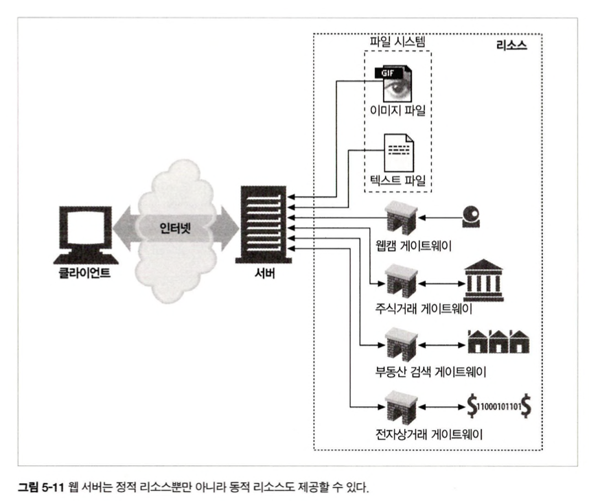
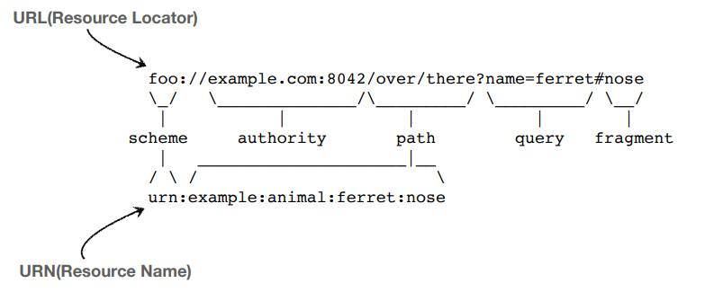
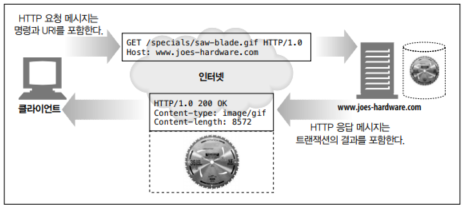
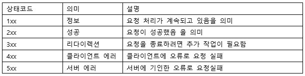
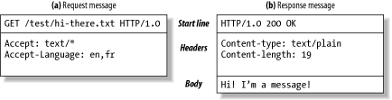
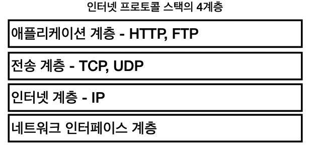
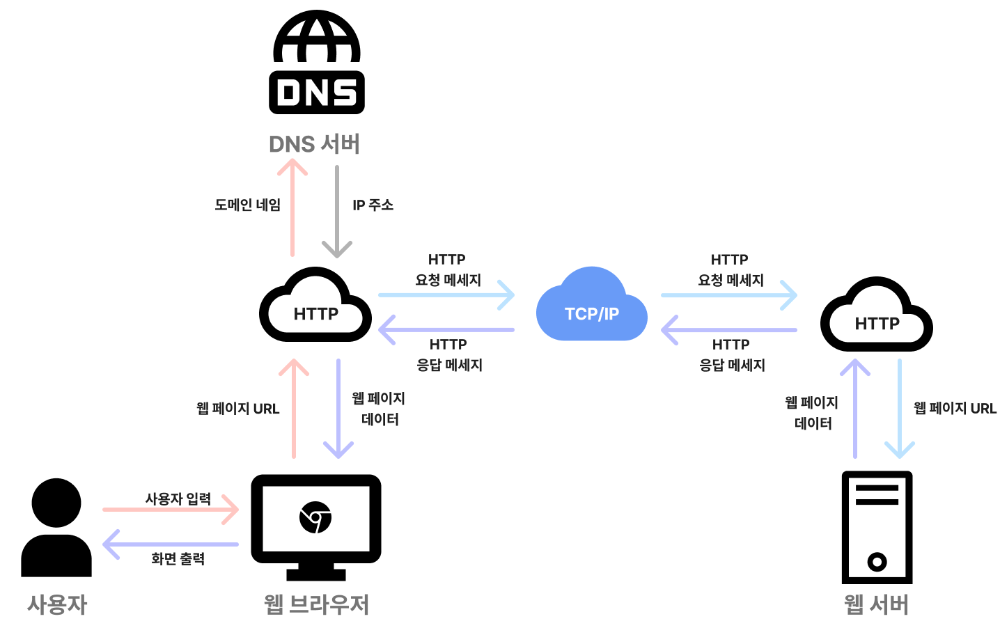
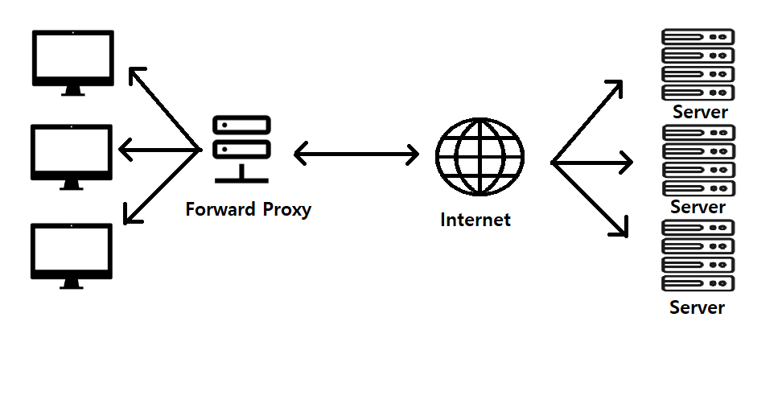
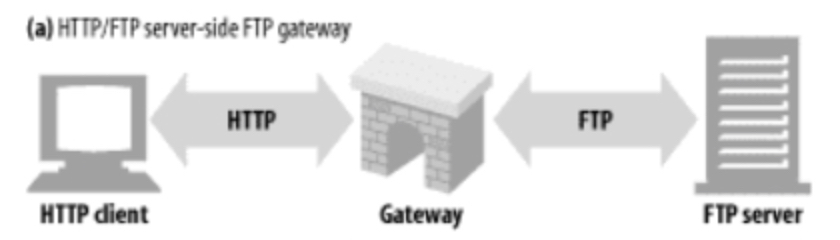
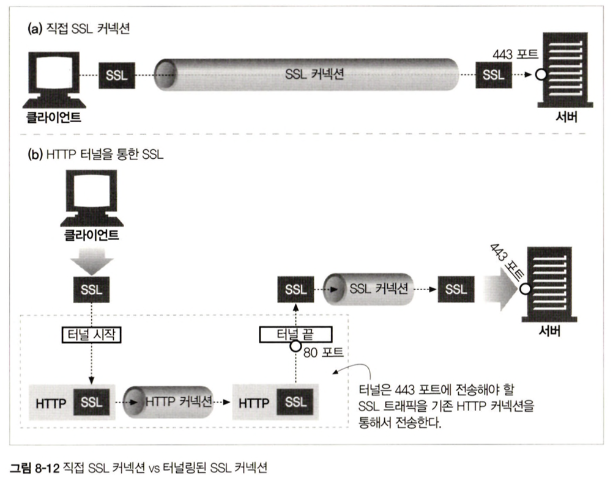

# 1.1 HTTP: 인터넷의 멀티미디어 배달부
HTTP는 전 세계의 웹 서버로부터 대량의 정보를 빠르고, 간편하고, 정확하게 사람들의 PC에 설치된 웹브라우저에 옮긴다.

HTTP 특징
- **신뢰성 있는 데이터 전송 프로토콜 사용**
    - 사용자 : 인터넷에서 얻은 정보가 손상되었는지 여부를 염려하지 않아도 됨
    - 개발자 : HTTP 통신이 전송 중 파괴되거나, 중복되거나, 왜곡되는 것을 걱정하지 않아도 됨

# 1.2 웹 클라이언트와 서버
웹 서버 (HTTP 서버)
- HTTP 프로토콜로 의사소통
- 인터넷의 데이터를 저장하고, HTTP 클라이언트가 요청한 데이터를 제공

클라이언트는 서버에게 HTTP 요청을 보ㅗ내고 서버는 요청된 데이터를 HTTP 응답으로 돌려줌

월드 와이드 웹의 기본 요소 : HTTP 클라이언트, HTTP 서버

"http://www.oreilly.com/index.html" 페이지를 열어 보는 경우
1. 웹브라우저는 HTTP 요청을 www.oreilly.com 서버로 보냄
2. 서버는 요청을 받은 객체("/index.html")을 찾음
3. 성공 시 타입, 길이 등의 정보와 함께 HTTP 응답에 실어서 클라이언트에게 전송

# 1.3 리소스
웹 리소스 예시
- 웹 서버 파일의 정적 파일
    - 텍스트 파일, HTML 파일, 동영상 파일, 이미지 파일, ...
- 동적 컨텐츠 리소스
- 어떤 종류도 콘텐츠 소스도 리소스가 될 수 있음

### 1.3.1 미디어 타입
MME 타입 : 웹에서 전송되는 객체 각각에 붙는 데이터 포맷 라벨

- HTML로 작성된 텍스트 문서 : text/html
- plain ASCII 텍스트 문서 : text/plain
- JPEG : image/jpeg
- GIF : image/gif
- 애플 퀵타임 동영향 : video/quicktime
- 파워포인트 : application/vdn.ms-powerpoint

### 1.3.2 URI
URI (Uniform Resource Indentifier) : 서버 리소스 이름
- 정보 리소스를 고유하게 식별하고 위치를 지정할 수 있음

### 1.3.3 URL
URL (Uniform Resource Locator)

특정 서버의 한 리소스에 대한 구체적인 위치 서술

리소스가 정확히 어디에 있고 어떻게 접근할 수 있는지 분명히 알려줌

표준 포맷

- scheme : 리소스에 접근하기 위해 사용되는 프로토콜
- 서버의 인터넷 주소
- 웹 서버의 리소스

### 1.3.4 URN
URN(Uniform Resource Name)

콘텐츠를 이루는 한 리소스에 대해, 그 리소스의 위치에 영향 받지 않는 유일무이한 이름 역할

# 1.4 트랜잭션
HTTP 트랜잭션 : 요청 명령과 응답 결과로 구성

애플리케이션은 보통 하나의 작업을 수행하기 위해 여러 HTTP 트랜잭션을 수행

### 1.4.1 HTTP 메서드
- GET : 서버에서 클라이언트로 지정한 메서드 전송
- PUT : 클라이언트에서 서버로 보낸 데이터를 지정한 이름의 리소스로 저장
- DELETE : 지정한 리소스를 서버에서 삭제
- POST : 클라이언트 데이터를 서버 게이트웨이 애플리케이션으로 전송
- HEAD : 지정한 리소스에 대한 응답에서, HTTP 헤더 부분만 전송

### 1.4.2 상태 코드
모든 HTTP 응답 메시지는 상태 코드와 함께 반환

# 1.5 메시지
요청 메시지 : 웹 클라이언트에서 웹 서버로 보낸 HTTP 메시지

응답 메시지 : 웹 서버에서 클라이언트로 가는 메시지

메시지 구조

# 1.6 TCP 커넥션
### 1.6.1 TCP/IP
TCP 특징
- 오료 없는 데이터 전송
- 순서에 맞는 데이터 전달
- 조각나지 않는 데이터 스트림

TCP/IP는 TCP와 IP가 층을 이루는, 패킷 교환 네트워크 프로토콜의 집합

### 1.6.2 접속, IP 주소 그리고 포트번호

HTTP URL에 포트번호 빠진 경우 : 기본값 = 80

ex : "http://www.netscape.com/index.html"

웹 브라우저 연결 절차

1. 웹 브라우저는 서버의 URL에서 호스트명 추출
2. 웹 브라우저는 서버의 호스트명 -> IP로 변환
3. URL에서 포트번호 추출
4. 웹 브라우저와 웹 서버 TCP 커넥션
5. 서버에 HTTP 요청
6. 서버 -> 웹브라우저 HTTP 응답
7. 커넥션이 닫히면 웹브라우저가 문서 보여줌

### 1.6.3 Telnet 활용

# 1.7 프로토콜 버전
### HTTP/0.9
- 오직 GET 메서드만 지원
- MIME, HTTP 헤더, 버전 번호 미지원

### HTTP/1.0
- 버전 번호, HTTP 헤더, 추가 메서드, 멀티미디어 객체 처리 추가

### HTTP/1.0+
- keep-alive 커넥션, 가상 호스팅 지원, 프락시 연결 지원

### HTTP/1.1
- HTTP 설계의 구조적 결함 조정, 성능 최적화, 잘못된 기능 제거
- 현재의 HTTP 버전

### HTTP/2.0
- HTTP/1.1의 성능 문제 개선
- 구글의 SPDY 프토로콜 기반

# 1.8 웹의 구성요소
### 1.8.1 Proxy
클라이언트와 서버 사이에 위치하여, 클라이언트의 모든 HTTP 요청을 받아 서버에 전달

- 주로 보안을 위해 사용됨
- 요청과 응답을 필터링

### 1.8.2 캐시
많이 찾는 웹페이지를 클라이언트 가까이에 보관하는 HTTP 창고

웹캐시, 캐시 프록시 : 자신을 거쳐 가는 문서들 중 자주 찾는 것의 사본을 저장해두는 특별한 종류의 HTTP 프록시 서버

### 1.8.3 게이트웨이
다른 서버들의 중개자로 동작

주로 HTTP 트래픽을 다른 프로토콜로 변환하기 위해 사용

HTTP/FTP 게이트웨이 
- FTP URI에 대한 HTTP 요청 받음
- FTP 프로토콜로 문서 가져옴
- 받아온 문서는 HTTP 메시지에 담겨 클라이언트에게 전송

### 1.8.4 터널
단순히 HTTP 통신을 전달하기만 함

주로 비 HTTP 데이터를 하나 이상의 HTTP 연결을 통해 그대로 전송해주기 위해 사용

암호화된 SSL 트래픽을 HTTP 커넥션으로 전송함으로써 웹 트래픽만 허용하는 사내 방화벽을 통과시킴

#### HTTP SSL 터널을 쉽게 설명하면?
예시: 전화 연결하기

- 전화국에 먼저 연결: 먼저 중계원(프록시)에게 전화를 건다
- "나 상대방이랑 연결해줘": 상대방 번호를 알려준다
- 중계가 연결: 전화국이 상대방과 연결해준다
- 직접 대화: 이제 전화국을 거치지 않고 직접 이야기한다

SSL 터널은?
- 브라우저가 프록시 서버에게 **"443번 포트로 연결해줘"**라고 요청 (CONNECT)
- 프록시가 HTTPS 서버와 연결을 맺어준다
- 이후 브라우저와 HTTPS 서버가 직접 암호화 통신을 한다

### 1.8.5 에이전트
사용자를 위해 HTTP 요청을 만들어주는 클라이언트 프로그램