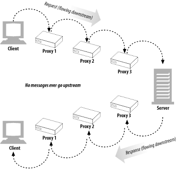
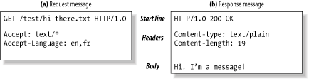
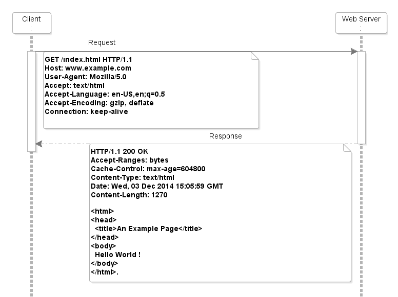

# HTTP 메시지
 
HTTP 메시지는 HTTP 애플리에티션 간에 주고 받는 데이터의 블록들이다.
이 데이터 블록들은 메시지의 메타 정보와 메시지의 내용을 포함한다.

## 메시지의 흐름

메시지는 흐름의 방향에 따라 `업스트림`, `다운스트림`으로 나눌 수 있다.
그리고 트랜잭션 방향은 `인바운드`, `아웃바운드`로 표현할 수 있다.



HTTP는 항상 다운스트림으로 흐르고, 메시지의 발송자는 업스트림이다.

> 전진 포워드 성질, 아무리 실패해도 롤백이 아닌 포워드로 진행한다. HTTP는 트랜잭션이 실패하더라도 롤백하지 않고, 계속해서 다음 단계로 진행하는 전진 포워드 성질을 가지고 있다. 이는 HTTP가 신뢰성 있는 프로토콜이 아니기 때문에, 실패한 트랜잭션에 대해서는 롤백하지 않고, 다음 단계로 진행하는 방식을 채택하고 있기 때문인 것 같다.

## 메시지의 각 부분

HTTP 메시지는 클라이언트의 요청이나 서버의 응답 중 하나를 포함한 시작줄, 헤더 블록,본문으로 이루어진다.



시작줄은 어떤 메시지인지 표현하는 HTTP Protocol과 Status를 포함하며,
헤더에는 본문에 담긴 데이터에 대한 메타 정보가 담긴다.
본문은 메시지가 담긴 부분으로 헤더에서 정의된 메타 정보에 따라 해석된다.

### 3.2.1 메시지 문법



요청 메시지의 형식은 다음과 같다.

```http request
<메서드> <요청 URL> <HTTP 버전>
<헤더 필드>: <헤더 값>

<본문>
```

응답 메시지의 형식은 다음과 같다.

```http response
<HTTP 버전> <상태 코드> <상태 메시지>
<헤더 필드>: <헤더 값>

<본문>
```

##### 메서드: 클라이언트 측에서 서버가 리소스에 대해 수행해주길 바라는 동작
|메서드| 설명                              |본문 유무|
|:---:|:--------------------------------|:---:|
|GET| 서버에서 데이터를 가져온다.                 |없음|
|HEAD| GET과 동일하지만, 응답 본문이 없고 헤더만 가져온다. |없음|
|POST| 서버가 처리해야 할 데이터를 보낸다.            |있음|
|PUT| 서버에 데이터를 저장한다.                  |있음|
|TRACE| 서버가 받은 요청을 그대로 돌려준다.            |없음|
|OPTIONS| 서버가 지원하는 메서드와 기능을 요청한다.         |없음|
|DELETE| 서버에서 데이터를 삭제한다.                 |없음|

##### 요청 URL: 요청 대상이 되는 리소스를 지칭하는 완전한 URL 혹은 URL의 경로
#####  버전: HTTP의 버전으로 형식은 다음과 같다. `HTTP/<메이저 버전>.<마이너 버전>`

대화 상대의 능력과 메시지의 형식을 제공해주기 위한 것으로, HTTP/1.1은 HTT/1.2의 새로운 기능ㅇ을 하숑할 수 없다는 것을 알아야 한다.

#####  상태 코드: 요청 중에 무엇이 일어났는지 설명하는 코드(+ 세자리의 숫자로 이루어져있다.)

|전체 범위| 정의된 범위  | 설명|
|:---:|:-------:|:---:|
|100-199| 100-101 | 정보 응답: 요청이 수신되어 처리 중임을 나타냄|
|200-299| 200-206 | 성공 응답: 요청이 성공적으로 처리되었음을 나타냄|
|300-399| 300-305 | 리다이렉션 응답: 요청을 완료하기 위해 추가 작업이 필요함을 나타냄|
|400-499| 400-415 | 클라이언트 오류 응답: 요청에 오류가 있음을 나타냄|
|500-599| 500-505 | 서버 오류 응답: 서버가 요청을 처리하는 동안 오류가 발생했음을 나타냄|

#####  사유 구절: 상태 코드의 의미를 설명하는 텍스트

`HTTP/1.1 200 OK`는 HTTP 버전이 `1.1`이고, 상태 코드가 `200`이며, 사유 구절이 `OK`인 응답 메시지의 시작줄이다.
HTTP 명세에서는 사유 구절에 대한 어떤 엄격한 규칙도 정의하지 않고 있다. 

#####  헤더: 메시지의 메타 정보를 담는 필드로, `<헤더 필드>: <헤더 값>`의 형식으로 이루어져 있다.

- 일반 헤더: 요청과 응답 모두에 적용되는 헤더
- 요청 헤더: 요청에 대한 부가 정보를 담는 헤더
- 응답 헤더: 응답에 대한 부가 정보를 담는 헤더
- 엔티티 헤더: 메시지 본문에 대한 정보를 담는 헤더
- 커스텀 헤더: HTTP 명세에 정의되지 않은 헤더로, `X-`로 시작하는 이름을 가진다.

#####  본문: 메시지의 내용이 담긴 부분으로, 헤더에서 정의된 메타 정보에 따라 해석된다.
