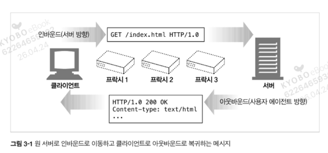
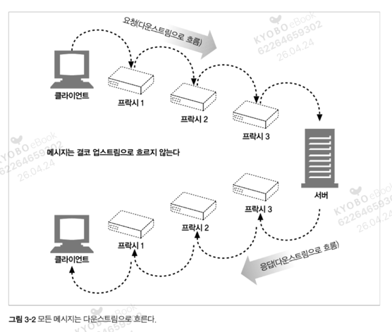

# 3.1 메시지의 흐름

HTTP 메시지는 HTTP 애플리케이션 간에 주고받은 데이터의 블록들이다.  
이 데이터의 블록들은 메시지의 내용과 의미를 설명하는 **텍스트 메타 정보** 로 시작하고 그 다음에 선택적으로 데이터가 올 수 있다.  
메시지는 클라이언트, 서버, 프락시 사이를 흐른다.

---

## 3.1.1 메시지는 원 서버 방향을 인바운드로 하여 송신된다

HTTP는 **인바운드** 와 **아웃바운드** 라는 용어를 트랜잭션 방향을 표현하기 위해 사용한다.



| 방향 | 설명 |
|------|------|
| **인바운드(Inbound)** | 메시지가 원 서버를 향해 이동하는 것 |
| **아웃바운드(Outbound)** | 모든 처리가 끝난 뒤 메시지가 사용자 에이전트로 돌아오는 것 |

```
[요청] 클라이언트 → 프락시1 → 프락시2 → 프락시3 → 서버   (인바운드)
                    GET /index.html HTTP/1.0

[응답] 서버 → 프락시3 → 프락시2 → 프락시1 → 클라이언트   (아웃바운드)
              HTTP/1.0 200 OK
              Content-type: text/html
```

---

## 3.1.2 다운스트림으로 흐르는 메시지

HTTP 메시지는 강물과 같이 흐른다.  
요청 메시지나 응답 메시지나에 관계없이 **모든 메시지는 다운스트림으로 흐른다.**



- 메시지의 **발송자** 는 수신자의 **업스트림** 이다.
- 요청에서는 프락시 1이 프락시 3의 업스트림이지만,
- 응답에서는 프락시 3이 프락시 1의 **다운스트림** 이다.

> **핵심:** '업스트림'이나 '다운스트림'이란 용어는 발송자와 수신자에 대한 것이다.  
> 메시지가 원 서버를 향하는가 아니면 클라이언트를 향하는가에 대한 것이 아니다. 어느 방향이든 다운스트림이기 때문이다.
