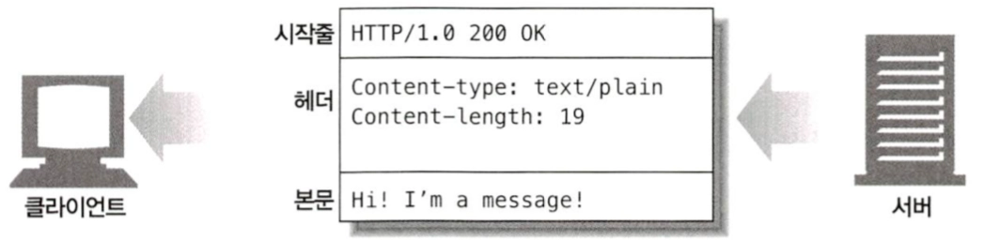
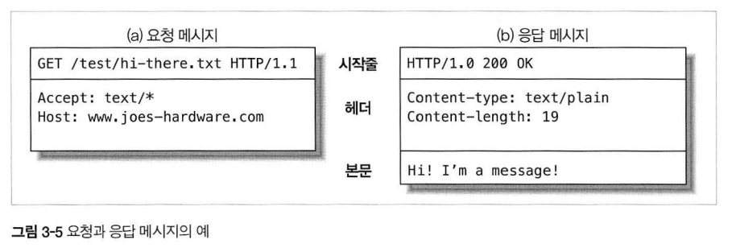

HTTP가 인터넷의 배달원이라면, HTTP 메시지는 무언가를 담아 보내는 소포와 같다.

- 메시지가 어떻게 흘러가는가
- HTTP 메시지의 세 부분(시작줄, 헤더, 개체 본문)
- 요청과 응답 메시지의 차이
- 요청 메시지가 지원하는 여러 기능(메서드)들
- 응답 메시지가 반환하는 여러 상태 코드들
- 여러 HTTP 헤더들은 무슨 일을 하는가

## 3.1 메시지의 흐름

HTTP 메시지는 HTTP 애플리케이션 간에 주고받은 데이터의 블록들이다. 이 데이터의 블록들은 메시지의 내용과 의미를 설명하는 텍스트 메타 정보로 시작하고 그 다음에 선택적으로 데이터가 올 수 있다. 이 메시지는 클라이언트, 서버, 프락시 사이를 흐른다. ‘인바운드’, ‘아웃바운드’, ‘업스트림’, ‘다운스트림’은 메시지의 방향을 의미하는 용어다.

### 3.1.1 메시지는 원 서버 방향을 인바운드로 하여 송신된다.

HTTP는 인바운드와 아웃바운드라는 용어를 트랜잭션 방향을 표현하기 위해 사용한다. 메시지가 원 서버로 향하는 것은 인바운드로 이동하는 것이고, 모든 처리가 끝난 뒤에 메시지가 사용자 에이전트로 돌아오는 것은 아웃바운드로 이동하는 것이다.

### 3.1.2 다운스트림으로 흐르는 메시지

HTTP 메시지는 강물과 같이 흐른다. 요청 메시지나 응답 메시지냐에 관계 없이 모든 메시지는 다운스트림으로 흐른다(메시지는 결코 업스트림으로 흐르지 않는다)

메시지의 발송자는 수신자의 업스트림이다. 그림 3-2에서 요청에서는 프락시 1이 프락시 3의 업스트림이지만 응답에서는 프락시 3의 다운스트림이다.

<aside>

‘업스트림’이나 ‘다운스트림’이란 용어는 발송자와 수신자에대한 것이다. 메시지가 원 서버를 향하는가 아니면 클라이언트를 향하는가에 대한 것이 아니다. 어느 방향이든 다운스트림이기 때문이다.

</aside>

## 3.2 메시지의 각 부분

HTTP 메시지는 단순한, 데이터의 구조화된 블록이다. 그림 3-3의 예를 통해 살펴보자. 각 메시지는 클라이언트로부터의 요청이나 서버로부터의 응답 중 하나를 포함한다. 메시지는 시작줄, 헤더 블록, 본문 이렇게 세 부분으로 이루어진다. 시작줄은 이것이 어떤 메시지인지 서술하며, 헤더 블록은 속성을, 본문은 데이터를 담고 있다. 본문은 아예 없을 수도 있다.

시작줄과 헤더 블록은 그냥 줄 단위로 분리된 아스키 문자열이다. 각 줄은 캐리지 리턴(엔터)과 개행 문자로 구성된 두 글자의 줄바꿈 문자열으로 끝난다.

이 줄바꿈 문자열은 ‘CRLF’라고 쓴다. HTTP 명세에 따른다면 줄바꿈 문자열은 CRLF이지만 견고한 애플리케이션이라면 그냥 개행 문자도 받아들일 수 있어야 한다는 점을 언급할 필요가 있을 듯하다. 오래되거나 잘못 만들어진 HTTP 애플리케이션들 중에서는 캐리지 리턴과 개행 문자 모두를 항상 전송하지는 않는 것들도 있다.

엔티티 본문이나 메시지 본문은 단순히 선택적인 데이터 덩어리이다. 시작줄이나 헤더와는 달리, 본문은 텍스트나 이진 데이터를 포함할 수도 있고 그냥 비어있을 수도 있다.

위 그림에서 헤더는 본문에 대한 꽤 많은 정보를 준다. Content-Type 줄은 본문이 무엇인지 말해준다. Content-Length 줄은 본문의 크기를 말해준다.

### 3.2.1 메시지 문법

모든 HTTP 메시지는 요청 메시지나 응답 메시지로 분류된다. 요청 메시지는 웹 서버에 어떤 동작을 요구한다. 응답 메시지는 요청의 결과를 클라이언트에게 돌려준다.요청과 응답 모두 기본적으로 구조가 같다.

요청 메시지의 형식은 다음과 같다.

<aside>

<메서드> <요청 URL> <버전>

<헤더>

<엔터티 본문>

</aside>

응답 메시지의 형식은 다음과 같다.

<aside>

<버전> <상태 코드> <사유 구절>

<헤더>

<엔터티 본문>

</aside>

**메서드**

클라이언트 측에서 서버가 리소스에 대해 수행해주길 바라는 동작이다. ‘GET’, ‘HEAD’, ‘POST’와 같이 한 단어로 되어 있다. 우리는 메서드에 대해 이 장의 뒷부분에서 자세히 다룰 것이다.

**요청 URL**

요청 대상이 되는 리소스를 지칭하는 완전한 URL 혹은 URL의 경로 구성요소다. 완전한 URL이 아닌 URL의 경로 구성요소라고 해도, 클라이언트가 서버와 직접 대화하고 있고 경로 구성요소가 리소스를 가리키는 절대 경로이기만 하면 대체로 문제가 없다. 서버는 URL에서 생략된 호스트/포트가 자신을 가리키는 것으로 간주할 것이다.

**버전**

이 메시지에서 사용 중인 HTTP의 버전이다. 형식은 다음과 같다.

<aside>

HTTP/<메이저>.<마이너>

</aside>

메이저와 마이너는 모두 정수다. 이 장의 뒷부분에서 HTTP 버전을 매기는 방식에 대해 좀 더 자세히 다룰 것이다.

**상태 코드**

요청 중에 무엇이 일어났는지 설명하는 세 자리의 숫자다. 각 코드의 첫 번째 자릿수는 상태의 일반적인 분류를 나타낸다. (’성공’, ‘에러’ 등) HTTP 명세에 정의된 상태 코드와 그ㅡㄹ의 의미에 대한 완전한 목록은 이 장의 뒷부분에서 제공될 것이다.

**사유 구절(reason-phrase)**

숫자로 된 상태 코드의 의미를 사람이 이해할 수 있게 설명해주는 짧은 문구로, 상태 코드 이후부터 줄바꿈 문자열까지가 사유 구절이다. HTTP 명세에 정의된 모든 상태 코드에 대한 사유 구절의 예는 이 장의 뒷부분에서 제공할 것이다. 사유 구절은 오로지 사람에게 읽히기 위한 목적으로만 존재하는 것이다. 예를 들어 ‘HTTP/1.0 200 NOT OK’와 ‘HTTP/1.0 200 OK’ 는 사유 구절이 서로 전혀 달라 보임에도 불구하고 동등하게 성공을 의미하는 것으로 처리되어야 한다.

**헤더들**

이름, 콜론(:), 선택적인 공백, 값, CRLF가 순서대로 나타나는 0개 이상의 헤더들. 이 헤더의 목록은 빈 줄로 끝나 헤더 목록의 끝과 엔터티 본문의 시작을 표시한다. HTTP는 요청이나 응답에 어떤 특정 헤더가 포함되어야만 유효한 것으로 간주한다. 다양한 HTTP 헤더에 대해서는 이 장의 뒷부분에서 다룰 것이다.

**엔터티 본문**

엔터티 본문은 임의의 데이터 블록을 포함한다. 모든 메시지가 엔터티 본문을 갖는 것은 아니므로, 때때로 메시지는 그냥 CRLF으로 끝나게 된다. 우리는 엔터티에 대해 15장에서 자세히 다룰 것이다.

헤더나 엔터티 본문이 없더라도 HTTP 헤더의 집합은 항상 빈 줄로 끝나야 함에 주의하라.

### 3.2.2 시작줄

모든 HTTP 메시지는 시작줄로 시작한다. 요청 메시지의 시작줄은 무엇을 해야 하는지 말해준다. 응답 메시지의 시작줄은 무슨 일이 일어났는지 말해준다.

**요청줄**

요청 메시지는 서버에게 리소스에 대해 무언가를 해달라고 부탁한다. 요청 메시지의 시작줄, 혹은 요청줄에는 서버에서 어떤 동작이 일어나야 하는지 설명해주는 메서드와 그 동작에 대한 대상을 지칭하는 요청 URL이 들어있다. 또한 요청줄은 클라이언트가 어떤 HTTP 버전으로 말하고 있는지 서버에게 알려주는 HTTP 버전도 포함한다.

이 모든 필드는 공백으로 구분된다. 그림 3-5a에서, 요청 메서드는 GET이고, 요청 URL은 /test/hi-there.txt이며, 버전은 HTTP/1.1이다. HTTP/1.0 이전에는 요청줄에 HTTP 버전이 들어있을 필요가 없었다.

**응답줄**

응답 메시지는 수행 결과에 대한 상태 정보와 결과 데이터를 클라이언트에게 돌려준다. 응답 메시지의 시작줄 혹은 응답줄에는 응답 메시지에서 쓰인 HTTP 의 버전, 숫자로 된 상태 코드, 수행 상태에 대해 설명해주는 텍스트로 된 사유 구절이 들어있다.

이 모든 필드는 공백으로 구분된다. 그림 3-5b에서, HTTP 버전은 HTTP/1.0이고, 상태 코드는 200 이며, 사유 구절은 OK로 문서가 성공적으로 반환되었음을 의미한다. HTTP/1.0 이전 시절에는 응답에 응답줄이 들어있을 필요가 없었다.

**메서드**

요청의 시작줄은 메서드로 시작하며, 서버에게 무엇을 해야 하는지 말해준다. 예를 들어, ‘GET /specials/saw-blade.gif HTTP/1.0’ 이라는 줄에서 메서드는 GET이다.

HTTP 명세는 공통 요청 메서드의 집합을 정의한다. 예를 들어, GET 메서드는 서버에서 문서를 가져오는 것이며, POST 메서드는 서버가 처리해줬으면 하는 데이터를 보내는 것이고, OPTIONS 메서드는 웹 서버의 일반적인 지원 범위 혹은 웹 서버의 특정 리소스에 대한 지원 범위를 알아보는 것이다.

표 3-1은 일곱 가지 메서드에 대해 서술하고 있다. 메서드에 따라 요청 메시지에 본문이 있는 경우도 있고 그렇지 않은 경우도 있다는 점에 주의하라.

| 메서드 | 설명 | 메시지 본문이 있는가? |
| --- | --- | --- |
| GET | 서버에서 어떤 문서를 가져온다. | 없음 |
| HEAD | 서버에서 어떤 문서에 대해 헤더만 가져온다. | 없음 |
| POST | 서버가 처리해야 할 데이터를 보낸다. | 있음 |
| PUT | 서버에 요청 메시지의 본문을 저장한다. | 있음 |
| TRACE | 메시지가 프락시를 거쳐 서버에 도달하는 과정을 추적한다. | 없음 |
| OPTIONS | 서버가 어떤 메서드를 수행할 수 있는지 확인한다. | 없음 |
| DELETE | 서버에서 문서를 제거한다. | 없음 |

모든 서버가 표 3-1의 메서드를 모두 구현한 것은 아니다. 더 나아가, HTTP는 쉽게 확장할 수 있도록 설계되었기 때문에, 다른 서버는 그들만의 메서드를 추가로 구현했을 수도 있다. 이러한 추가 메서드는 HTTP 명세를 확장하는 것이기 때문에 확장 메서드라고 불린다.

**상태 코드**

메서드가 서버에게 무엇을 해야 하는지 말해주는 것처럼, 상태 코드는 클라이언트에게 무엇이 일어났는지 말해준다. 상태 코드는 응답의 시작줄에 위치한다. 예를 들어, ‘HTTP/1.0 200 OK’라는 줄에서 상태 코드는 200이다.

클라이언트가 HTTP 서버에게 요청 메시지를 보낼 때, 많은 일이 일어난다. 만약 운이 좋다면 요청은 완전히 성공할 것이다. 그러나 항상 운이 좋을 수는 없다. 서버는 요청한 리소스가 발견되지 않았거나, 그 리소스에 접근할 권한이 없거나, 어쩌면 그 리소스가 다른 곳으로 옮겨졌다고 알려올 수도 있다.

상태 코드는 각 응답 메시지의 시작줄에 담겨 반환된다. 숫자로 된 코드와, 문자열로 되어 있어서 사람이 이해하기 쉬운 메시지 두 형태 모두로 반환된다. 사유 구절이 사람에게 쉽게 읽히는 한편, 숫자로 된 코드는 프로그램이 에러를 처리하기 쉽다.

상태 코드들은 세 자리 숫자로 된 그들의 코드값을 기준으로 묶인다. 200에서 299까지의 상태 코드는 성공을 나타낸다. 300에서 399까지의 코드는 리소스가 옮겨졌음을 뜻한다. 400에서 499까지의 코드는 클라이언트가 뭔가 잘못된 요청을 했음을 의미한다. 500에서 599까지의 코드는 서버에서 뭔가 실패했음을 의미한다.

표 3-2는 상태 코드의 종류를 보여주고 있다.

| 전체 범위 | 정의된 범위 | 분류 |
| --- | --- | --- |
| 100-199 | 100-101 | 정보 |
| 200-299 | 200-206 | 성공 |
| 300-399 | 300-305 | 리다이렉션 |
| 400-499 | 400-415 | 클라이언트 에러 |
| 500-599 | 500-505 | 서버 에러 |

현재 버전의 HTTP는 각 상태 분류에 대해 적은 수의 코드만을 정의했다. 프로토콜이 진화하면서, 더 많은 상태 코드가 HTTP 명세에 공식적으로 정의될 것이다. 만약 당신이 인식할 수 없는 상태 코드를 받게 되면, 누군가가 현재 프로토콜의 확장으로 그것을 정의했을 가능성이 있다. 그 상태 코드를 그것이 포함되는 범주의 일반적인 구성원으로 가정하고 다루어야 한다.

| 상태 코드 | 사유 구절 | 의미 |
| --- | --- | --- |
| 200 | OK | 성공! |
| 401 | Unauthorized | 사용자 이름과 비밀번호를 입력해야 한다 |
| 404 | Not Found | 서버는 요청한 URL에 해당하는 리소스를 찾지 못했다. |

**사유 구절**

사유 구절은 응답 시작줄의 마지막 구성요소다. 이것은 상태 코드에 대한 글로 된 설명을 제공한다. 예를 들어, ‘HTTP/1.0 200 OK’ 라는 줄에서, 사유 구절은 OK이다.

사유 구절은 상태 코드와 일대일로 대응된다. 사유 구절은, 애플리케이션 개발자들이 그들의 사용자에게 요청 중에 무슨 일이 일어났는지 알려주기 위해 넘겨줄 수 있는, 상태 코드의 사람이 이해하기 쉬운 버전이다.

HTTP 명세는 사유 구절이 어때야 한다는 어떤 엄격한 규칙도 제공하지 않는다.

이 장의 뒷부분에서, 우리는 상태 코드와 그에 어울릴만한 사유 구절을 열거해 보일 것이다.

**버전 번호**

버전 번호는 HTTP/x.y 형식으로 요청과 응답 메시지 양쪽 모두에 기술된다. 이것은 HTTP 애플리케이션들이 자신이 따르는 프로토콜의 버전을 상대방에게 말해주기 위한 수단이 된다.

버전 번호는 HTTP로 대화하는 애플리케이션들에게 대화 상대의 능력과 메시지의 형식에 대한 단서를 제공해주기 위한 것이다. HTTP 버전 1.1 애플리케이션과 대화하는 HTTP 버전 1.2 애플리케이션은 1.2버전의 새로운 기능을 사용할 수 없다는 것을 알아야한다. 버전 1.1 애플리케이션은 아마도 1.2 버전의 기능을 구현하지 않았을 것이기 때문이다.

버전 번호는 어떤 애플리케이션이 지원하는 가장 높은 HTTP 버전을 가리킨다.때떄로 이는 애플리케이션 간에 혼란을 유발하는데, HTTP/1.0 애플리케이션이 버전 번호가 HTTP/1.1로 된 응답을 받았을 때, 이를 HTTP/1.1 메시지라고 해석하는 경우가 있기 때문이다. **응답 프로토콜 버전이 HTTP/1.1 이라는 것은 사실 응답을 보낸 애플리케이션이 HTTP/1.1 까지 이해할 수 있음을 의미하는 것이다.**

### 3.2.3 헤더

전 절에서는 요청과 응답의 첫 번째 줄에 초점을 맞췄다. 시작줄 다음에는 0개, 1개 혹은 여러 개의 HTTP 헤더가 온다.

HTTP 헤더 필드는 요청과 응답 메시지에 추가 정보를 더한다. 그들은 기본적으로 이름/값 쌍의 목록이다. 예를 들어, 다음의 헤더줄은 Content-Length 헤더 필드에 19라는 값을 할당한다.

<aside>

Content-length: 19

</aside>

**헤더 분류**

HTTP 헤더 명세는 여러 헤더 필드를 정의한다. 애플리케이션은 또한 자유롭게 자신만의 헤더를 만들어낼 수 있다. HTTP 헤더는 다음과 같이 분류된다.

- 일반 헤더
    - 요청에 대한 부가 정보를 제공
- 응답 헤더
    - 응답에 대한 부가 정보를 제공
- Entity 헤더
    - 본문 크기와 콘텐츠, 혹은 리소스 그 자체를 서술
- 확장 헤더
    - 명세에 정의되지 않은 새로운 헤더

각 HTTP 헤더는 간단한 문법을 가진다. 이름, 쉼표, 공백, 필드 값, CRLF가 순서대로 온다.

| 헤더의 예 | 설명 |
| --- | --- |
| Date: Tue, 3 Oct 1997 02:16:03 GMT | 서버가 응답을 만들어 낸 시각 |
| Content-length: 15040 | 15040 바이트의 데이터를 포함한 엔티티 본문 |
| Content-type: image/gif | 엔티티 본문은 GIF 이미지다. |
| Accept: image/gif, image/jpeg, text/html | 클라이언트는 GIF, JPEG 이미지와 HTML 을 받아들일 수 있다. |

**헤더를 여러 줄로 나누기**

긴 헤더 줄은 그들을 여러 줄로 쪼개서 더 읽기 좋게 만들 수 있는데, 추가 줄 앞에는 최소 하나의 스페이스 혹은 탭 문자가 와야 한다.

<aside>

HTTP/1.0 200 OK

Content-Type: image/gif

Content-length: 8572

Server: Test Server

Version 1.0

</aside>

이 예에서, 응답 메시지는 여러 줄로 값이 쪼개진 Server 헤더를 포함하고 있다. 그 헤더의 완전한 값은 “Test Server Version 1.0”이다.

우리는 모든 HTTP 헤더를 이 장의 뒷부분에서 간략히 설명할 것이다. 또한 모든 헤더에 대한 더 자세한 요약을 부록 C에서 제공한다.

### 3.2.4 엔터티 본문

HTTP 메시지의 세 번째 부분은 선택적인 엔터티 본문이다. 엔터티 본문은 HTTP 메시지의 화물이라고 할 수 있다. 그것들은 HTTP가 수송하도록 설계된 것들이다.

HTTP 메시지는 이미지, 비디오, HTML, 문서, 소프트웨어 애플리케이션, 신용카드 트랜잭션, 전자우편 등 여러 종류의 디지털 데이터를 실어 나를 수 있다.

### 3.2.5 버전 0.9 메시지

HTTP 버전 0.9는 HTTP 프로토콜의 초기 버전이다. 그것은 오늘날 HTTP가 갖고 있는 요청과 응답 메시지의 시초이지만, 훨씬 단순한 프로토콜로 되어 있다.

**HTTP/0.9 메시지도 마찬가지로 요청과 응답으로 이루어져 있지만, 요청은 그저 메서드와 요청 URL를 갖고 있을 뿐이며, 응답은 오직 엔터티로만 되어 있다.** 버전 정보도 없고, 상태 코드나 사유 구절도 없으며, 헤더도 포함되어 있지 않다.

이와 같은 지나칠 정도의 단순함 때문에, HTTP/0.9로는 다양한 상황에 대응할 수 없으며 이 책에서 설명하고 있는 HTTP 의 긴으들과 애플리케이션들도 대부분 구현할 수 없다. 여기서 HTTP/0.9에 대해 설명한 것은, 여전히 그것을 사용하는 클라이언트, 서버, 기타 애플리케이션 들이 있기 때문에, 애플리케이션 개발자들이 HTTP/0.9의 제약에 대해 알아둘 수 있게 하기 위함이다.

## 3.3 메서드

표 3-1에 열거된 몇몇 기본적인 HTTP 메서드에 대해 자세히 이야기해보자. 모든 서버가 모든 메서드를 구현하지는 않는다는 것에 주의하라. HTTP 버전 1.1과 호환되고자 한다면, 서버는 자신의 리소스에 대해 GET과 HEAD 메소드만을 구현하는 것으로 충분하다.

비록 서버가 모든 메서드를 구현하지 않았다 하더라도 메서드는 대부분 제한적으로 사용될 것이다. 예를 들어, DELETE와 PUT을 지원하는 서버는 아무나 저장된 리소스를 삭제할 수 있길 바라지는 않을 것이다. 이 제한은 일반적으로 서버 설정에 의해 정해지며, 따라서 사이트마다 또 서버 마다 다를 수 있다.

### 3.3.1 안전한 메서드(Safe Method)

HTTP는 안전한 메서드라 불리는 메서드의 집합을 정의한다. GET과 HEAD 메서드는 안전하다고 할 수 있는데, 이는 **GET이나 HEAD 메서드를 사용하는 HTTP 요청의 결과로 서버에 어떤 작용도 없음을 의미한다**.

작용이 없다는 것은, HTTP 요청의 결과로 인해 서버에서 일어나는 일은 아무것도 없다는 의미이다. 예를 들어, 죠의 하드웨어에서 온라인 쇼핑을 하다 ‘구매’ 버튼을 클릭했다고 해보자. 그 순간 당신의 신용카드 정보를 담은 POST 요청이 전송될 것이고, 서버에서 당신을 위한 작용이 일어날 것이다. 이 사례에서, ‘작용’이란 구매로 인해 신용카드로 대금이 청구되는 것을 말한다.

안전한 메서드가 서버에 작용을 유발하지 않는다는 보장은 없다(웹 개발자에게 달렸다). 안전한 메서드의 목적은, 서버에 어떤 영향을 줄 수 있는 안전하지 않은 메서드가 사용될 때 사용자들에게 그 사실을 알려주는 HTTP 애플리케이션을 만들 수 있도록 하는 것에 있다.

### 3.3.2 GET

GET은 가장 흔히 쓰이는 메서드다. 주로 서버에게 리소스를 달라고 요청하기 위해 쓰인다. HTTP/1.1은 서버가 이 메서드를 구현할 것을 요구한다.

### 3.3.3 HEAD

HEAD 메서드는 정확히 GET처럼 행동하지만, 서버는 응답으로 헤더만을 돌려준다. 엔터티 본문은 결코 반환되지 않는다. 이는 클라이언트가 헤더만을 조사할 수 있도록 해준다.

- 리소스를 가져오지 않고도 그에 대해 무엇인가를 알아낼 수 있다.
- 응답의 상태 코드를 통해, 개체가 존재하는지 확인할 수 있다.
- 헤더를 확인하여 리소스가 변경되었는지 검사할 수 있다.

서버 개발자들은 반드시 반환되는 헤더가 GET으로 얻는 것과 정확히 일치함을 보장해야 한다. 또한 HTTP/1.1 준수를 위해서는 HEAD 메서드가 반드시 구현되어 있어야 한다.

### 3.3.4 PUT

GET 메서드가 서버로부터 문서를 읽어 들이는데 반해 PUT 메서드는 서버에 문서를 쓴다. 어떤 발행 시스템은 사용자가 PUT을 이용해 웹페이지를 만들고 웹 서버에 직접 개시할 수 있도록 해준다.

PUT 메서드의 의미는, 서버가 요청의 본문을 가지고 요청 URL의 이름대로 새 문서를 만들거나, 이미 URL이 존재한다면 본문을 사용해서 교체하는 것이다.

PUT은 콘텐츠를 변경할 수 있게 해주기 때문에, 많은 웹 서버가 PUT을 수행하기 전에 사용자에게 비밀번호를 입력해서 로그인을 하도록 요구할 것이다.

### 3.3.5 POST

POST 메서드는 서버에 입력 데이터를 전송하기 위해 설계되었다. 실제로, HTML 폼을 지원하기 위해 흔히 사용된다. 채워진 폼에 담긴 데이터는 서버로 전송되며, 서버는 이를 모아서 필요로 하는 곳에 보낸다. 그림 3-10은 클라이언트가 POST 메서드를 이용해 폼 데이터를 서버로 전달하는 요청을 하는 것을 보여준다.

### 3.3.6 TRACE

클라이언트가 어떤 요청을 할 때, 그 요청은 방화벽, 프락시, 게이트웨이 등의 애플리케이션을 통과할 수 있다. 이들에게는 원래의 HTTP 요청을 수정할 수 있는 기회가 있다. TRACE 메서드는 클라이언트에게 자신의 요청이 서버에 도달했을 때 어떻게 보이게 되는지 알려준다.

TRACE 요청은 목적지 서버에서 ‘루프백(loopback)’ 진단을 시작한다. 요청 전송의 마지막 단계에 있는 서버는 자신이 받은 요청 메시지를 본문에 넣어 TRACE 응답을 되돌려준다. 클라이언트는 자신과 목적지 서버 사이에 있는 모든 HTTP 애플리케이션의 요청/응답 연쇄를 따라가면서 자신이 보낸 메시지가 망가졌거나 수정되었는지, 만약 그렇다면 어떻게 변경되었는지 확인할 수 있다.

TRACE 메서드는 주로 진단을 위해 사용된다. 예를 들면 요청이 의도한 요청/응답 연쇄를 거쳐가는지 검사할 수 있다. 또한 프락시나 다른 애플리케이션들이 요청에 어떤 영향을 미치는지 확인해보고자 할 때도 좋은 도구다.

TRACE는 진단을 위해 사용할 때는 괜찮지만, 그 대신 중간 애플리케이션이 여러 다른 종류의 요청들을 일관되게 다룬다고 가정하는 문제가 있다. 많은 HTTP 애플리케이션은 메서드에 따라 다르게 동작한다. 예를 들어, 프락시는 POST 요청을 바로 서버로 통과시키는 반면 GET 요청은 웹 캐시와 같은 다른 HTTP 애플리케이션으로 전송한다. TRACE는 메서드를 구별하는 메커니즘을 제공하지 않는다. 어떻게 TRACE 요청을 처리할 것인지에 대해서는 일반적으로 중간 애플리케이션이 결정을 내린다.

TRACE 요청은 어떠한 엔터티 본문도 보낼 수 업사. TRACE 응답의 엔터티 본문에는 서버가 받은 요청이 그대로 들어있다.

### 3.3.7 OPTIONS

OPTIONS 메서드는 웹 서버에게 여러 가지 종류의 지원 범위에 대해 물어본다. 서버에게 특정 리소스에 대해 어떤 메서드가 지원되는지 물어볼 수 있다.

이 메서드는 여러 리소스에 대해 실제로 접근하지 않고도 그것들을 어떻게 접근하는 것이 최선인지 확인할 수 있는 수단을 클라이언트 애플리케이션에게 제공한다.

그림 3-12는 OPTIONS 메서드를 사용한 요청 시나리오를 보여준다.

### 3.3.8 DELETE

DELETE 메서드는 당신이 예상한 바로 그 일을 한다. 서버에게 요청 URL로 지정한 리소스를 삭제할 것을 요청한다. 그러나 클라이언트는 삭제가 수행되는 것을 보장하지 못한다. 왜냐하면 HTTP 명세는 서버가 클라이언트에게 알리지 않고 요청을 무시하는 것을 허용하기 때문이다.

### 3.3.9 확장 메서드

HTTP는 필요에 따라 확장해도 문제가 없도록 설계되어 있으므로, 새로운 기능을 추가해도 과거에 구현된 소프트웨어들의 오동작을 유발하지 않는다. 확장 메서드는 HTTP/1.1 명세에 정의되지 않은 메서드다. 그들은 개발자들에게 그들의 서버가 구현한 HTTP 서비스의 서버가 관리하는 리소스에 대한 능력을 확장하는 수단을 제공한다. 확장 메서드의 대표적인 예 몇 가지가 표 3-5에 열거되어 있다. 그 메서드들은 모두 웹 콘텐츠를 웹 서버로 발행하는 것을 돕는 WebDAV HTTP 확장의 일부다.

| 메서드 | 설명 |
| --- | --- |
| LOCK | 사용자가 리소스를 잠글 수 있게 해준다. 예를 들어, 문서를 편집하는 동안 다른 사람이 동시에 같은 문서를 편집하지 못하도록 문서를 잠글 수 있다. |
| MKCOL | 사용자가 문서를 생성할 수 있게 해준다. |
| COPY | 서버에 있는 리소스를 복사한다. |
| MOVE | 서버에 있는 리소스를 옮긴다. |

모든 확장 메서드가 형식을 갖춘 명세로 정의된 것은 아니라는 점에 주의해야 한다. 만약 당신이 어떤 확장 메서드를 정의한다면, 그것은 대부분의 HTTP 애플리케이션이 이해할 수 없을 것이다. 마찬가지로, 당신의 HTTP 애플리케이션이 이해할 수 없는 확장 메서드를 사용하는 애플리케이션과 마주칠 수도 있다.

이런 상황에서는 확장 메서드에 대해 관용적인 것이 최고다. 프락시는, 종단 간 행위를 망가뜨리지 않을 수 있다면, 알려지지 않은 메서드가 담긴 메시지를 다운스트림 서버로 전달하려고 시도한다.

확장 메서드를 다룰 때는 “엄격하게 보내고 관대하게 받아들여라” 라는 오랜 규칙에 따르는 것이 가장 좋다.

## 3.4 상태 코드

앞서 표 3-2에서 보았듯이, HTTP 상태 코드는 크게 다섯 가지로 나뉜다. 이 절에서는 HTTP 상태 코드의 각 분류에 대해 요약한다.

상태 코드는 클라이언트에게 그들의 트랜잭션을 이해할 수 있는 쉬운 방법을 제공한다. 이 절에서는 또한 사유 구절의 예를 나열해 보일 것이다. 우리는 여기에 HTTP/1.1 명세에서 추천하는 사유 구절을 포함시켰다.

### 3.4.1 100-199: 정보성 상태 코드

정보성 상태 코드는 HTTP/1.1에서 도입되었다. 이들은 비교적 새로운 것이며, 복잡함을 감수할 만한 가치가 있는지에 대해 논란이 되고 있다.

| 상태 코드 | 사유 구절 | 의미 |
| --- | --- | --- |
| 100 | Continue | 요청의 시작 부분 일부가 받아들여졌으며, 클라이언트는 나머지를 계속 이어서 보내야 함을 의미한다. 이것을 보낸 후, 서버는 반드시 요청을 받아 응답해야 한다. |
| 101 | Switching Protocols | 클라이언트가 Upgrade 헤더에 나열한 것 중 하나로 서버가 프로토콜을 바꾸었음을 의미한다. |

특히 100 Continue 상태 코드는 약간 혼란스럽다. 100 Continue는 HTTP 클라이언트 애플리케이션이서버에 엔터티 본문을 전송하기 전에 그 엔터티 본문을 서버가 받아들일 것인지 확인하려고 할 때, 그 확인 작업을 최적화하기 위한 의도로 도입된 것이다. 이는 HTTP 프로그래머를 혼란스럽게 하는 경향이 있으므로, 여기서 좀 더 자세히 다룰 것이다.

**클라이언트와 100 Continue**

만약 클라이언트가 엔터티를 서버에게 보내려고 하고, 그 전에 100 Continue 응답을 기다리겠다면, 클라이언트는 값을 100-continue로 하는 Except 요청 헤더를 보낼 필요가 있다. 만약 클라이언트가 엔터티를 보내지 않으려 한다면, 100-continue Expect 헤더를 보내지 않아야 한다. 왜냐하면 이것은 클라이언트가 엔터티를 보낼 것이라고 생각하게 만들어 서버를 혼란에 빠뜨릴 뿐이기 때문이다. 100-continue를 서버가 다루거나 사용할 수 없는 큰 엔터티를 서버에게 보내지 않으려는 목적으로만 사용해야 한다.

100 Continue 상태에 대한 초창기의 혼란 때문에

## 3.5 헤더

헤더와 메서드는 클라이언트와 서버가 무엇을 하는지 결정하기 위해 함께 사용된다. 이 절에서는 표준 HTTP 헤더와 명시적으로 HTTP/1.1 명세에 정의 되지 않은 몇몇 헤더의 목적에 대해 간략히 설명한다.

헤더에는 특정 종류의 메시지에만 사용할 수 있는 헤더와, 더 일반 목적으로 상ㅇ할 수 있는 헤더, 그리고 응답과 요청 메시지 양쪽 모두에서 정보를 제공하는 헤더가 있다. 헤더는 크게 다섯 가지로 분류된다.

**일반 헤더(General Header)**

일반 헤더는 클라이언트와 서버 양쪽 모두가 사용한다. 이들은 클라이언트, 서버, 그리고 어딘가에 메시지를 보내는 다른 애플리케이션들을 위해 다양한 목적으로 사용된다. 예를 들어, Date 헤더는 서버와 클라이언트를 가리지 않고 메시지가 만들어진 일시를 지칭하기 위해 사용하는 일반 목적 헤더이다.

<aside>

Date: Tue, 3 Oct 1974 02:16:00 GMT

</aside>

**요청 헤더(Request Header)**

이름에서 드러나는 것과 같이, 요청 헤더는 요청 메시지를 위한 헤더다. 그들은 서버에게 클라이언트가 받고자 하는 데이터의 타입이 무엇인지와 같은 부가 정보를 제공한다, 예를 들어, 다음의 Accept 헤더는 서버에게 클라이언트가 자신의 요청에 대응하는 어떤 미디어 타입도 받아들일 것임을 의미한다.

<aside>

Accept: */*

</aside>

**응답 헤더(Response Headers)**

응답 메시지는 클라이언트에게 정보를 제공하기 위한 자신만의 헤더를 갖고 있다. 예를 들어, 다음의 Server 헤더는 클라이언트에게 그가 Tiki-Hut 서버 1.0 버전과 대화하고 있음을 말해준다.

<aside>

Server: Tiki-Hut/1.0

</aside>

**엔터티 헤더(Entity Header)**

엔터티 헤더란 엔터티 본문에 대한 헤더를 의미한다. 예를 들어, 엔터티 헤더는 엔터티 본문에 들어있는 데이터의 타입이 무엇인지 말해줄 수 있다. 예를 들어, 다음의 Content-Type 헤더는 애플리케이션에게 데이터가 iso-latin-1 문자집합으로 된 HTML  문서임을 알려준다.

<aside>

Content-Type: text/html; charset=iso-latin-1

</aside>

**확장 헤더(Extension Headers)**

확장 헤더는 애플리케이션 개발자들에 의해 만들어졌지만 아직 승인된 HTTP 명세에는 추가되지 않은 비표준 헤더다. HTTP 프로그램은 확장 헤더들에 대해 설령 그 의미를 모른다 할지라도 용인하고 전달해야 할 필요가 있다.

### 3.5.1 일반 헤더

어떤 헤더는 메시지에 대한 아주 기본적인 정보를 제공한다. 이 헤더들은 일반 헤더라고 불린다. 그들은 메시지가 어떤 종류이든 상관없이 유용한 정보를 제공한다. 예를 들어, 당신이 요청 메시지나 응답 메시지를 작성할 때, 요청에서나 응답에서나 메시지가 생성된 일시는 같은 의미를 가지므로, 이런 종류의 정보를 제공하는 헤더는 양쪽 메시지 모두에 대해 일반적이다.

| 헤더 | 설명 |
| --- | --- |
| Connection | 클라이언트와 서버가 요청/응답 연결에 대한 옵션을 정할 수 있게 해준다. |
| Date | 메시지가 언제 만들어졌는지에 대한 날짜와 시간을 제공한다. |
| MIME-Version | 발송자가 사용한 MIME의 버전을 알려준다. |
| Trailer chunked transfer | 인코딩으로 인코딩된 메시지의 끝 부분에 위치한 헤더들의 목록을 나열한다. |
| Transfer-Encoding | 수신자에게 안전한 전송을 위해 메시지에 어떤 인코딩이 적용되었는지 말해준다. |
| Upgrade | 발송자가 ‘업그레이드’하길 원하는 새 버전이나 프로토콜을 알려준다. |
| Via | 이 메시지가 어떤 중개자(프락시, 게이트웨이)를 거쳐 왔는지 보여준다. |

**일반 캐시 헤더**

HTTP/1.0은 HTTP 애플리케이션에게 매번 원 서버로부터 객체를 가져오는 대신 로컬 복사본으로 캐시할 수 있도록 해주는 최초의 헤더를 도입했다. 최신 버전의 HTTP는 매우 풍부한 캐시 매개변수의 집합을 가지고 있다. 7장에서, 우리는 캐시에 대해 자세히 다룰 것이다.

| 헤더 | 설명 |
| --- | --- |
| Cache-Control | 메시지와 함께 캐시 지시자를 전달하기 위해 사용한다. |
| Pragma | 메시지와 함께 지시자를 전달하는 또 다른 방법. 캐시에 국한되지 않는다. |

### 3.5.2 요청 헤더

요청 헤더는 요청 메시지에서만 의미를 갖는 헤더다. 그들은 요청이 최초 발생한 곳에서 누가 혹은 무엇이 그 요청을 보냈는지에 대한 정보나 클라이언트의 신호나 능력에 대한 정보를 준다.

서버는 요청 헤더가 준 클라이언트에 대한 그 정보를 클라이언트에게 더 나은 응답을 주기 위해 활용할 수 있다. 표 3-13은 요청 정보 헤더를 나열하고 있다.

| 헤더 | 설명 |
| --- | --- |
| Client-IP | 클라이언트가 실행된 컴퓨터의 IP를 제공한다. |
| From | 클라이언트 사용자의 메일 주소를 제공한다. |
| Host  | 요청의 대상이 되는 서버의 호스트 명과 포트를 준다. |
| Referer | 현재의 요청 URI가 들어있었던 문서의 URL을 제공한다. |
| UA-Color | 클라이언트 기기 디스플레이의 색상 능력에 대한 정보를 제공한다. |
| UA-CPU | 클라이언트 CPU의 종류나 제조사를 알려준다. |
| UA-Disp | 클라이언트의 디스플레이 능력에 대한 정보를 제공한다. |
| UA-OS | 클라이언트 기기에서 동작 중인 운영체제의 이름과 버전을 알려준다. |
| UA-Pixels | 클라이언트 기기 디스플레이에 대한 픽셀 정보를 제공한다. |
| User-Agent | 요청을 보낸 애플리케이션의 이름을 서버에게 말해준다. |

**Accept 관련 헤더**

클라이언트는 Accept 관련 헤더들은 이용해 서버에게 자신의 선호와 능력을 알려줄 수 있다. 즉 클라이언트가 무엇을 원하고 무엇을 할 수 있는지, 그리고 무엇보다도 원치 않는 것은 무엇인지 알려줄 수 있다. 서버는 그 후 이 추가 정보를 활용해서 무엇을 보낼 것인가에 대해 더 똑똑한 결정을 내릴 수 있다. 서버는 그 후 이 추가 정보를 활용해서 무엇을 보낼 것인가에 대해 더 똑똑한 결정을 내릴 수 있다. Accept 관련 헤더들은 서버와 클라이언트 양쪽 모두에게 유익하다. 클라이언트는 그들이 원하는 것을 얻을 수 있으며, 서버는 클라이언트가 사용할 수도 없는 것을 전송하는 데 시간과 대역폭을 낭비하지 않을 수 있다.

| 헤더 | 설명 |
| --- | --- |
| Accept | 서버에게 서버가 보내도 되는 미디어 종류를 말해준다. |
| Accept-Charset | 서버에게 서버가 보내도 되는 문자집합을 말해준다. |
| Accept-Encoding | 서버에게 서버가 보내도 되는 인코딩을 말해준다. |
| Accept-Language | 서버에게 서버가 보내도 되는 언어를 말해준다. |
| TE | 서버에게 서버가 보내도 되는 확장 전송 코딩을 말해준다. |

**조건부 요청 헤더**

때때로, 클라이언트는 요청에 몇몇 제약을 넣기도 한다. 예를 들어, 클라이언트가 이미 어떤 문서의 사본을 갖고 있는 상태라면, 클라이언트는 서버에게 그 문서를 요청할 때 자신이 갖고 있는 사본과 다를 때만 전송해 달라고 요청하고 싶을 수 있을 것이다. 조건부 요청 헤더를 사용하면, 클라이언트는 서버에게 요청에 응답하기 전에 먼저 조건이 참인지 확인하게 하는 제약을 포함시킬 수 있다.

| 헤더 | 설명 |
| --- | --- |
| Expect | 클라이언트가 요청에 필요한 서버의 행동을 열거할 수 있게 해준다. |
| If-Match | 문서의 엔터티 태그가 주어진 엔터티 태그와 일치하는 경우에만 문서를 가져온다. |
| If-Modified-Since | 주어진 날짜 이후에 리소스가 변경되지 않았다면 요청을 제한한다. |
| If-None-Match | 문서의 엔터티 태그가 주어진 엔터티 태그와 일치하지 않는 경우에만 문서를 가져온다. |
| If-Range | 문서의 특정 범위에 대한 요청을 할 수 있게 해준다. |
| If-Unmodified-SInce | 주어진 날짜 이후에 리소스가 변경되었다면 요청을 제한한다. |
| Range | 서버가 범위 요청을 지원한다면, 리소스에 대한 특정 범위를 요청한다. |

**요청 보안 헤더**

HTTP는 자체적으로 요청을 위한 간단한 인증요구/응답 체계를 갖고 있다. 그것은 요청하는 클라이언트가 어느 정도의 리소스에 접근하기 전에 자신을 인증하게 함으로써 트랜잭션을 약간 더 안전하게 만들고자 한다. 우리는 인증요구/응답 체계에 대해, HTTP 위에서 구현된 다른 보안 체계들과 함께 14장에서 다룰 것이다.

| 헤더 | 요청 |
| --- | --- |
| Authorization | 클라이언트가 서버에게 제공하는 인증 그 자체에 대한 정보를 담고 있다. |
| Cookie | 클라이언트가 서버에게 토큰을 전달할 때 사용한다. 진짜 보안 헤더는 아니지만, 보안에 영향을 줄 수 있다는 것은 확실하다. |
| Cookie2 | 요청자가 지원하는 쿠키의 버전을 알려줄 때 사용한다.  |

**프락시 요청 헤더**

인터넷에서 프락시가 점점 흔해지면서, 그들의 기능을 돕기 위해 몇몇 헤더들이 정의되어 왔다. 6장에서, 우리는 이 헤더들에 대해 자세히 다룰 것이다.

| 헤더 | 설명 |
| --- | --- |
| Max-Forwards | 요청이 원 서버로 향하는 과정에서 다른 프락시나 게이트웨이로 전달될 수 있는 최대 횟수. Trace 메서드와 함께 사용된다. |
| Proxy-Authorization | Authorization과 같으나 프락시에서 인증을 할 때 쓰인다 |
| Proxy-Connection | Connection과 같으나 프락시에서 연결을 맺을 때 쓰인다. |

### 3.5.3 응답 헤더

응답 메시지는 그들만의 응답 헤더를 갖는다. 응답 헤더는 클라이언트에게 부가 정보를 제공한다. 누가 응답을 보내고 있는지 혹은 응답자의 능력은 어떻게 되는지 알려주며, 더 나아가 응답에 대한 특별한 설명도 제공할 수 있다. 이 헤더들은 클라이언트가 응답을 잘 다루고 나중에 더 나은 요청을 할 수 있도록 도와준다.

| 헤더 | 설명 |
| --- | --- |
| Age | 응답이 얼마나 오래되었는지 |
| Public | 서버가 특정 리소스에 대해 지원하는 요청 메서드의 목록 |
| Retry-After | 현재 리소스가 사용 불가능한 상태일 때, 언제 가능해지는지 날짜 혹은 시각 |
| Server | 서버 애플리케이션의 이름과 버전 |
| Title | HTML 문서에서 주어진 것과 같은 제목 |
| Warning | 사유 구절에 있는 것보다 더 자세한 경고 메시지 |

**협상 헤더**

서버에 프랑스어와 독일어로 번역된 HTML 문서가 있는 경우와 같이 여러 가지 표현이 가능한 상황이라면, HTTP/1.1은 서버와 클라이언트가 어떤 표현을 택할 것인 가에 대한 협상을 할 수 있도록 지원한다. 17장에서 협상에 대해 보여줄 것이다. 여기 서버가 협상 가능한 리소스에 대한 정보를 운반하는 몇 가지 헤더들이 있다.

| 헤더 | 설명 |
| --- | --- |
| Accept-Ranges | 서버가 자원에 대해 받아들일 수 있는 범위의 형태 |
| Vary | 서버가 확인해 보아야 하고 그렇기 때문에 응답에 영향을 줄 수 있는 헤더들의 목록. |

**응답 보안 헤더**

기본적으로 HTTP 인증요구/응답 체계에서 응답 측에 해당하는 요청 보안 헤더는 이미 본 적이 있을 것이다. 우리는 보안에 대해 14장에서 자세히 이야기할 것이다. 여기서는 기본적인 인증요구 헤더에 대해 다룬다.

| 헤더 | 설명 |
| --- | --- |
| Proxy-Authenticate | 프락시에서 클라이언트로 보낸 인증요구의 목록 |
| Set-Cookie | 진짜 보안 헤더는 아니지만, 보안에 영향은 줄 수 있다. 서버가 클라이언트를 인증할 수 있도록 클라이언트 측에 토큰을 설정하기 위해 사용한다. |
| Set-Cookie2 | Set-Cookie와 비슷하게 RFC 2965로 정의된 쿠키. 11장의 “Version 1(RFC 2965) 쿠키”를 보라.  |
| WWW-Authenticate | 서버에서 클라이언트로 보낸 인증요구의 목록 |

### 3.5.4 엔터티 헤더

HTTP 메시지의 엔터티에 대해 설명하는 헤더들은 많다. 요청과 응답 양쪽 모두 엔터티를 포함할 수 있기 때문에, 이 헤더들은 양 타입의 메시지에 모두 나타날 수 있다.

엔터티 헤더는 엔터티와 그것의 내용물에 대한, 개체의 타입부터 시작해서 주어진 리소스에 대해 요청할 수 있는 유효한 메서드들까지, 광범위한 정보를 제공한다. 일반적으로 엔터티 헤더는 메시지의 수신자에게 자신이 다루고 있는 것이 무엇인지 말해준다.

| 헤더  | 설명 |
| --- | --- |
| Allow | 이 엔터티에 대해 수행될 수 있는 요청 메서드들을 나열한다. |
| Location | 클라이언트에게 언터티가 실제로 어디에 위치하고 있는지 말해준다. 수신자에게 리소스에 대한 위치를 알려줄 때 사용한다. |

**콘텐츠 헤더**

콘텐츠 헤더는 엔터티의 콘텐츠에 대한 구체적인 정보를 제공한다. 콘텐츠의 종류, 크기, 기타 콘텐츠를 처리할 때 유용하게 활용될 수 있는 것들이다.

| 헤더 | 설명 |
| --- | --- |
| Content-Base | 본문에서 사용된 상대 URL을 계산하기 위한 기저 URL |
| Content-Encoding | 본문에 적용된 어떤 인코딩 |
| Content-Language | 본문을 이해하는데 가장 적절한 언어 |
| Content-Length | 본문의 길이나 크기 |
| Content-Location | 리소스가 실제로 어디에 위치하는지 |
| Content-MD5 | 본문의 MD5 체크섬 |
| Content-Range | 전체 리소스에서 이 엔터티가 해당하는 범위를 바이트 단위로 표현 |
| Content-Type | 이 본문이 어떤 종류의 객체인지 |

**엔터티 캐싱 헤더**

일반 캐싱 헤더는 언제 어떻게 캐시가 되어야 하는지에 대한 지시자를 제공한다.

엔터티 캐싱 헤더는 엔터티 캐싱에 대한 정보를 제공한다. 예를 들면, 리소스에 대해 캐시된 사본이 아직 유효한지에 대한 정보와, 캐시된 리소스가 더 이상 유효하지 않게 되는 시점을 더 잘 추정하기 위한 단서 같은 것이다.

7장에서 우리는 HTTP 요청과 응답의 캐싱에 대해 깊이 살펴볼 것이다. 우리는 이 헤더들을 그때 다시 만나게 될 것이다.

| 헤더 | 설명 |
| --- | --- |
| ETag | 이 엔터티에 대한 엔터티 태그 |
| Expires | 이 엔터티가 더 이상 유효하지 않아 원본을 다시 받아와야 하는 일시 |
| Last-Modified | 가장 최근 이 엔터티가 변경된 일시 |