# 4.1 커넥션 관리

HTTP 통신은 네트워크 장비에서 널리 쓰이고 있는 네트워크 프로토콜들의 계층화된 집합인 TCP/IP를 통해 이루어진다.
커넥션이 맺어지면 클라이언트와 서버 간에 주고 받는 메시지들은 손실 혹은 손상되거나 순서가 바뀌지 않고 안전하게 전달된다.

웹브라우저가 TCP을 통해서 웹 서버에 요청을 보내는 과정

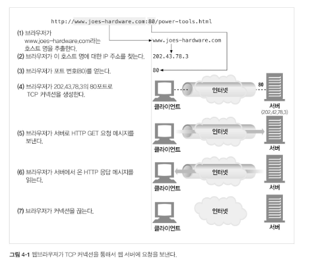

## 4.1.1 신뢰할 수 있는 데이터 전송 통로인 TCP

HTTP 커넥션은 몇몇 사용 규칙을 제외하고는 TCP 커넥션에 불과하다.
TCP는 충돌 없이 순서에 맞게 HTTP 데이터를 전달한다.

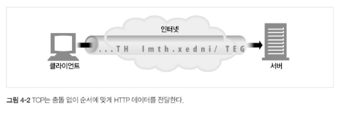

## 4.1.2 TCP 스트림은 세그먼트로 나뉘어 IP 패킷을 통해 전송된다.

TCP는 IP 패킷(혹은 IP 데이터그램)이라고 불리는 작은 조각을 통해 데이터를 전송한다.
HTTP는 아래 그림과 같이 IP, TCP, HTTP로 구성된 프로토콜 스택에서최상위 계층이다.
HTTP에 보안 기능을 더한 HTTPS는 TSL 혹은 SSL이라 불리기도 하며 HTTP와 TCP 사이에 있는 암호화 계층이다.

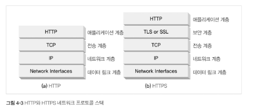

HTTP가 메시지를 전송하고자 할 경우, 현재 연결되어 있는 TCP 커넥션을 통해서 메시지 데이터의 내용을 순서대로 보낸다.
TCP는 세그먼트라는 단위로 데이터 스트림을 잘게 나누고, 세그먼트를 IP 패킷이라고 불리는 봉투에 담아서 인터넷을 통해 데이터를 전달한다.
이 모든 것은 TCP/IP 소프트웨어에 의해 처리되며, 그 과정은 HTTP 프로그래머에게 보이지 않는다.

각 TCP 세그먼트는 하나의 IP 주소에서 다른 IP 주소로 IP 패킷에 담겨 저낟ㄹ된다.
이 IP 패킷들 각각은 다음을 포함한다.

- IP 패킷 헤더(보통 20바이트)
- TCP 세그먼트 헤더(보통 20바이트)
- TCP 데이터 조각(0 혹은 그 이상의 바이트)


IP 헤더는 발신지와 목적지 IP 주소, 크기, 기타 플래그를 가진다.  
TCP 세그먼트 헤더는 TCP 포트번호, TCP 제어 플래그, 그리고 데이터의 순서와 무결성을 검사하기 위해 사용되는 숫자 값을 포함한다.

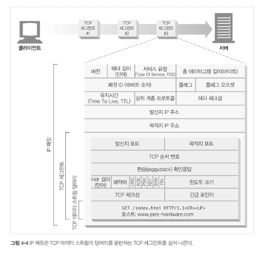

## 4.1.3 TCP 커넥션 유지하가ㅣ

TCP 커넥션은 발신자 IP 주소, 발신자 포트, 수신자 IP 주소, 수신지 포트로 식별하고 커넥션을 생성한다.
서로 다른 TCP 커넥션은 4가지 주소 구성 요소의 값이 모두 같을 수 없다.

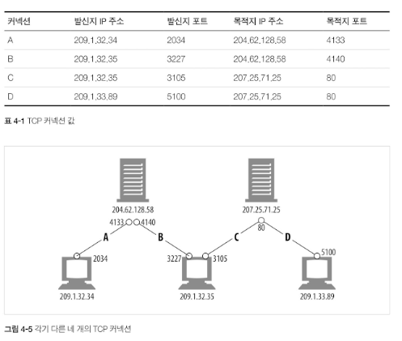

## 4.1.4 TCP 소켓 프로그래밍

운영체제는 TCP 커넥션의 생성과 관련된 여러 기능을 제공한다.
다음은 소켓 API의 주요 인터페이스인데, HTTP 프로그래머에게 TCP와 IP의 세부사항들을 숨긴다.

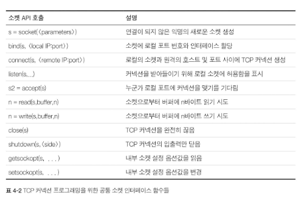

소켓 API를 사용하면, TCP 종단(endpoint) 데이터 구조를 생성하고, 원격 서버의 TCP 종단에 그 종단 데이터 구조를 연결하여 데이터 스트림을 읽고 쓸 수 있다.
TCP API는 기본적인 네트워크 프로토콜의 핸드셰이킹, 그리고 TCP 데이터 스트림과 IP 패킷 간의 분할 및 재조립에 대한 모든 세부사항을 외부로부터 숨긴다.

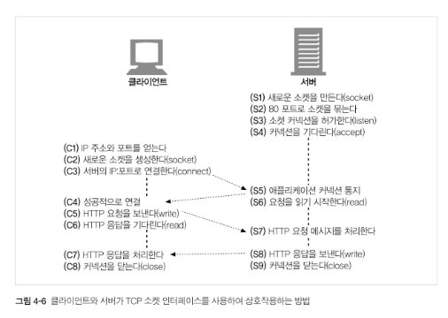

# 4.2 TCP의 성능에 대한 고려

HTTP는 TCP 바로 위에 있는 계층이기 때문에 HTTP 트랜잭션의 성능은 그 아래 계층인 TCP 성능에 영향을 받는다.

## 4.2.1 HTTP 트랜잭션 지연

다음 이미지는 HTTP 트랜잭션이 처리되는 과정이다.


트랜잭션을 처리하는 시간은 TCP 커넥션을 설정하고, 요청을 전송하고, 응답 메시지를 보내는 것에 비하면 상당히 짧다는 것을 알 수 있다.
클라이언트나 서버가 너무 많은 데이터르 내려받거나 복잡하고 동적인 자원들을 실행하지 않는 한, 대부분의 HTTP 지연은 TCP 네트워크 지연 때문에 발생한다.

HTTP 트랜잭션을 지연시키는 원인은 여러가지가 있다.
1. 클라이언트는 URI에서 웹 서버의 IP 주소와 포트 번호를 알아내야 한다. 만약 URI에 기술되어 있는 호스트에 방문한 적이 최근에 없으면, DNS 인프라를 사용하여 URI에 있는 호스트 명을 IP 주소로 변환하는데 수십 초의 시간이 걸릴 것이다.
2. 클라이언트는 TCP 커넥션 요청을 서버에게 보내고 서버가 커넥션 허가 응답을 회신하기를 기다린다. 커넥션 설정 시간은 새로운 TCP 커넥션에서 항상 발생한다. 보통 1~2초의 시간이 소요되지만, 수백 개의 HTTP 트랜잭션이 만들어지면 소요시간은 크게 증가할 것이다.
3. 커넥션이 맺어지면 클라이언트는 HTTP 요청을 새로 생성된 TCP 파이프를 통해 전송한다. 웹 서버는 데이터가 도착하는 대로 TCP 커넥션에서 요청 메시지를 읽고 처리한다. 요청 메시지가 인터넷을 통해 전달되고 서버에 의해서 처리되는데 까지는 시간이 소요된다.
4. 웹 서버가 HTTP 응답을 보내는 것 역시 시간이 소요된다.

TCP 네트워크 지연은 하드웨어의 성능, 네트워크와 서버의 전송 속도, 요청과 응답 메시지의 크기, 클라이언트와 서버 간의 거리에 따라 크게 달라진다. 
또한 TCP 프로토콜의 기술적인 복잡성도 지연에 큰 영향을 끼친다.

## 4.2.2. 성능 관련 중요 요소

 성능상의 문제르 포함해 HTTP 프로그래머에게 영향을 주는 가장 일반적인 TCP 관련 지연 요소는 다음과 같다.

- TCP 커넥션의 핸드셰이크 설정
- 인터넷의 혼잡을 제어하기 위한 TCP의 slow-start
- 데이터를 한데 모아 한 번에 전송하기 위한 네이글(nagle) 알고리즘
- TCP의 편승 확인응답을 위한 확인응답 지연 알고리즘
- TIME_WAIT 지연과 포트 고갈

## 4.2.3 TCP 커넥션 핸드셰이크 지연

어떤 데이터를 전송하든 새로운 TCP 커넥션을 열 때면, TCP 소프트웨어는 커넥션을 맺기 위한 조건으로 맞추기 위해 연속으로 IP 패킷을 교환한다.
작은 크기의 데이터 전송에 커넥션이 사용된다면 이런 패킷 교환은 HTTP 성능을 크게 저하 시킬 수 있다.

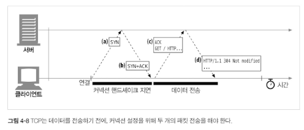

다음은 TCP 커넥션이 핸드셰이크를 하는 순서다.
1. 클라이언트는 새로운 TCP 커넥션을 생성하기 위해 작은 TCP 패킷(보통 40~60바이트)을 서버에게 보낸다. 그 패킷은 `SYN`라는 특별한 플래그를 가지는데, 이 요청이 커넥션 생성 요청이라는 뜻이다.
2. 서버가 그 커넥션을 받으면 몇 가지 커넥션 매개변수를 산출하고, 커넥션 요청이 받아들여졌음을 의미하는 `SYN`과 `ACK` 플래그를 포함한 TCP 패킷을 클라이언트에게 보낸다.
3. 마지막으로 클라이언트는 커넥션이 잘 맺어졌음을 알리기 위해서 서버에게 다시 확인 응답을 보낸다. 오늘 날의 TCP는 클라이언트가 이 확인응답 패킷과 함께 데이터를 보낼 수 있다.

HTTP 프로그래머는 이 패킷을 보이지 않게 TCP 소프트웨어가 관리하여 보지 못한다.
HTTP 프로그래머가 보는 것은 새로운 TCP 커넥션이 생성될 때 발생하는 지연이 전부다.
HTTP 트랜잭션이 아주 큰 데이터를 주고받지 않는 평범한 경우에는, `SYN`/`SYN+ACK 핸드셰이크가 눈에 띄는 지연을 발생시킨다.
TCP의 ACK 패킷의 HTTP 요청 메시지 전체를 전달할 수 있을 만큼 큰 경우가 많고, 많은 HTTP서버 응답 메시지는 하나의 IP 패킷에도 담길 수 있다.
결국 크기가 작은 작은 HTTP 트랜잭션은 50% 이상의 시간을 TCP를 구성하는데 쓴다.

## 4.2.4 확인응답 지연

인터넷 자체가 패킷 전송을 완벽히 보장하지는 않기 때문에(인터넷 라우터는 과부하가 걸렸을 때 패킷을 마음대로 파기할 수 있다.),
TCP는 성공적인 데이터 전송을 보장하기 위해서 자체적인 확인 체계를 가진다.

각 TCP 세그먼트는 순번과 데이터 무결성 체크섬을 가진다.
각 세그먼트의 수신자는 세그먼트를 온전히 받으면 작으면 확인응답 패킷을 송신자에게 반환한다.
만약 송신자가 특정 시간 안에 확인응답 메시지를 받지 못하면 패킷이 파기되었거나 오류가 있는 것으로 판단하고 데이터를 다시 전송한다.

확인응답은 그 크기가 작기 때문에, TCP는 같은 방향으로 송출되는 데이터 패킷에 확인응답을 편승시킨다.
TCP는 송출 데이터 패킷과 확인 응답을 하나로 묶음으로써 네트워크를 좀 더 호율적으로 사용한다.
확인 응답이 같은 방향으로 가는 데이터 패킷에 편승되는 경우를 늘리기 위해서, 많은 TCP 스택은 확인응답 지연 알고리즘을 구현한다.
확인 응답 지연은 송출할 확인 응답을 특정 시간동안(보통 0.1~0.2초) 버퍼에 저장해두고, 확인 응답을 편승시키기 위한 송출 데이터 패킷을 찾는다.
만약 일정 시간 안에 송출 데이터 패킷을 찾지 못하면 확인 응답은 별도 패캇을 만들어 전송된다.

안타깝게도, 요청과 응답 두 가지 형식으로만 이루어지는 HTTP 동작 방식은, 확인 응답이 송출 데이터 패킷에 편승할 기회를 감소시킨다.
막상 편승할 패킷을 찾으려고 하면 해당 방향으로 송출될 패킷이 많지 않기 때문에, 확인응답 지연 알고리즘으로 인한 지연이 자주 발생한다.
운영체제에 따라 다르지만, 지연의 원인이 되는 확인응답 지연 관련 기능을 수정하거나 비활성화할 수 있다.

TCP 스택에 있는 매개변수를 수정할 때는, 지금 무엇을 하고 있는지 항상 잘 알고 수정해야 한다.
TCP 내부 알고리즘은 잘못 만들어진 애플이케이션으로부터 인터넷을 보호하도록 설계되어 있다.

TCP 설정을 수정하려고 한다면, TCP의 내부 알고리즘이 피하려고 하는 문제를 애플리에키엿ㄴ이 발생시키지 않을 것이라고 확신할 수 있어야 한다.

## 4.2.5 TCP 느린 시작(slow start)

TCP의 데이터 전송 속도는 TCP 커넥션이 만들어진 지 얼마나 지났는지에 따라 달라질 수 있다.
TCP 커넥션은 시간이 지나면서 자체적으로 튜닝되어서, 처음에는 커넥션의 최대 속도를 제한하고 데이터가 성공적으로 전송됨에 따라서 속도 제한을 높여나간다.
이렇게 조율하는 것을 TCP 느린 시작(slow start)이라고 부르며, 이는 인터넷의 급작스러운 부하와 혼잡을 방지하는 데 쓰인다.

TCP 느린 시작은 TCP가 한 번에 전송할 수 있는 패킷의 수를 제한한다.
간단히 말해서, 패킷이 성공적으로 전달되는 각 시점에 송신자는 추가로 2개의 패킷을 더 전송할 수 있는 권한을 얻는다.
HTTP 트랜잭션에서 전송하 데이터의 양이 많으면 모든 패킷을 한 번에 전송할 수 없다.
그 대신 한 개의 패킷만 전송하고 확인 응답을 기다려야 한다.
확인 응답을 받으면 2개의 패킷을 보낼 수 있으며, 그 패킷 각각에 대한 확인응답을 받으면 총 4개의 패킷을 보낼 수 있게 된다.
이를 혼잡 윈도를 연다라고 한다.
이 혼잡제어 기능 떄문에 새로운 커넥션은 이미 어느 정도 데이터를 주고받은 튜닝된 커넥션보다 느리다.
튜닝된 커넥션은 HTTP에 존재하는 커넥션을 재사용하는 기능이 있어 더 빠르다.

## 4.2.6 네이글(Nagle) 알고리즘과 TCP_NODELAY

애플리케이션이 어떤 크기의 데이터든지 TCP 스택으로 전송할 수 있도록 TCP는 데이터 스트림 인터페이스를 제공한다.
하지만 각 TCP 세그먼트는 40바이트 상당의 플래그와 헤더를 포함하여 전송하기 때문에 TCP가 작은 크기의 데이터를 포함한 많은 수의 패킷을 전송한다면 네트워크의 성능은 크게 떨어진다.

네이글 알고리즘은 네트워크 효율을 위해서, 패킷을 전송하기 전에 많은 양의 TCP 데이터를 한 개의 덩어리로 합친다.(RFC896, "Congestion Control in IP/TCP internetworks" 참고)

네이글 알고리즘은 세그먼트가 최대 크기(패킷의 최대 크기는 LAN 상에서 1,500바이트 정도, 인터넷 상에서는 576바이트 정도)가 되지 않으면 전송을 하지 않은다.
다만 다른 모든 패킷이 확인 응답을 받았을 경우에는 최대 크기보다 작은 패킷의 전송을 허락한다.
다른 패킷들이 아직 전송 중이면 데이터는 버퍼에 전송된다.
전송되고 나서 확인 응답을 기다리던 패킷이 확인 응답을 받았거나 전송하기 충분할 만큼의 패킷이 쌓였을 때 버퍼에 저장되어 있던 데이터가 전송된다.

네이글 알고리즘은 HTTP 성능 관련해 여러 문제를 발생시킨다.
1. 크기가 작은 HTTP 메시지는 패킷을 채우지 못하기 떄문에, 앞으로 생길지 생기지 않을지 모르는 추가적인 데이터를 기다리며 지연될 것이ㅏㄷ.
2. 네이글 알고리즘은 확인 으답 지연과 함께 쓰일 경우, 확인 응답이 도착할 때까지 데이터를 전송을 멈추고 있는 반면, 확인 응답 지연 알고리즘은 확인응답을 100~200밀리초 지연시킨다.

HTTP 애플리케이션은 성능 향상을 위해서 HTTP 스택에 TCP_NODELAY 파라미터 값을 설정하여 네이글 알고리즘을 비활성화하기도 한다.
이 설정을 했다면, 작은 크기의 패킷이 너무 많이 생기지 않도록 큰 크기의 데이터 덩어리를 만들어야 한다.

## 4.2.7 TIME_WAIT의 누적과 포트 고갈

TIME_WAIT 포트 고갈은 성능 측정 시에 심각한 성능 저하를 발생시키지만, 보통 실제 상황에서는 문제를 발생시키지 않는다.
TCP 커넥션의 종단에서 TCP 커넥션을 끊으면, 종단에서는 커넥션의 IP 주소와 포트 번호를 메모리의 작은 제어 영역(control block)에 저장한다.
이 정보는 같은 주소와 포트를 사용하는 새로운 TCP 커넥션이 일정 시간 동안에는 생성되지 않게 하는데, 보통 세그먼트의 최대 생명주기에 두배 정도(2MSL이라고 불리며 보통 2분 정도)의 시간 동안만 유지된다.
이는 이전 커넥션과 관련된 패킷이 그 커넥션과 같은 주소와 포트를 가지는 새로운 커넥션에 삽입되는 문제를 방지한다.
실제로 이 알고리즘은 특정 커넥션이 생성되고 닫힌 다음, 그와 같은 IP 주소와 포트 번호를 가지는 커넥션이 2분 이내에 또 생성되는 것을 막아준다.
현대의 빠른 라우터들 덕분에 커넥션이 닫힌 후에 중복되는 패킷이 생긱는 경우는 거의 없어졌다.
2SML을 더 짧은 값으로 수정하는 OS도 있지만 이 값 수정은 조심해야 한다.
이전 커넥션의 패킷이 그 커넥션과 같은 연결 값으로 생성된 커넥션에 삽입되면, 패킷은 중복되고 TCP 데이터는 충돌할 것이다.

일반적으로 2MSL의 커넥션 종료 지연이 문제가 되지는 않지만, 성능 시험을 하는 상황에서는 문제가 될 수 있다.
성능 측정 대상 서버는 클라이언트가 접속할 수 있는 IP 주소의 개수를 제한하고, 그 서버에 접속하여 부하를 발생시킬 컴퓨터의 수는 적기 떄문이다.
게다가 일반적으로 서버는 HTTP의 기본 TCP 포트인 80번을 사용한다.
이런 상황에서는 가능한 연결의 조합이 제한되며, TIME_WAIT로 인해서 순간수간 포트를 재활용하는 것이 불가능해진다.
각각 한 개의 클라이언트와 웹 서버가 있고, TCP 커넥션을 맺기 위한 네 개의 값이 있다고 해보자.

<발신지 IP 주소, 발신지 포트, 목적지 IP 주소, 목적지 포트>

이 중에서 세 개는 고정되어 있고 발신지 포트만 변경할 수 있다.

<클라이언트 IP, 발신지 포트, 서버 IP, 80>

클라이언트가 서버에 접속할 때마다, 유일한 커넥션을 생성하기 위해서 새로운 발신지 포트를 쓴다.
하지만 사용할 수 있는 발신지 포트의 수는 제한되어 있고(6만개로 가정) 2MSL초 동안(120초로 가정) 커넥션이 재사용될 수 없으므로, 초당 500개(60,000 / 120 = 500)로 커넥션이 제한된다.
서버가 초당 500개 이상의 트랜잭션을 처리할 만큼 빠르지 않다면 TIME_WAIT 포트 고갈은 일어나지 않는다.
이 문제를 해결하기 위해 부하를 생성하는 장비를 더 많이 사용하거나 클라이언트와 서버가 더 많은 커넥션을 맺을 수 있도록 여러 개의 가상 IP 주소를 쓸 수도 있다.

포트 고갈 문제를 겪지 않더라고, 커넥션을 너무 많잉 맺거나 대기 상태로 있는 제어 블록이 너무 많아지는 상황은 주의해야 한다.
커넥션이나 제어 블록이 너무 많이 생기면 극심하게 느려지는 OS도 있다.

# 4.3 HTTP 커넥션 관리

## 4.3.1 흔히 잘못 이해하는 Connection 헤더

HTTP는 클라이언트와 서버 사이에 프락시 서버, 캐시 서버 등과 같은 중개 서버가 놓이는 것을 허락한다.
HTTP 메시지는 클라이언트에서 서버(혹은 리버스 서버)까지 중개 서버들을 하나하나 거치면서 전달된다.

어떤 경우에는, 두 개의 인접한 HTTP 애플리케이션이 현재 맺고 있는 커넥션에만 적용될 옵션을 지정해야 할 때가 있다.
HTTP Connection 헤더 필드는 커넥션 토큰을 쉼표로 구분하여 가지고 있으며 그 값들은 다른 커넥션에 전달되지 않는다.

Connection 헤더에는 다음 세 가지 종류의 도큰이 전달될 수 있다.
- HTTP 헤더 필드명: 커넥션에 해당되는 헤더들을 나열한다.
- 임서직인 토큰 값은 커넥션에 대한 비표준 옵션을 의미한다.
- close 값은 커넥션이 작업이 완려되면 종료되엉야 함을 의미한다.

커넥션 토큰이 HTTP 헤더 필드 명을 가지고 있으면, 해당 필드들은 현재 커넥션만을 위한 저옵이므로 다음 커넥션에 전달하면 안된다. 
Connection 헤더에 있는 모든 헤더 필드는 메시지를 다른 고승로 전달하는 시점에 삭제되어야 한다.

Connection 헤더에는 홉별(hop-by-hop) 헤더 명을 기술하는데, 이것을 헤더 보호하기라 한다.
Connection 헤더에 명시된 헤더들이 전달되는 것을 방지하기 때문이다.

HTTP 애플리케이션이 Connection 헤더와 함께 메시지를 전달받으면, 수신자는 송신자에게서 온 요청에 기술되어 있는 모든 옵션을 적용한다.
그리고 홉에 메시지를 전달하기 전에 Connection 헤더와 Connection 헤더에 기술되어 있는 모든 헤더 필드를 삭제한다.
또한 Connection 헤더에 기술되어 있지는 않더라도 홉별 헤더인 것들도 있따.
예를 들면 Proxy-Authenticate, Proxy-Connection, Transfer-Encoding, Upgrade 같은 것이다.

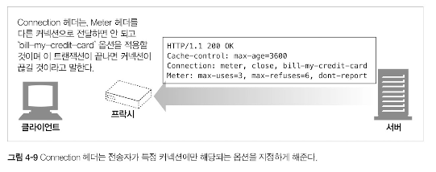

## 4.3.2 순차적인 트랜잭션 처리에 의한 지연

커넥션 관리가 제대로 이루어지지 않으면 TCP 성능이 매우 안 좋아질 수 있다.
예를 들어 3개의 이미지가 있는 웹 페이지가 있다고 해보자.
브라우저가 이 페이지를 보여주려면 네 개의 HTTP 트랜잭션을 만들어야 한다.
하나는 해당 HTML을 받기 위해, 나머지 세 개는 첨부된 이미지를 받기 위한 것이다.
각 트랜잭션이 새로운 커넥션을 필요로 한다면, 커넥션을 맺는데 발생하는 지연과 함께 느린 시작 지연이 발생할 것이다.

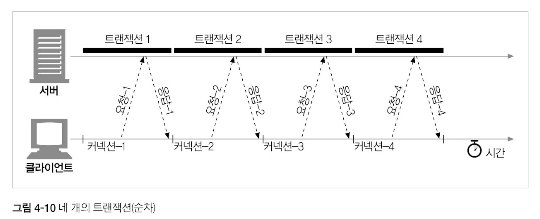

순차적인 처리로 인한 지연에는 물리적인 지연뿐 아니라, 하나의 이미지를 내려받고 있는 중에는 웹페이지의 나머지 공간에 아무런 변화가 없어서 느껴지는 심리적인 지연도 있다.
사용자는 여러 개의 이미지가 동시에 로드되는 것을 더 좋아한다.

순차적으로 로드하는 방식은 특정 브라우저의 경우 객체를 화면에 배치하려면 객체의 크기를 알아야 하기 때문에 모든 객체를 내려받기 전까지는 텅 빈 화면을 보여준다는 것이다.
이 경우 브라우저는 객체들을 연속해서 하나씩 내려받는 것이 효율적이겠으나, 사용자는 어떻게 진행되고 있는지 모르는 상태로 흰색의 텅 빈화면만 보게 된다.
HTTP 커넥션의 성능을 향상시킬 수 있는 여러 최신 기술이 있다.
이제 그런 기술 네 가지에 대해서 알아보자.

- 병렬(parallel) 커넥션: 여러 개의 TCP 커넥션을 통한 동시 HTTP 요청
- 지속(persist) 커넥션: 커넥션을 맺고  끊는 데서 발생하는 지연을 제거하기 위한 TCP 커넥션의 재활용
- 파이프라인(pipelining) 커넥션: 공유 TCP 커넥션을 통한 병렬 HTTP 요청
- 다중(multiplexed) 커넥션: 요청과 응답들에 대한 중재(실험적인 기술이다)

# 4.4 병렬 커넥션

HTTP는 클라이언트가 여러 개의 커넥션을 동시에 열어서 HTTP 트랜잭션을 병렬로 처리할 수 있게 한다.

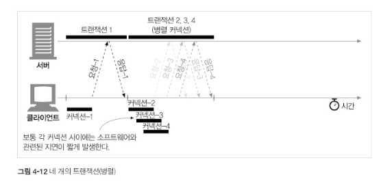

## 4.4.1 병렬 커넥션은 페이지를 더 빠르게 내려받는다.

단일 커넥션의 대역폭 제한과 커넥션이 동작하지 않고 있는 시간을 활용하면, 객체가 여러 개 있는 웹페이지를 더 빠르게 내려받을 수 있다.
하나의 커넥션으로 객체들을 로드할 때의 대역폭 제한과 대기 시간을 줄일 수 있다면 더 빠르게 로드할 수 있을 것이다.
각 커넥션의 지연 시간을 겹치게 하면 총 지연 시간을 줄일 수 도 있고, 클라이언트의 인터넷 대역폭을 한 개의 커넥션이 다 써버리는 것이 아니라면 나머지 객체를 내려받는 데에 남은 대역폭을 사용할 수 있다.
병렬로 내려받아 커넥션 지연이 겹쳐짐으로 총 지연시간이 줄어든다.

## 4.4.2 병렬 커넥션이 항상 더 빠르지는 않다.

클라이언트의 네트워크 대역폭이 좁을 때, 대부분 시간을 데이터 전송하는 데만 사용할 것이다.
여러 개의 객체를 병렬로 내려바는 경우, 이 제한된 대역폭 내에서 각 객체를 전송받는 것은 느리기 떄문에 성능상의 장점은 거의 없어진다.

또한 다수의 커넥션은 메모리를 많이 소모해서 자체적인 성능 문제를 발생시킨다.
브라우저는 병렬 커넥션을 사용하긴 하지만 적은 수(대부분6~8개)의 커넥션만을 허용한다.
서버는 특정 클라이언트로부터 과도한 수의 커넥션이 맺어졌을 경우, 그것을 임의로 끊어버릴 수 있다.

## 4.4.3 병렬 커넥션은 더 빠르게 느껴질 수  있다.

병렬 커넥션이 실제로 페이지를 더 빠르게 내려 받는 것은 아지만 사용자는 더 빠르게 내려받고 있는 것처럼 느낄 수 있다.

# 4.5 지속 커넥션

웹 클라이언트는 보통 같은 사이트에 여러 개의 커넥션을 맺는다.
서버에 HTTP 요청을 하기 시작한 애플리케이션은 웹페이지 내의 이미지 등을 가져오기 위해서 그 서버에 또 요청하게 될 것이다.
이 속성을 사이트 지역성(site locality)이라 부른다.
따라서 HTTP/1.1을 지원하는 기기는 처리가 완료된 후에도 TCP 커넥션을 유지하여 앞으로 있을 HTTP 요청에 재사용할 수 있다.
처리가 완료된 후에도 계속 연결된 상태로 있는 TCP 커넥션을 지속 커넥션이라고 부른다.
지속 커넥션은 클라이언트나 서버가 커넥션을 끊기 전까지는 트랜잭션 간에도 커넥션을 유지한다.

해당 서버에 이미 맺어져 있는 지속 커넥션을 재사용함으로써, 커넥션을 맺기 위한 준비작업에 따른는 시간을 절약할 수 있다.
게다가 이미 맺어져 있는 커넥션은 TCP의 느린 시작으로 인한 지연을 피함으로써 더 빠르게 데이터를 전송할 수 있다.

## 4.5.1 지속 커넥션 vs 병렬 커넥션

병렬 커넥션은 여러 객체가 있는 페이지를 더 빠르게 전송한다.
하지만 단점이 몇 가지 있다.
- 각 트랜잭션마다 새로운 커넥션을 맺고 끊기 때문에 시간과 대역폭이 소요된다.
- 각각의 새로운 커넥션은 TCP 느린 시작 때문에 성능이 떨어진다.
- 실제로 연결할 수 있는병렬 커넥션의 수는 제한이 있다.

지속 커넥션은 병렬 커넥션에 비해 몇 가지 장점이 있다.
- 커넥션을 맺기 휘한 사전 작업과 지연 시간을 줄여주고, 튜닝된 커넥션을 유지하며, 커넥션의 수를 줄여준다.
- 하지만 지속 커넥션을 잘못 관리할 경우, 계속 연결된 상태로 있는 수많은 커넥션이 쌓이게 될 것이다.
- 이는 로컬의 리소스 그리고 원격의 클라이언트와 서버의 리소스에 불필요한 소모를 발생시킨다.

지속 커넥션은 병렬 커넥션과 함께 사용될 때에 가장 효과적이다.
오늘날 많은 웹 어플리케이션은 적은 수의 병렬 커넥션만을 맺고 그것을 유지한다.
두 가지 지속 커넥션 타입이 있는데, HTTP/1.0+에는 keep-alive 커넥션이 있고 HTTP/1.1에는 지속 커넥션이 있다.

## 4.5.2 HTTP/1.0+의 keep-alive 커넥

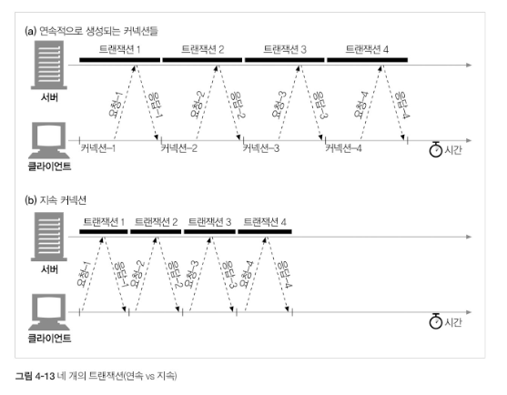

위 그림에서 네 개의 같은 HTTP 트랜잭션에 대해서, 연속적으로 네 개의 커넥션을 생성하여 처리하는 방식과 하나의 지속 커넥션으로만 처리하는 방식을 비교했다.
커넥션을 맺고 끊는 데 필요한 작업이 없어서 시간이 단축되었다.

## 4.5.3 keep-alive 동작

keep-alive는 사용하지 않기로 결정되어 HTTP/1.1 명세에서 빠졌다.
하지만 아직도 브라우저와 서버 간에 keep-alive 핸드셰이크가 널리 사용되고 있기 때문에 HTTP 어플리케이션은 그것을 처리할 수 있게 개발해야 한다.

HTTp/1.0 keep-alive 커넥션을 구현한 클라이언트는 커넥션을 유지하기 위해서 요청에 Connection:Keep-Alive 헤더를 포함시킨다.
이 요청을 받은 서버는 그 다음 요청도 이 커넥션을 통해 받고자 한다면, 응답 메시지에 같은 헤더를 퐇마시켜 응답한다.
응답에 Connectionㅇ: Keep-Alive가 없으면, 클라이언트는 서버가 keep-alvie를 지원하지 않으며, 응답 메시지가 전송되고 나면 서버 커넥션을 끊을 것이라 추정한다.

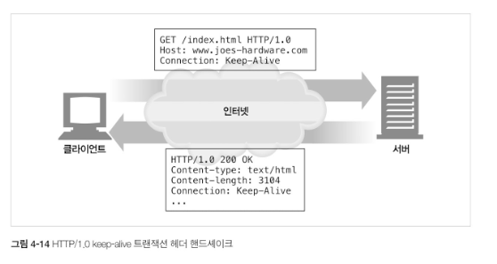

## 4.5.4 keel-alive 옵션

keep-alive 헤더는 커넥션을 유지하기를 바라는 요청일 뿐이다. 클라이언트와 서버는 무조건 그것을 따를 필요는 없다.
언제든지 현재의 keep-alive 커넥션을 끊을 수 있으며 keep-alive 커넥션에서 처리되는 트랜잭션의 수를 제한할 수 도 있다.
keep-alive의 동작은 keep-alive 헤더로 제어할 수 있다.

- timeout은 keep-alive 응답 헤더를 통해 보낸다. 이는 커넥션이 얼마나 유지될 것인지를 의미한다.
- max는 keep-alive 응답 헤더를 통해 보낸다. 이는 커넥션이 몇 개의 HTTP 트랜잭션을 처리할 때까지 유지될 것인지를 의미한다.
- keep-alive 헤더는 진단이나 디버깅을 주목적으로 하는, 처리되지는 않는 임의의 속성들을 지원하기도 한다.

keep-alive 헤더 사용은 선택 사항이지만, Connection:Keep-Alive 헤더가 있을 때만 사용할 수 있다.

다음 예는 서버가 5개의 추가 트랜잭션이 처리될 동안 커넥션을 유지하거나 2분 동안 커넥션을 유지하라는 내용의 Keep-Alive의 응답 헤더다

```http request
Connectino: Keep-Alive
Keep-Alive: max=5, timeout=120
```

## 4.5.5 keep-alive 커넥션 제한과 규칙

- keep-alive 커넥션은 HTTP/1.0+에서만 지원된다.
- 커넥션을 유지하기 위해서, 클라이언트는 요청에 Connection:Keep-Alive 헤더를 포함시켜야 한다.
- 클라이언트는 Connection:Keep-Alive 응답 헤더가 없는 경우, 서버가 keep-alive를 지원하지 않는다고 추정한다.
- 커넥션이 끊어지기 전에 엔터티 본문의 끝을 알리는 Content-Length 헤더가 필요하다. 이는 트랜잭션이 끝나는 시점을 알리기 위해서다.
- 프록시와 게이트 웨이는 Connection 헤더의 규칙을 지켜야 하며, 게이트 웨이는 메시지를 전달하거나 캐시에 넣기 전에 Connection 헤더에 기술된 모든 헤더 필드를 삭제해야 한다.
- keep-alive 커넥션은 Connection 헤더를 인식하지 못하는 dumb 프록시로 인한 문제를 예방하기 위해 맺어지면 안된다.
- 기술적으로 HTTP/1.0을 따르는 기기로부터 받는 모든 Connection 헤더 필드는 무시해야한다. 오래된 프록시 서버에서 실수로 전달 될 수 있기 때문이다.
- 클라이언트는 응답 전체를 모두 받기 전에 끊어졌을 경우, 요청이 반복되는 문제를 방지하기 위해 별다른 문제가 없으면 요청을 다시 보낼 수 있게 해야 한다.

## 4.5.6 keep-alive와 dumb 프록시

웹 클라이언트 요청에 Connection: Keep-Alive 헤더가 있으면, 클라이언트가 현재 연결하고 있는 TCP 커넥션을 유지하기를 바란다는 뜻이다.
헤더 이름이 connection인 것도 이 때문이다.
클라이언트가 웹 서버에 요청을 보내려는 중이라면, 그 요청으로 생긴 커넥션이 keep-alive가 되기를 원한다는 의미로, Connection: Keep-Alive 헤더를 포함시킨다.
서버가 keep-alive를 지원한다면, 응답 메시지에 Connection: Keep-Alive 헤더를 포함시켜서 응답할 것이고, 지원하지 않는다면 포함하지 않을 것이다.

특히 문제는 프록시에서 시작되는데 프록시는 Connection 헤더를 이해하지 못해서 해당 헤더들을 삭제하지 않고 요청 그대로를 다음 프록시에 전달한다.
오래되고 단순한 숨낳은 프록시들이 Connection 헤더에 대한 처리없이 요청을 그대로 전달한다.

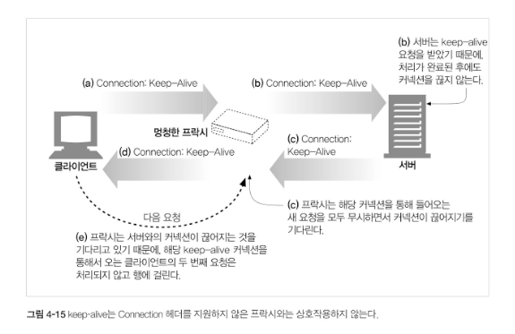

이런 종류의 잘못된 통신을 피하려면, 프록시는 Connection 헤더와 Connection 헤더에 명시된 헤더들은 절대 전달하면 안 된다.
따라서 프록시가 Connection: Keep-Alive 헤더를 받으면 Connection 헤더뿐만 아니라 Keep-Alive란 이름의 헤더도 전달하면 안된다.
또한, Connection 헤더의 값으로 명시되지 않는, 홉별 헤더들 역시 전달하거 명시하면 안된다.

## 4.5.7 Proxt-Connection 살펴보기

넷스케이프의 브라우저 및 프록시 개발자들이 웹 어플리케이션이 HTTP 최신 버전을 지원하지 않아도, 모든 헤더를 무조건 전달하는 문제를 해결하는 기발한 차선책을 제시하였다.
그 차선책은, 클라이언트의 요청이 중개 서버를 통해 이어지는 경우 모든 헤더를 무조건 전달하는 문제를 해결하기 위해 Proxy-Connection이라는 헤더를 사용하는 것이다.
멍청한 프록시는 Connection: Keep-Alive 같은 홉별 헤더를 무조건 전달하기 때문에 문제를 일으킨다. 홉별 헤더들은 한 개의 특정 커넥션에서 쓰이고 그 이후에는 전달하면 안 된다.
홉별 헤더를 전달받은 서버가 그 헤더를 자신과 프록시 간의 커넥션에 대한 것으로 오해하면서 문제가 생기는 것이다.

넷스케이프는 멍청한 프록시 문제를 해결하기 위해 브라우저에서 일반적으로 전달하는 Connection 헤더 대신 비표준 Proxy-Connection 확장 헤더를 프록시에게 전달한다.
프록시가 Proxy-Connection 헤더를 전달하더라고 웹서버는 그것을 무시하기 때문에 별 문제가 되지 않는다.

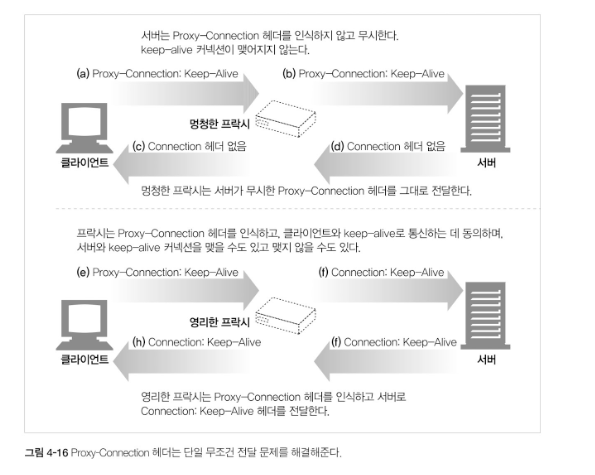

이 방식은 클라이언트와 서버 사이에 한 개의 프락시만 있는 경우에서만 동작한다.

하지만 멍청한 프록시 옆에 영리한 프록시가 있다면 잘못된 헤더를 만들어내는 문제가 다시 발생한다.

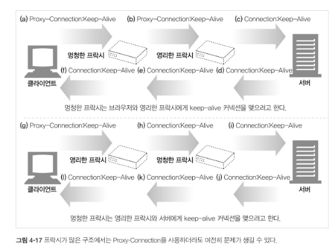

게다가 문제를 발생시키는 프록시들은 방화벽, 캐시 서버, 혹은 리버스 프록시 서버 가속기와 같이 네트워크 상에서 보이지 않는 경우가 많다.
브라우저는 이러한 기기들을 볼 수 없으므로, Proxy-Connection 헤더를 보내지 못한다.
보이지 않는 웹 애플리케이션들이 지속 커넥션을 명확히 구현하는 것은 중요하다.

## 4.5.8 HTTP/1.1의 지속 커넥션

HTTP/1.1에서는 keep-alive 커넥션을 지원하지 않는 대신, 설계가 더 개선된 지속 커넥션을 지원한다.
HTTP/1.0과 달리 기본으로 활성화 되어있고, 별도 설정하지 않는 한 모든 커넥션을 지속 커넥션으로 취급한다.
트랜잭션이 끝난 다음 커넥션을 끊으려면 애플리케이션은 Connection: close 헤더를 명시해야 한다.
Connection: close를 보내지 않으면 서버는 클라이언트가 커넥션을 계속 유지하자는 것으로 추정하지만 영원히 유지하겠다는 것을 뜻하지는 않는다.

## 4.5.9 지속 커넥션의 제한과 규칙

- 클라이언트가 요청에 Connection: close 헤더를 포함시키면, 클라이언트는 그 커넥션으로 추가 요청을 보낼 수 없다.
- 클라이언트가 해당 커넥션으로 추가적인 요청을 보내지 않으것이라면 Connection: close 헤더를 보내야 한다.
- 커넥션에 있는 모든 메시지가 자신의 길이 정보를 정확히 가지고 있을 때에만 커넥션을 지속 시킬 수 있다.
- HTTP/1.1 프록시는 클라이언트와 서버 각각에 대해 별도의 지속 커넥션을 맺고 관리해야 한다.
- HTTP/1.1 프록시 서버는 클라이언트가 커넥션 관련 기능에 대한 클라이언트의 지원 범위를 알고 있지 않은 한 지속 커넥션을 맺으면 안된다.
- 서버는 메시지를 전송하는 중간에 커넥션을 끊지 않을 것이고 커넥션을 끊기 전에 적어도 한 개의 요청에 대해 응답을 할 것이긴 하지만, HTTP/1.1 기기는 Connection 헤더의 값과는 상관없이 언제든지 커넥션을 끊을 수 있다.
- HTTP/1.1 애플리케이션은 중간에 끊어지는 커넥션을 복구할 수 있어야만 한다. 클라이언트는 다시 보내도 문제가 없는 요청이라면 가능한 한 다시 보내야 한다.
- 클라이언트는 전체 응답을 받기 전에 커넥션이 끊어지면, 요청을 반복해서 보내도 문제가 없는 경우에는 요청을 다시 보낼 준비가 되어 있어야 한다.
- 하나의 사용자 클라이언트는 서버의 과부하를 방지하기 위해서, 넉넉잡아 두 개의 지속 커넥션만을 맺어야 한다. 

## 4.6 파이프라인 커넥션

HTTP/1.1은 지속 커넥션을 통해서 요청을 파이프라이닝할 수 있다.
이는 keep-alive 커넥션의 성능을 더 높여준다.
여러 개의 요청은 응답이 도착하기 전까지 큐에 쌓인다.
첫 번째 요청이 네트워크를 통해 지구 반대편에 있는 서버로 전달되면 거기에 이어 두 번째와 세 번째 요청이 전달될 수 있다.
이는 대기 시간이 긴 네트워크 상황에서 네트워크상의 왕복으로 인한 시간을 줄여서 성능을 높여준다.

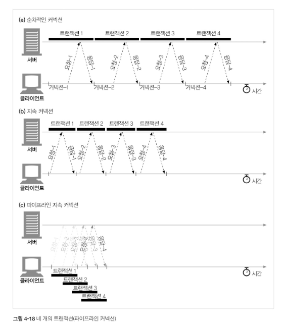

위 그림에서는 지속 커넥션이 어떻게 TCP 커넥션 지연을 제거하며, 파이프라인을 통한 요청이 어떻게 전송 대기 시간을 단축시키는지 보여준다.

파이프 라인에는 여러 가지 제약 사항이 있다.
- HTTP 클라이언트는 커넥션이 지속 커넥션인지 확인 전까지는 파이프라인을 이어서는 안된다.
- HTTP 응답은 요청 순서와 같게 와야 한다. HTTP 메시지는 순번이 매겨져 있지 않아서 응답이 순서 없이 오면 순서에 맞게 정렬시킬 방법이 없다.
- HTTP 클라이언트는 커넥션이 언제 끊어지더라도, 완료되지 않은 요청이 파이프라인에 있으면 언제든 다시 요청을 보낼 준비가 되어 있어야 한다. 클라이언트가 지속 커넥션을 맺고 나서 바로 10개의 요청을 보낸다고 해도 서버는 5개의 요청만 처리하고 커넥션을 임의로 끊을 수 있다. 남은 5개의 요청은 실패할 것이고 클라이언트는 예상치 못하게 끊긴 커넥션을 다시 맺고 요청을 보낼 수 있어야 한다.
- HTTP 클라이언트는 POST 요청같이 반복해서 보낼 경우 문제가 생기는 요청은 파이프라인을 통해 보내면 안된다. 에러가 발생하면 파이프라인을 통한 요청 중에 어떤 것들이 서버에서 처리되었는지 클라이언트가 알 방법이 없다. POST와 같이 비멱등 요청을 재차 보내면 문제가 생길 수있기 때문에 문제가 있는 상황에서 그런 위험한 메서드로 요청을 보내서는 안된다.

# 4.7 커넥션 끊기에 대한 미스터리

커넥션이 언제 어떻게 끊는가에는 명확한 기준이 없고 그에 관한 기술 문서도 별로 없다.

## 4.7.1 마음대로 커넥션 끊기

어떠한 HTTP 클라이언트, 서버, 혹은 프록시든 언제든지 TCP 전송 커넥션을 끊을 수 있다.
보통 커넥션은 메시지를 다 보낸 다음 끊지만, 에러가 있는 상황에서는 헤더의 중간이나 다른 엉뚱한 곳에서 끊길 수 있다.

이 상황은 파이프라인 지속 커넥션에서와 같다. HTTP 애플리케이션은 언제든지 지속 커넥션을 임의로 끊을 수 있다.
예를 들어, 지속 커넥션이 일정 시간 동안 요청을 전송하기 않고 유휴 상태에 있으면 서버는 그 커넥션을 끊을 수 있다.
하지만 서버가 그 유휴상태에 있는 커넥션을 끊는 시점에 서버는 클라이언트가 데이터를 전송하지 않을 것이라고 확신하지 못한다. 만약 이 일이 벌어지면 클라이언트는 그 요청 메시지를 보내는 도중에 문제가 생긴다.

## 4.7.2 Content-Length와 Truncation

각 HTTP 응답은 본문의 정확한 크기 값을 가지는 Content-Length 헤더를 가지고 있어야 한다.
일부 오래된 HTTP 서버는 자신이 커넥션을 끊으면 데이터 전송이 끝났음을 의미하는 형태로 개발되어 있기 때문에
Content-Length 헤더를 생략하거나 잘못된 길이 정보로 응답하는 경우도 있다.
클라이언트나 프록시가 커넥션이 끊어졌다는 HTTP 응답을 받은 후, 실제 전달된 엔터티의 길이와 Content-Length의 값이 일치하지 않거나 Content-Length 자체가 존재하지 않으면
수신자는 데이터의 정확한 길이를 서버에게 물어봐야 한다. 
만약 수신자가 캐시 프록시일 경우 응답(잠재적인 에러가 복합적으로 ㅂ라생하는 것을 최소화하기 위해)을 캐시하면 안된다.
프록시는 Content-Length를 정정하려하지 말고 메시지를 받은 그대로 전달해야 한다.

## 4.7.3 커넥션 끊기의 허용, 재시도, 멱등성

커넥션은 심지어 에러가 없더라도 언제든 끊을 수 있다.
HTTP 애플리케이션은 예상치 못하게 커넥션이 끊어졌을 때에 적절히 대응할 수 있는 준비가 되어 있어야 한다.
클라이언트가 트랜잭션을 수행 중에 전송 커넥션이 끊기게 되면, 클라이언트는 그 트랜잭션을 재시도 하더라도 문제가 없다면 커넥션을 다시 맺고
한 번 더 전송을 시도해야 한다.
그 상황은 파이프라인 커넥션에서 좀 더 어려워진다. 
클라이언트는 여러 요청을 큐에 쌓아 놓을 수 있지만, 서버는 아직 처리되지 않고 스케줄이 조정되어야 하는 요청들을 남겨둔 채로 커넥션을 끊어버릴 수도 있다.
그로 인한 부작용들을 조심해야 한다. 어떤 요청 데이터가 전송되었지마느 응답이 오기 전에 커넥션이 끊기면 클라이언트는 실제로 서버에서 얼마만큼 요청이 처리되었는지 전혀 알 수 없다.
정적인 HTML 페이지를 GET 하는 부류의 요청들은 반복적으로 요청하더라도 결과적으로 아무런 영향을 끼치지 않는다.
반면 온라인 서점에 주문을 POST 하는 부류의 요청들은 반복될 경우 주문이 여러 번 중복될 것이기 때문에 반복은 피해야 한다.

한 번 혹은 여러 번 실행됐는지에 상관없이 같은 결과를 반환한다면 그 트랜잭션은 멱등하다고 한다. 
GET, HEAD, PUT, DELETE, TRACE 그리고 OPTIONS 메서들은 멱등하다고 이해하면 된다.
클라이언트는 POST와 같이 멱등이 아닌 요청은 파이프라인을 통해 요청하면 안 된다.
그렇지 않으면 전송 커넥션이 예상치 못하게 끊어져 버렸을 때, 알 수 없는 결과를 초래할 수 있다.
비멱등인 요청을 다시 보내야 한다면, 이전 요청에 대한 응답을 받을 때까지 기다려야 한다.
비멱등인 메서드나 순서에 대해 에이준트가 요청을 다시 보낼 수 있도록 기능을 제공한다 하더라도, 자동으로 재시도하면 안된다.
예를 들어 대부분 브라우저는 캐시된 POST 요청 페이지를 다시 로드하려고 할 때, 요청을 다시 보내기를 원하는지 묻는 대화상즈를 보여준다.

## 4.7.4 우아한 커넥션 끊기


TCP 커넥션은 위 그림과 같이 양방향이다. TCP 커넥션의 양쪽에는 데이터를 읽거나 쓰기 위한 입력 큐와 출력 큐가 있다.
한쪽 출력 큐에 있는 데이터는 다른 쪽이 입력 큐에 보내질 것이다.

애플리케이션은 TCP 입력 채널과 출력 채널 중 하 개만 끊거나 둘 다 끊을 수 있다.
close()를 호출하면 TCP 커넥션의 입력 채널과 출력 채널의 커넥션을 모두 끊는다.
이를 전체 끊기라고 한다. 입력 채널이나 출력 채널 중에 하나를 개별적으로 끊으려면 shutdown을 호출하면 된다.

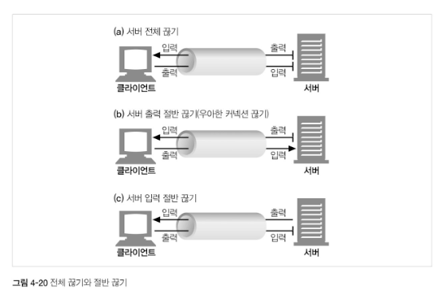

단순한 HTTP 애플리케이션은 전체 끊기만을 사용할 수 있지만 애플리케이션이 각각 다른 HTTP 클라이언트, 서버, 프록시와 통신할 때
그리고 그들과 파이프라인 지속 커넥션을 사용할 때 기기들에 예상치 못한 쓰기 에러를 발생하는 것을 예방하기 위해 절반 끊기를 사용해야 한다.

보통은 커넥션의 출력 채널을 끊는 것이 안전하다.
커넥션의 반대편에 있는 기기는 모든 데이터를 버퍼로부터 읽고 나서 데이터 전송이 끝남과 동시에 당신이 커넥션을 귾었다는 것을 알게 될 것이다.
클라이언트에서 더는 데이터를 보내지 않을 것임을 확신할 수 없는 이상,
커넥션의 입력 채널을 끊는 것은 위험하다.
만약 클라이언트에서 이미 끊긴 입력 채널에 데이터를 전송하면 서버의 OS는 TCP connection rest by peer 메시지를 클라이언트에게 보낼 것이다.
대부분 OS는 이것을 심각한 에러로 취급하여 버퍼에 저장된 아직 읽히지 않은 데이터를 모두 삭제한다.
이러한 상황은 파이프라인 커넥션에서는 더 악화된다.

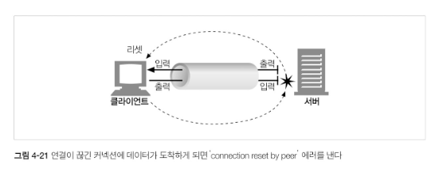

10개의 요청을 파이프라인 지속 커넥션을 통해 전송하였고, 이미 응답은 OS의 버퍼에 있지만 아직은 애플리케이션이 읽지는 않았다고 해보자.
그러고 나서 당신은 11번째 요청을 보냈지만 서버는 이 커넥션을 충분히 오래 유지되었다고 한단하고 연결을 끊어버렸다고 하자.
11번째 요청을 이미 종료된 커넥션에 보냈기 때문에 서버는 요청을 처리하지 않고 connection reset by peer 메시지로 응답한다.
이 리셋 메시지는 입력 버퍼에 있는 데이터를 지운다.
결론적으로 데이터를 읽으려 하면 에러를 받게 될 것이고, 응답 데이터가 당신의 기기에 잘 도착했어도 아직 읽히지 않은 버퍼에 있는 응답데이터는 사라지게 된다.

HTTP 명세에서는 클라이언트나 서버가 예기치 않게 커넥션을 끊어야 한다면 우아하게 끊어야 한다라고 하지만 정작 그 방법은 설명하지 않고 있다.
일반적으로 애플리케이션이 우아한 커넥션 끊기를 구현하는 것은 애플리케이션 자신의 출력 채널을 먼저 끊고 다른 쪽에 있는 기기의 출력 채널이 끊기는 것을 기다리는 것이다.
양쪽에서 더는 데이터를 전송하지 않을 것이라고 알려주면 커넥션은 리셋의 위험 없이 온전히 종료된다.
안타깝게도 상대방이 절반 끊기를 구현했다는 보장도 없고 절반 끊기를 했는지 검사해준다는 보장도 없다.
따라서 커넥션을 우하하게 끊고자 하는 애플리케이션은 출력 채널에 절반 끊기를 하고 난 후에도 데이터나 스트림의 끝을 식별하기 위해 입력 채널에 대해 상태 검사를 주기적으로 해야한다.
만약 입력 채널이 특정 타임아웃 시간 내에 끊어지지 않으면 애플리케이션은 리소스를 보호하기 위해 커넥션을 강제로 끊을 수도 있다.
