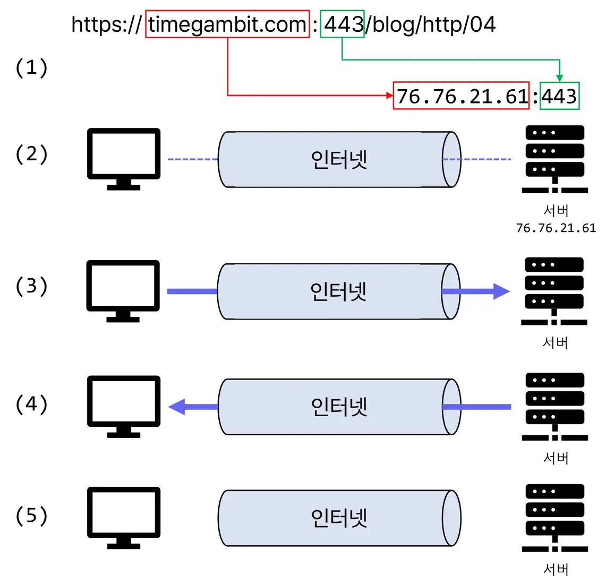
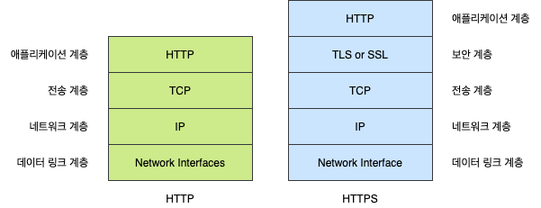
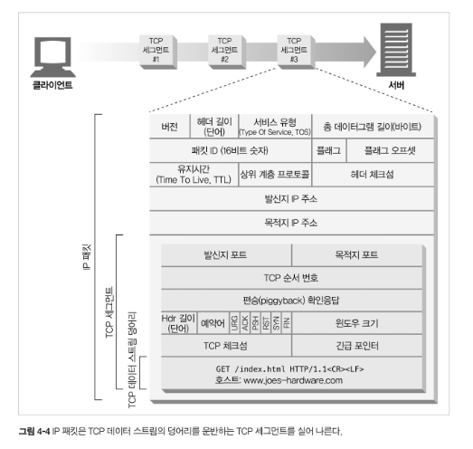
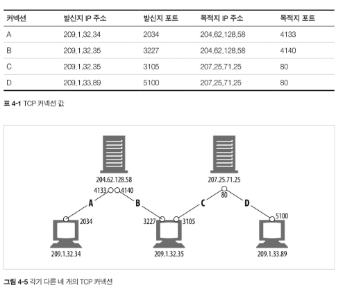
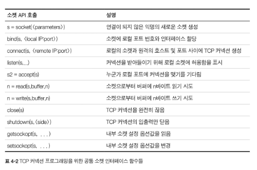
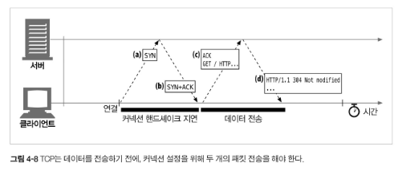

# 4.1 TCP 커넥션
전 세계의 모든 HTTP 통신은 TCP/IP를 통해 이루어진다.

커넥션이 맺어지면 클라이언트와 서버 컴퓨터 간에 주고받는 메시지들은 손실 혹은 손상되거나 순서가 바뀌지 않고 안전하게 전달된다.

#### 웹브라우저가 TCP 커넥션을 통해 웹 서버에 요청을 보내는 과정

1. 브라우저가 호스트명 추출
2. 브라우저가 이 호스트 명에 대한 IP 주소 찾음
3. 브라우저가 포트 번호 얻음
4. 브라우저가 76.76.21.61의 443 포트로 TCP 커넥션 생성
5. 브라우저가 서버로 HTTP GET 요청 메시지를 보냄
6. 브라우저가 서버에서 온 HTTP 응답 메시지를 읽음
7. 브라우저가 커넥션을 끊는다

## 4.1.1 신뢰할 수 있는 데이터 전송 통로인 TCP
TCP는 충돌 없이 순서에 맞게 HTTP 데이터를 전달한다.

## 4.1.2 TCP 스트림은 세그먼트로 나뉘어 IP 패킷을 통해 전송된다
TCP는 IP 패킷이라고 불리는 작은 조각을 통해 데이터를 전송함

### HTTP 프로토콜 스택



### HTTP 메시지 전송 과정
- 현재 연결되어 있는 TCP 커넥션을 통해서 메시지 데이터의 내용을 순서대로 보냄
- TCP는 세그먼트라는 단위로 데이터 스트림을 잘게 나눔
- 세그먼트를 IP 패킷에 담아 인터넷을 통해 데이터 전달

IP 패킷 구성요소
- IP 패킷 헤더
- TCP 세그먼트 헤더
- TCP 데이터 조각



## 4.1.3 TCP 커넥션 유지하기
컴퓨터는 항상 TCP 커넥션 여러 개를 가지고 있음, TCP는 포트 번호를 통해서 이런 여러 개의 커넥션을 유지함

TCP 커넥션 식별 방법 : <발신지 IP 주소, 발신지 포트, 수신지 IP 주소, 수신지 포트>

서로 다른 두 개의 TCP 커넥션은 네 가지 주소 구성요소의 값이 모두 같을 수 없다



## 4.1.4 TCP 소켓 프로그래밍

소켓 API의 주요 인터페이스



소켓 API를 사용하면, TCP 종단 데이터 구조를 생성하고, 원격 서버의 TCP 종단에 그 종단 데이터 구조를 연결하여 데이터 스트림을 읽고 쓸 수 있다.

TCP API는 기본적인 네트워크 프로토콜의 핸드셰이킹, 그리고 TCP 데이터 스트림과 IP 패킷 간 분할 및 재조립에 대한 모든 세부사항을 외부로부터 숨긴다.

### 웹브라우저가 HTTP를 이용하여 power-tools.html 내려받는 방법

1. 웹 서버는 커넥션 기다림
2. 클라이언트는 URL에서 IP주소와 포트 번호 알아내고 서버에 TCP 커넥션 생성
3. 커넥션이 맺너지면 클라이언트는 HTTP 요청 보냄, 서버는 읽음
4. 서버가 요청 메시지를 다 받으면, 그 요청을 분석하여 클라이언트가 원하는 동작 수행, 데이터 전송
5. 클라이언트는 그것을 받아 응답 데이터 처리

---
# 4.2 TCP의 성능에 대한 고려
HTTP는 TCP 바로 위에 있는 계층 -> HTTP 트랜잭션의 성능은 바로 그 아래 계층인 TCP 성능에 영향
## 4.2.1 HTTP 트랜잭션 지연


### 트랜잭션 지연 원인
1. 클라이언트는 URI에서 웹 서버의 IP주소와 포트 번호를 알아내야 함, 만약 URI에 기술되어 있는 호스트에 최근에 방문한 적이 없으면 DNS를 통해 URI 호스트명 -> IP주소 변환해야 함
2. 클라이언트는 TCP 커넥션 요청을 서버에게 보내고 서버가 커넥션 허가 응답을 회신하기를 기다림, 커넥션 설정 시간은 새로운 TCP 커넥션에서 항상 발생
3. 커넥션이 맺어지면 클라이언트는 HTTP 요청을 새로 생성된 TCP 파이프를 통해 전송, 웹 서버는 TCP 커넥션에서 요청 메시지를 읽고 처리하는데 시간 소요
4. 웹 서버가 HTTP 응답 보내는 것 역시 시간 소요

## 4.2.2 성능 관련 중요 요소
- TCP 커넥션의 핸드셰이크 설정
- 인터넷의 혼잡을 제어하기 위한 TCP의 느린 시작
- 데이터를 한데 모아 한 번에 전송하기 위한 네이글 알고리즘
- TCP 편승(piggyback) 확인응답(acknowledgment)을 위한 확인 응답 지연 알고리즘
- TIME_WAIT 지연과 포트 고갈

## 4.2.3 TCP 커넥션 핸드셰이크 지연

TCP 커넥션을 열 떄면, TCP 소프트웨어는 커넥션을 맺기 위한 조건을 맞추기 위해 연속으로 IP 패킷을 교환

작은 크기의 데이터 전송에 커넥션이 사용된다면 이런 패킷 교환은 HTTP 성능을 크게 저하시킬 수 있음

### TCP 커넥션이 핸드셰이크를 하는 순서


1. 클라이언트는 새로운 TCP 커넥션을 생성하기 위해 작은 TCP 패킷(보통 40~60바이트)을 서버에 보냄, 그 패킷은 "SYN"라는 특별한 플래그를 가지는데, 이 요청이 커넥션 생성 요청
2. 서버가 커넥션을 받으면 몇 가지 커넥션 매개변수를 산출, 커넥션 요청이 받아들여졌음을 의미하는 "SYN", "ACK" 플래그를 포함한 TCP 패킷을 클라이언트에게 보냄
3. 클라이언트는 커넥션이 잘 맺어졌음을 알기 위해서 서버에게 다시 확인응답 신호를 보냄
오늘날의 TCP는 클라이언트가 이 확인응답 패킷과 함꼐 데이터를 보낼 수 있다.

HTTP 트랜젝션이 아주 큰 데이터를 주고받지 않는 평범한 경우에는, SYN/SYN + ACK 핸드셰이크가 눈에 띄는 지연을 발생시킴

TCP의 ACK 패킷은 HTTP 요청 메시지 전체를 전달할 수 있을 만큼 큰 경우가 많고

많은 HTTP 서버 응답 메시지는 하나의 IP 패킷에도 담길 수 있다(예를 들어 응답이 장식용 이미지가 있는 작은 크기의 HTML 파일이거나 브라우저의 캐시 요청에 대한 응답인 304 Not Modified일 경우)

크기가 작은 HTTP 트랜젝션은 50% 이상의 시간을 TCP를 구성하는데 쓴다.

## 4.2.4 확인응답 지연

TCP는 인터넷에서 패킷이 유실될 수 있기 때문에, 데이터를 받으면 수신자가 송신자에게 **확인응답(ACK)** 을 보낸다. 송신자가 일정 시간 안에 ACK를 받지 못하면 패킷이 손실되었거나 오류가 있다고 판단하고 데이터를 다시 전송한다.

하지만 ACK는 크기가 작기 때문에, TCP는 ACK만 따로 보내기보다 같은 방향으로 나가는 데이터 패킷에 ACK를 함께 실어 보내는 **편승(piggyback)** 방식을 사용한다. 이렇게 하면 네트워크를 더 효율적으로 사용할 수 있다.

이를 위해 많은 TCP 구현은 **확인응답 지연 알고리즘**을 사용한다. ACK를 바로 보내지 않고 보통 **0.1~0.2초 정도 잠시 기다렸다가**, 그 사이에 같은 방향으로 보낼 데이터가 있으면 그 데이터에 ACK를 함께 실어 보낸다. 만약 기다리는 동안 보낼 데이터가 없으면 ACK만 담은 별도 패킷을 보낸다.

그런데 HTTP는 주로 **요청과 응답** 구조로 동작하기 때문에, ACK를 편승시킬 만한 같은 방향의 데이터 패킷이 자주 생기지 않는다. 그래서 ACK 지연 때문에 오히려 HTTP 통신 지연이 발생할 수 있다.

운영체제에 따라 TCP의 ACK 지연 기능을 조정하거나 비활성화할 수 있지만, TCP 설정을 바꿀 때는 주의해야 한다. TCP 내부 알고리즘은 잘못된 애플리케이션 동작으로부터 네트워크를 보호하도록 설계되어 있으므로, 설정 변경이 다른 문제를 만들지 않는지 확실히 이해해야 한다.
## 4.2.5 TCP slow start
TCP 커넥션은 시간이 지나면서 자체적으로 튜닝되고, 커넥션의 최대 속도를 제한하고 데이터가 성공적으로 전송됨에 따라서 속도 제한을 높여나간다.

TCP 느린 시작은 TCP가 한 번에 전송할 수 있는 패킷의 수를 제한함 

혼잡제어 기능 : HTTP 트랜잭션에서 전송할 데이터의 양이 많으면 한 개의 패킷만 전송하고 확인응답 기다림, 확인응답 받으면 2개의 패킷 전송

### 4.2.6 네이글 알고리즘과 TCP_NODELAY

TCP는 애플리케이션이 아주 작은 데이터도 보낼 수 있게 해주지만, 작은 데이터마다 TCP 헤더가 붙으면 패킷 수가 많아져 네트워크 효율이 떨어진다.

이를 줄이기 위해 **네이글(Nagle) 알고리즘**은 작은 데이터를 바로 보내지 않고 버퍼에 모아 두었다가, 충분한 크기의 패킷으로 합쳐 전송한다.

동작 방식은 다음과 같다.

- 전송할 데이터가 최대 세그먼트 크기보다 작으면 일단 버퍼에 저장한다.
- 이전에 보낸 패킷의 확인응답(ACK)을 받기 전까지는 작은 패킷을 추가로 보내지 않는다.
- ACK를 받거나, 버퍼에 충분한 데이터가 쌓이면 모아둔 데이터를 전송한다.

이 방식은 작은 패킷이 많이 생기는 것을 막아 네트워크 효율을 높인다. 하지만 HTTP처럼 작은 메시지를 빠르게 주고받아야 하는 경우에는 지연을 만들 수 있다.

특히 **네이글 알고리즘**과 **확인응답 지연 알고리즘**이 함께 쓰이면 문제가 커질 수 있다. 네이글 알고리즘은 ACK가 올 때까지 데이터를 보내지 않고, 확인응답 지연은 ACK를 100~200ms 정도 늦게 보내기 때문에 서로 기다리면서 성능 저하가 발생할 수 있다.

이 문제를 피하기 위해 HTTP 애플리케이션은 성능 향상을 목적으로 `TCP_NODELAY` 옵션을 설정해 네이글 알고리즘을 비활성화하기도 한다. 다만 이 경우 작은 패킷이 너무 많이 생기지 않도록 애플리케이션이 데이터를 적절히 모아서 보내야 한다.

### 4.2.7 TIME_WAIT의 누적과 포트 고갈

TCP 커넥션을 종료하면, 운영체제는 그 커넥션의 IP 주소와 포트 번호 정보를 일정 시간 동안 메모리에 보관한다. 이 상태를 **TIME_WAIT**이라고 한다.

TIME_WAIT은 같은 IP 주소와 포트 번호 조합을 가진 새 커넥션이 너무 빨리 만들어져, 이전 커넥션의 지연된 패킷과 새 커넥션의 패킷이 섞이는 문제를 막기 위한 장치다.

보통 이 정보는 세그먼트 최대 생명주기의 두 배인 **2MSL** 동안 유지되며, 일반적으로 약 **2분 정도** 유지된다.

TIME_WAIT은 실제 서비스에서는 큰 문제가 아닌 경우가 많지만, 성능 측정이나 부하 테스트에서는 문제가 될 수 있다. 짧은 시간에 많은 TCP 커넥션을 만들고 닫으면 TIME_WAIT 상태가 누적되어 사용할 수 있는 포트가 부족해질 수 있기 때문이다.

일부 운영체제는 2MSL 값을 줄일 수 있지만, 너무 짧게 설정하면 이전 커넥션의 패킷이 새 커넥션에 섞여 TCP 데이터가 충돌할 수 있으므로 신중해야 한다.

---

# 4.3 HTTP 커넥션 관리

HTTP 메시지는 클라이언트와 서버 사이를 직접 오가기도 하지만, 프락시·캐시·게이트웨이 같은 중개 서버를 거칠 수도 있다.

### Connection 헤더

`Connection` 헤더는 **현재 커넥션에만 적용되는 옵션**을 지정한다.

예를 들어 `Connection: close`는 이 메시지를 처리한 뒤 커넥션을 닫으라는 뜻이다.

주의할 점은 `Connection` 헤더에 적힌 값들은 **다음 커넥션으로 전달되면 안 된다**는 것이다. 즉, 홉별(hop-by-hop) 헤더이므로 프락시가 다음 서버로 전달하기 전에 제거해야 한다.

## 4.3.2 순차적인 트랜잭션 처리의 지연

웹페이지 하나를 보여주려면 HTML뿐 아니라 이미지, CSS, 스크립트 등 여러 객체를 받아야 한다.

이 객체들을 **하나의 커넥션에서 순서대로 요청하고 응답받으면** 각 객체마다 커넥션 생성 지연, 서버 처리 지연, 전송 지연이 누적된다.

또한 사용자는 여러 이미지가 동시에 로드되는 것을 더 빠르게 느끼기 때문에, 순차 처리는 실제 지연뿐 아니라 **심리적인 지연**도 만든다.

이를 개선하기 위한 방식은 다음과 같다.

- 병렬 커넥션
- 지속 커넥션
- 파이프라인 커넥션
- 다중 커넥션

---

# 4.4 병렬 커넥션

병렬 커넥션은 여러 개의 TCP 커넥션을 동시에 열어 여러 HTTP 요청을 병렬로 처리하는 방식이다.

### 장점

여러 객체를 동시에 내려받을 수 있으므로, 순차 처리보다 페이지가 더 빨리 로드되는 것처럼 보인다. 특히 HTML을 먼저 받고, 이미지들을 여러 커넥션으로 동시에 받으면 전체 지연 시간이 줄어들 수 있다.

### 한계

병렬 커넥션이 항상 빠른 것은 아니다.

- 클라이언트의 네트워크 대역폭이 좁으면 여러 커넥션이 대역폭을 나눠 쓰기 때문에 큰 이득이 없다.
- 각 커넥션마다 TCP 연결 생성 비용과 느린 시작 비용이 든다.
- 서버는 많은 커넥션을 유지해야 하므로 메모리와 자원을 많이 쓴다.
- 너무 많은 병렬 커넥션은 서버 성능을 떨어뜨릴 수 있다.

그래서 브라우저는 보통 무제한 병렬 연결을 허용하지 않고, 제한된 수의 병렬 커넥션만 사용한다.

---

# 4.5 지속 커넥션

지속 커넥션은 하나의 TCP 커넥션을 요청 하나 처리 후 바로 닫지 않고, 이후 요청에도 재사용하는 방식이다.

웹페이지의 이미지나 링크는 같은 사이트에 몰려 있는 경우가 많다. 이를 **사이트 지역성(site locality)** 이라고 한다. 같은 서버에 반복 요청할 가능성이 높기 때문에, 이미 맺은 TCP 커넥션을 재사용하면 효율적이다.

### 장점

- TCP 연결을 새로 맺는 비용을 줄인다.
- TCP 느린 시작으로 인한 지연을 줄인다.
- 이미 튜닝된 커넥션을 재사용할 수 있다.
- 커넥션 수를 줄여 서버와 클라이언트 자원 소모를 줄인다.

하지만 오래 열린 커넥션을 제대로 관리하지 않으면 불필요한 리소스를 계속 점유할 수 있다.

---

## 4.5.2 HTTP/1.0 Keep-Alive

HTTP/1.0에서는 기본적으로 지속 커넥션이 아니었지만, `keep-alive` 확장으로 커넥션 재사용을 지원했다.

클라이언트가 요청에 다음 헤더를 넣으면 keep-alive를 요청한다.

```http
Connection: Keep-Alive
```

서버가 이를 지원하면 응답에도 같은 헤더를 넣어 커넥션을 유지한다. 응답에 `Connection: Keep-Alive`가 없으면 클라이언트는 서버가 커넥션을 닫을 것이라고 판단한다.

---

## 4.5.3 ~ 4.5.5 Keep-Alive 동작과 제한

`Keep-Alive` 헤더에는 옵션을 줄 수 있다.

```http
Connection: Keep-Alive
Keep-Alive: max=5, timeout=120
```

- `max=5`: 최대 5개의 추가 트랜잭션 동안 유지 가능
- `timeout=120`: 약 120초 동안 유지 가능

단, 이 값들은 보장이라기보다 힌트에 가깝다. 서버나 클라이언트는 언제든 커넥션을 닫을 수 있다.

Keep-Alive 사용 시 주의할 점은 다음과 같다.

- HTTP/1.0에서는 기본이 아니므로 명시적으로 요청해야 한다.
- 모든 메시지에 `Connection: Keep-Alive`를 포함해야 한다.
- 메시지 본문 길이를 알 수 있어야 커넥션을 계속 유지할 수 있다.
- `Content-Length`, multipart, chunked encoding 등이 정확해야 한다.
- 프락시는 `Connection` 헤더 규칙을 반드시 지켜야 한다.

---

## 4.5.6 명청한 프락시 문제

오래된 프락시가 `Connection: Keep-Alive`를 이해하지 못하면 문제가 생긴다.

`Connection` 헤더는 홉별 헤더라서 다음 서버로 전달하면 안 되는데, 명청한 프락시는 이를 그대로 서버에 전달할 수 있다.

그 결과:

1. 클라이언트는 프락시와 keep-alive 커넥션을 유지하려고 한다.
2. 프락시는 이를 이해하지 못하고 서버로 그대로 전달한다.
3. 서버는 프락시와 keep-alive가 맺어진 것으로 착각한다.
4. 프락시는 서버가 커넥션을 끊기를 기다리고, 서버는 유지하려고 하면서 대기 상태가 생길 수 있다.
5. 이후 요청이 무시되거나 멈춘 것처럼 보일 수 있다.

---

## 4.5.7 Proxy-Connection

이 문제를 피하기 위해 `Proxy-Connection` 헤더가 등장했다.

클라이언트가 프락시에게는 다음처럼 보낸다.

```http
Proxy-Connection: Keep-Alive
```

영리한 프락시는 이를 이해하고, 서버로 보낼 때는 적절히 `Connection: Keep-Alive`로 바꾼다.

하지만 프락시가 여러 개 있을 경우, 중간에 명청한 프락시가 끼면 여전히 문제가 생길 수 있다. 그래서 완벽한 해결책은 아니다.

---

## 4.5.8 HTTP/1.1의 지속 커넥션

HTTP/1.1에서는 지속 커넥션이 기본이다.

즉, 별도 설정이 없으면 커넥션을 계속 유지한다고 본다. 커넥션을 닫고 싶으면 명시적으로 다음 헤더를 보내야 한다.

```http
Connection: close
```

하지만 `Connection: close`가 없다고 해서 커넥션이 영원히 유지된다는 뜻은 아니다. 클라이언트와 서버는 언제든 커넥션을 닫을 수 있다.

---

## 4.5.9 지속 커넥션 제한과 규칙

지속 커넥션을 사용할 때는 다음 규칙이 중요하다.

- 클라이언트가 `Connection: close`를 보냈으면 그 커넥션으로 추가 요청을 보내면 안 된다.
- 마지막 요청에는 `Connection: close`를 보내는 것이 좋다.
- 메시지 본문 길이를 정확히 알아야 커넥션을 유지할 수 있다.
- HTTP/1.1 프락시는 클라이언트와 서버 각각에 대해 별도 지속 커넥션을 관리해야 한다.
- 오래된 프락시가 `Connection` 헤더를 잘못 전달할 수 있으므로 주의해야 한다.
- 서버는 응답 전송 중간에 커넥션을 끊지 않는 것이 좋다.
- 클라이언트는 커넥션이 갑자기 끊겨도 재시도할 준비가 되어 있어야 한다.

---

# 4.6 파이프라인 커넥션

파이프라인은 지속 커넥션 위에서 여러 요청을 응답을 기다리지 않고 연속해서 보내는 방식이다.

예를 들어 첫 번째 요청의 응답이 오기 전에도 두 번째, 세 번째 요청을 미리 보낼 수 있다. 네트워크 왕복 시간을 줄여 성능을 높일 수 있다.

### 제약

- 지속 커넥션인지 확인하기 전에는 파이프라인을 사용하면 안 된다.
- 응답은 요청 순서대로 와야 한다.
- 커넥션이 중간에 끊길 수 있으므로, 클라이언트는 요청을 다시 보낼 수 있어야 한다.
- `POST`처럼 반복 실행 시 문제가 생길 수 있는 비멱등 요청은 파이프라인으로 보내면 위험하다.
- `GET`, `HEAD`, `PUT`, `DELETE`, `TRACE`, `OPTIONS`는 보통 멱등 요청으로 본다.

---

# 4.7 커넥션 끊기

HTTP 커넥션을 언제 어떻게 끊을지는 명확하지 않은 부분이 많다. 잘못 끊으면 데이터 손실이나 재시도 문제가 생길 수 있다.

### Content-Length와 잘림 감지

응답에는 정확한 `Content-Length`가 있어야 한다. 커넥션이 끊겼을 때 실제 받은 본문 길이와 `Content-Length`가 다르면, 수신자는 응답이 잘렸다고 판단해야 한다.

캐시 프락시는 잘린 응답을 캐시하면 안 되며, 받은 그대로 전달해야 한다.

### 재시도와 멱등성

커넥션이 끊겼을 때 요청이 멱등이면 다시 보내도 비교적 안전하다.

- 멱등 요청: `GET`, `HEAD`, `PUT`, `DELETE`, `TRACE`, `OPTIONS`
- 비멱등 요청: 보통 `POST`

`POST`는 중복 실행되면 글이 두 번 등록되거나 결제가 중복되는 문제가 생길 수 있으므로 자동 재시도에 주의해야 한다.

### 우아한 커넥션 끊기

TCP 커넥션은 양방향이므로 입력 채널과 출력 채널이 있다.

- `close()`: 입력과 출력을 모두 끊음
- `shutdown()`: 입력 또는 출력 중 하나만 끊을 수 있음

일반적으로는 **출력 채널을 먼저 닫는 절반 끊기**가 더 안전하다. 입력 채널을 함부로 닫으면 상대방이 아직 보내는 데이터를 잃거나 `connection reset by peer` 같은 리셋 오류가 발생할 수 있다.

핵심은, 커넥션을 끊을 때도 상대방이 아직 데이터를 보내고 있을 가능성을 고려해야 한다는 것이다.