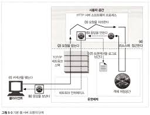

# 웹 서버

웹 서버는 HTTP 요청을 처리하고 응답을 제공하기 위해 
HTTP와 그와 관련된 TCP 처리를 구현하고, 웹 리소스를 관리하고, 웹 서버 관리 기능을 제공한다.
웹 서버는 TCP 커넥션 관리에 대한 책임을 운영체제와 나눠 갖는다.

운영체제는 컴퓨터 시스템의 하드웨어를 관리하고 
TCP/IP 네트워크 지원, 웹 리소스를 유지하기 위한 파일 시스템, 
현재 연산 활동을 제어하기 위한 프로세스 관리를 제공한다.

웹서버는 다음형태로 제공된다.
- 다목적 소프트웨어 웹 서버를 표준 컴퓨터 시스템에 설치하고 실행할 수 있다.
- 컴퓨터 칩에 임베디드된 웹 서버를 관리 콘솔로 제공한다.

다목적 소프트웨어 서버는 네트워크에 연결된 컴퓨터에서 동작하며, 웹 서버 같은 상용 소프트웨어를 사용할 수도 있다.
웹 서버 소프트웨어는 거의 모든 컴퓨터와 운영체제에서 동작한다.

임베디드 웹 서버는 일반 소비자 제품에 내장될 목적으로 만들어졌다.
사용자가 그들의 사용자용 기기를 관리할 수 있도록 웹 인터페이스로 관리할 수 있도록 제공한다.

# 웹 서버가 하는 일

사용 웹 서버는 공통적으로 다음과 같은 일들을 수행한다.

1. 커넥션을 맺는다: 클라이언트의 접속을 받아들이거나, 원치 않는 클라이언트라면 닫는다.
2. 요청을 받는다: HTTP 요청 메시지를 네트워크로부터 읽어 들인다.
3. 요청을 처리한다: 요청 메시지를 해석하고 행동을 취한다.
4. 리소스에 접근한다: 메시지에서 지정한 리소스에 접근한다.
5. 응답을 만든다: 올바른 헤더를 포함한 HTTP 응답 메시지를 생성한다.
6. 응답을 보낸다: 응답을 클라이언트에게 돌려준다.
7. 트랜잭션을 로그로 남긴다: 로그파일에 트랜잭션 완료에 대한 기록을 남긴다.

다음 절부터는 어떻게 웹 서버가 이런 기본 작업을 수행하는지 보여준다.

# 단계 1: 클라이언트 커넥션 수락

클라이언트가 이미 서버에 대해 열려있는 지속적 커넥션을 갖고 있다면,
클라이언트는 요청을 보내기 위해 그 커넥션을 사용할 수 있다.
그렇지 않다면, 클라이언트는 새 커넥션을 열 필요가 있다.

## 새 커넥션 다루기
클라이언트가 웹 서버에 TCP 커넥션을 요청하면, 
웹 서버는 그 커넥션을 맺고 TCP 커넥션에서 IP 주소를 추출하여 커넥션 맞은 편에 어떤 클라이언트가 있는지 확인한다.
일단 새 커넥션이 맺어지고 받아들여지면, 서버는 새 커넥션을 커넥션 목록에 추가하고 커넥션에서 오가는 데이터를 지켜보기 위한 준비를 한다.

웹 서버는 어떤 커넥션이든 마음대로 거절하거나 즉시 닫을 수 있다.
어떤 웹 서버들은 클라이언트의 IP 주소나 호스트 명이 인가되지 않았거나 악의적이라고 알려진 것인 경우 커넥션을 닫는다.
다른 신원 식별 기법 또한 사용될 수 있다.

## 클라이언트 호스트 명 식별
대부분의 웹 서버는 리버스 프록시를 사용해서 클라이언트의 IP 주소를 클라이언트의 호스트명으로 변환되도록 설정되어 있다.
웹 서버는 클라이언트 호스트 명을 구체적인 접근 제어와 로깅을 위해 사용할 수 있다.
호스트 명 룩업(hostname lookup)은 꽤 시간이 많이 거릴ㄹ 수 있어 웹 트랜잭션을 느려지게 할 수 있음을 미리 경고해두겠다.
많은 대용량 웹 서버는 호스트 명 분석(hostname resolution)을 꺼두거나 특정 컨텐츠에 대해서만 켜놓는다.

아파치에서는 HostnameLookups 설정 지시자로 호스트 명 룩업을 켤 수 있다.

## ident를 통해 클라이언트 사용자 알아내기

몇몇 웹 서버는 IETF ident 프로토콜을 지원한다.
ident 프로토콜은 서버에게 어떤 사용자 이름이 HTTP 커넥션을 초기화했는지 찾아낼 수 있게 해준다.
이 정보는 특히 웹 서버 로깅에서 유용하기 때문에, 널리 쓰이는 일반 로그 포맷의 두번 째 필드는 각 HTTP 요청의 ident 사용자 이름을 담고 있다.

만약 클라이언트가 ident 프로토콜을 지원한다면, 클라이언트는 ident 결과를 위해 TCP 포트 113번을 listen한다.

https://encrypted-tbn0.gstatic.com/images?q=tbn:ANd9GcTMJJkkpFufn4CZ3fcYw8NGIdNG1nvhFAqRPg&s

그림은 ident 프로콜이 어떻게 동작하는지 보여준다.
클라이언트는 HTTP 커넥션을 열고,
서버는 자신의 커넥션을 클랄이너트의 identd 서버 포트(113)를 향해 열고,
새 커넥션(클라이언트와 서버 포트 번호로 지정되는)에 대응하는 사용자 이름을 묻는 간단한 요청을 보낸다.

ident는 조직 내부에서는 잘 사용할 수 있지만, 공공 인터넷에서는 다음을 포함한 여러 이유로 잘 동작하지 않는다.

- 많은 클라이언트는 identd 신원확인 프로토콜 데몬 소프트웨어를 실행하지 않는다.
- ident 프로토콜은 HTTP 트랜잭션을 지연시킨다.
- 방화벽이 ident 트래픽이 들어오는 것을 막는 경우가 많다.
- ident 프로토콜은 안전하지 않고 조작하기 쉽다.
- ident 프로토콜은 가상 IP 주소를 잘 지원하지 않는다.
- 클라이언트 사용자 이름의 노출로 인한 프라이버시 침해의 우려가 있다.

아파치의 경우 IdentityCheck 지시어로 ident 룩업을 사용하게 할 수 있다.
보통 가용한 정보가 없기 때문에 로그 필드를 하이픈(-)으로 채워진다.

## 단계 2: 요청 메시지 수신

커넥션에 데이터가 도착하면 웹 서버는 네트워크 커넥션에서 그 데이터를 읽어 들이고 파싱하여 요청 메시지를 구성한다.
요청 메시지를 파싱할 때, 웹 서버는 다음과 같은 일을 한다.

1. 요청줄을 파싱하여 요청 메서드, 리소스 식별자(URI), 버전 번호를 찾는다. 각 값은 공백으로 그리고 요청줄은 캐리지 리턴 줄바꿈 문자열로 끝난다.
2. 메시지 헤더들을 읽는다. 각 메시지 헤더는 CRLF로 끝난다.
3. 헤더의 끝을 의미하는 CRLF로 끝나는 빈 줄을 찾아낸다.(존재한다면)
4. 요청 본문이 있다면, 읽어들인다.(길이는 Content-Length 헤더로 지정된다.)

요청 메시지를 파싱할 때, 웹 서버는 입력 데이터를 네트워크로부터 불규칙적으로 받는다.
네트워크 커넥션은 언제라도 무효화될 수 있다.
웹 서버는 파싱해서 이해하는 것이 가능한 수준의 분량을 확보할 때까지 데이터를 네트워크로부터 읽어서 메시지 일부분을 메모리에 임시로 저장해 둘 필요가 있다.

### 메시지 내부 표현

몇몇 웹 서버는 요청 메시지를 쉽게 다룰 수 있도록 내부의 자료 구조에 저장한다.
예를 들어, 그 자료 구조는 요청 메시지의 각 조각에 대한 포인터와 길이를 담을 수 있을 것이고,
헤더는 속도가 빠른 룩업 테이블에 저장되어 각 필드에 신속하게 접근할 수 있을 것이다.

### 커넥션 입력/출력 처리 아키텍처

고성능 웹 서버는 수천 개의 커넥션을 동시에 열 수 있도록 지원한다.
이 커넥션들은 웹 서버가 전 세계의 클라이언트들과 각각 한 개 이상의 커넥션을 통해 통힌할 수 있게 해준다.
어떤 커넥션으로부터는 요청이 느리게 혹은 드물게 흘러 들어ㅓ오고, 어떤 것들은 나중에 일어날 활동을 조용히 대하고 있는데 비해,
일부 커넥션들은 웹 서버로 급속히 요청을 보내고 있을 것이다.

웹 서버들은 항상 새 요청을 주시하고 있다. 왜냐하면 요청은 언제라고 도착할 수 있기 때문이다.

단일 스레드 웹 서버는 한 번에 하나씩 요청을 처리한다.
트랜잭션이 완료되면, 다음 커넥션이 처리된다.
이 아키텍처는 구현하기 간단하지만 처리 도중에 다른 커넥션은 무시된다.
이것은 성능 문제를 만들어내므로 오직 로드가 적은 서버나 진단 도구에서만 적당하다.

멀티프로세스와 멀티스레드 웹 서버는 여러 요청을 동시에 접근하기 위해 여러 개의 프로세스 혹은 고효율 스레드를 할당한다.
스레드/프로세스는 필요할 때마다 만들어질 수도 있고 미리 만들어질 수 있다.
몇몇 서버는 매 커넥션마다 스레드/프로세스 하나를 할당하지만 서버가 수백 수천 심지어 수만 개의 동시 커넥션을 처리할 때 그로 인해 만들어진
수많은 프로세스나 스레드는 너무 많은 메모리나 시스템 리소스를 소비한다.
그러므로 많은 멀티스레드 웹 서비스가 스레드/프로세스의 최대 개수에 제한을 둔다.

대량의 커넥션을 지원하기 위해, 많은 웹 서버는 다중 아키텍처를 채택했다.
다중 아키텍처에서는 모든 커넥션은 동시에 그 활동을 감시당한다.
커넥션의 상태가 바뀌면, 그 커넥션에 대해 작은 양의 처리가 수행된다.
그 처리가 완료되면, 커넥션은 다음번 상태 변경을 위해 열린 커넥션 목록으로 돌아간다.
어떤 커넥션에 대해 작업을 수행하는 것은 그 커넥션에 실제로 해야 할 일이 있을 때 뿐이다.
스레드와 프로세스는 유휴 상태의 커넥션에 매여 기다리느라 리소스를 낭비하지 않는다.

몇몇 시스템은 자신의 컴퓨터 플랫폼에 올라와 있는 CPU 여러 개의 이점을 살리기 위해 멀티스레딩과 다중화(multiplexing)를 결합한다.
여러 개의 스레드는 각각의 열려있는 커넥션을 감시하고 각 커넥션에 대해 조금씩 작업을 수행한다.

## 단계 3: 요청 처리

웹 서버가 요청을 받으면, 서버는 요청으로부터 메서드, 리소스, 헤더, 본문을 얻어내어 처리한다.
POST를 비롯한 몇몇 메서드는 요청 메시지에 엔터티 본문이 있을 것을 요구한다.
그 외 OPTION를 비롯한 다수의 메서드는 요청에 본문이 있는 것을 허용하되 요구하지는 않는다.
많지는 않지만 GET과 같이 요청 메시지에 엔터티 본문이 있는 것을 금지하는 메서드도 있다.
요청에 대한 디테일한 다른 부분에서 다룬다.

## 단계 4: 리소스의 매핑과 접근

웹 서버는 리소스 서버로 컨텐츠를 제공한다.
웹 서버가 클라이언트에 콘텐츠를 전달하려면, 그전에 요청 메시지의 URI에 대응하는 알맞은 콘텐츠를 웹 서버에서 찾아서 그 원천을 식별해야 한다.

### Docroot

웹 서버는 다양한 종류의 리소스 매핑을 지원한다.
일반적으로 웹 서버 파일 시스템의 특별한 폴더를 웹 콘텐츠를 위해 예약해둔다.
이 폴더를 문서 루트 혹은 docroot라고도 불린다.

웹 서버는 요청 메시지에서 URI를 가져와서 문서 루트 뒤에 붙인다.
그리고 httpd.conf 설정 파일에 DocumentRoot 줄을 추가하여 아파치 웹 서버의 문서 로트를 설정할 수 있다.

서버는 상대적인 yrl이 docroot를 벗어나서 파일 시스템을 