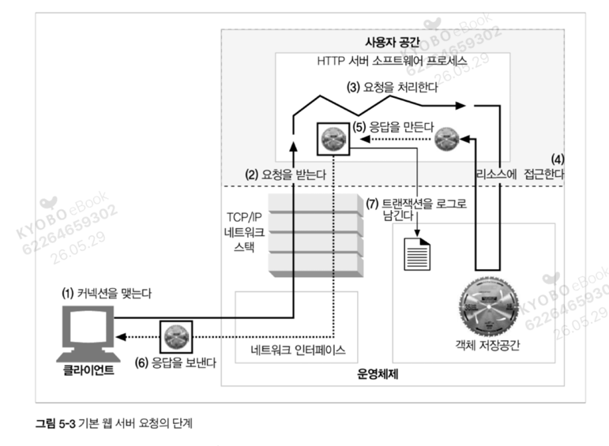

# 5.3 진짜 웹 서버가 하는 일

type-o-serve는 예제용으로 만든 간단한 웹 서버다.  
최신식 상용 웹 서버는 그보다 훨씬 복잡하지만, 그들은 공통적으로 다음 **일곱 가지 일**을 수행한다.

---

## 기본 웹 서버 요청의 7단계

| 단계 | 작업 | 설명 | 절(節) |
|------|------|------|--------|
| 1 | **커넥션을 맺는다** | 클라이언트의 접속을 받아들이거나, 원치 않는 클라이언트라면 닫는다. | 5.4 |
| 2 | **요청을 받는다** | HTTP 요청 메시지를 네트워크로부터 읽어 들인다. | 5.5 |
| 3 | **요청을 처리한다** | 요청 메시지를 해석하고 행동을 취한다. | 5.6 |
| 4 | **리소스에 접근한다** | 메시지에서 지정한 리소스에 접근한다. | 5.7 |
| 5 | **응답을 만든다** | 올바른 헤더를 포함한 HTTP 응답 메시지를 생성한다. | 5.8 |
| 6 | **응답을 보낸다** | 응답을 클라이언트에게 돌려준다. | 5.9 |
| 7 | **트랜잭션을 로그로 남긴다** | 로그파일에 트랜잭션 완료에 대한 기록을 남긴다. | 5.10 |

---

## 그림 5-3: 기본 웹 서버 요청의 단계

다음 일곱 개의 절(5.4 ~ 5.10)은 어떻게 웹 서버가 이러한 기본 작업을 수행하는지 단계별로 보여준다.

> **Java 개발자 관점**: 서블릿 컨테이너(톰캣)의 처리 흐름이 정확히 이 7단계다.  
> Connector가  
> (1) 커넥션을 받고  
> (2) 요청을 읽어 `HttpServletRequest` 로 파싱  
> (3), `DispatcherServlet` 이 핸들러로 매핑해 리소스에 접근  
> (4), `HttpServletResponse` 를 만들고  
> (5) 클라이언트로 flush  
> (6), access log를 남긴다  
> (7). 우리가 짜는 컨트롤러 코드는 사실상 (3)~(5)의 일부일 뿐이며 나머지는 컨테이너가 담당한다.
