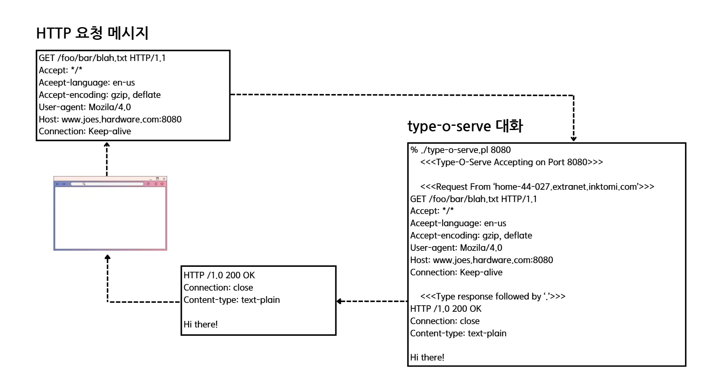
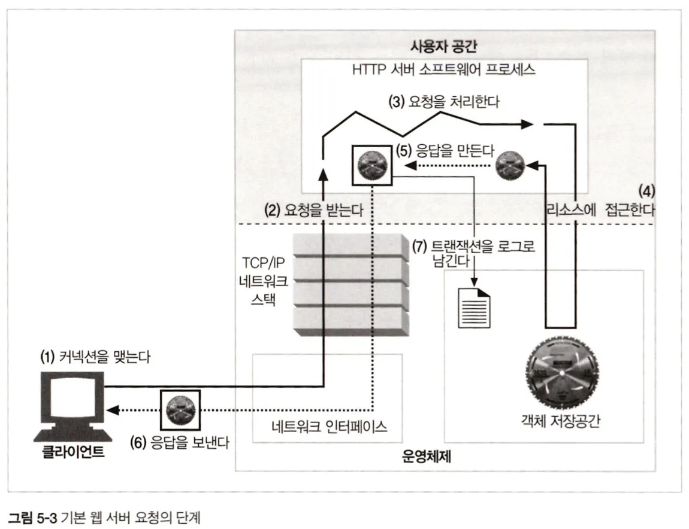
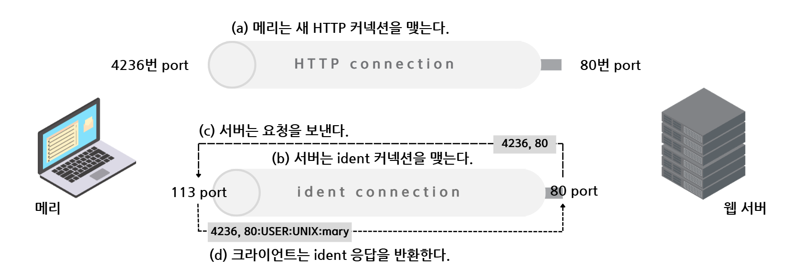
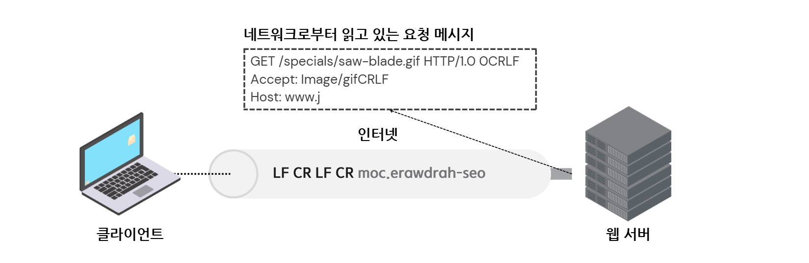
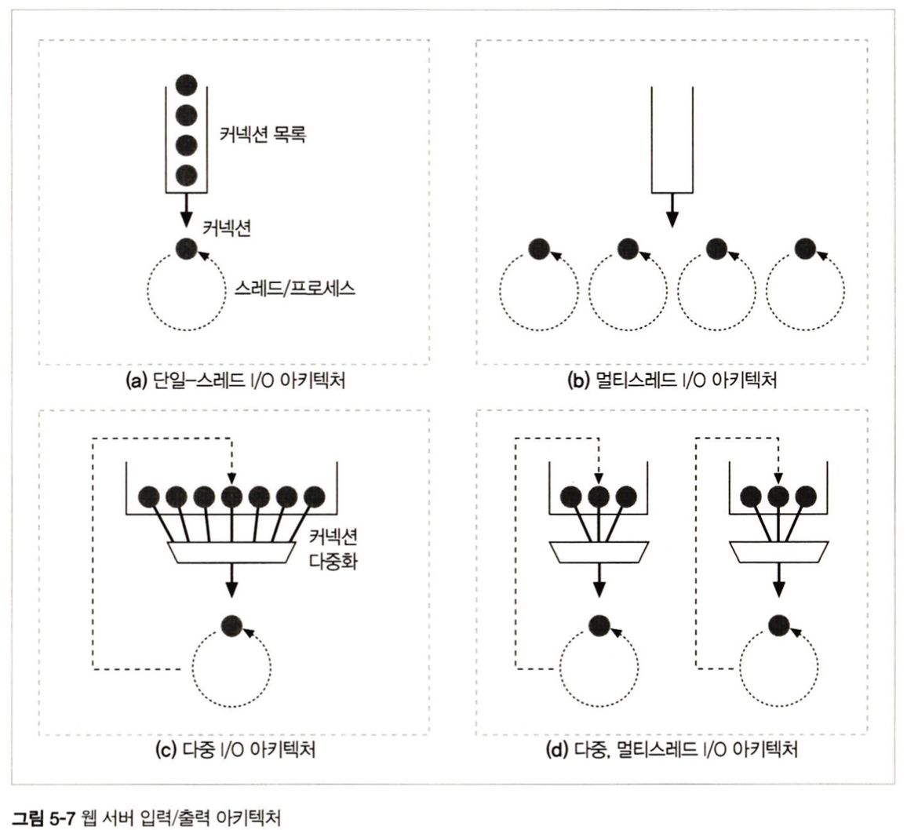
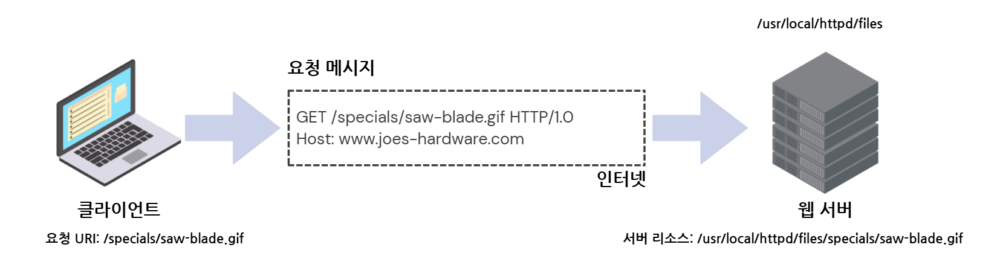
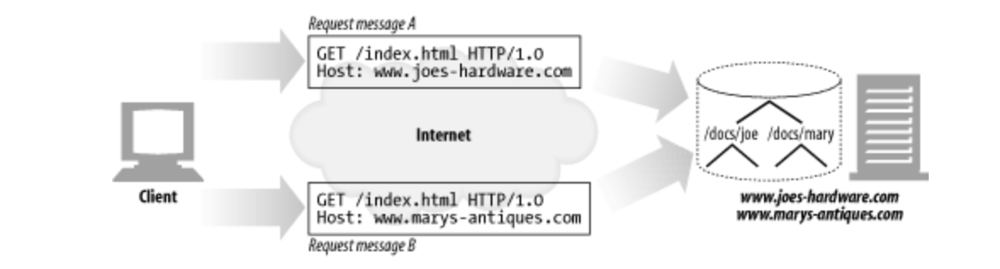

# 5.1 다채로운 웹 서버
웹 서버 : 월드 와이드 웹에서 사용자의 컴퓨터나 모바일 장치로 전송하는 컴퓨터 시스템이나 소프트웨어
## 5.1.1 웹 서버 구현
웹 서버는 HTTP 프로토콜을 구현하고, 웹 리소스를 관리하고, 웹 서버 관리 기능을 제공한다.

TCP 커넥션 관리에 대한 책임을 운영체제와 나눠 갖는다.

웹 서버는 다음과 같이 여러 가지 형태가 가능함
## 5.1.2 다목적 소프트웨어 웹 서버
네트워크에 연결된 표준 컴퓨터 시스템에서 동작

오픈 소스 소프트웨어를 사용하거나, 마이크로소프트나 아이플래닛의 웹 서버 같은 상용 소프트웨어 사용

- 모든 웹 서버의 37%가 마이크로소프트 웹 서버를 통해 서비스됨
- 아파치 웹 서버 : 35%
- ngnix 서버 : 14%

## 5.1.3 임베디드 웹 서버
일반 소비자용 제품에 내장될 목적으로 만들어진 작은 웹 서버

일반 소비자용 기기를 간편한 웹 브라우저 인터페이스로 관리할 수 있게 해줌

---

# 5.2 간단한 펄 웹 서버
HTTP/1.1 기능들을 지원하려면, 풍부한 리소스 지원, 가상 호스팅, 접근 제어, 로깅, 설정, 모니터링, 그 외 성능을 위한 각종 기능들이 필요

최소한으로 기능하는 HTTP 서버는 30줄 이하의 펄(Perl) 코드로도 만들 수 있음

```
#!/usr/bin/perl

use Socket;
use Carp;
use FileHandle;

# (1) 명령줄에서 덮어쓰지 않는 이상 8080포트를 기본으로 사용한다.
$port = (@ARGV ? $ARGV[0] : 8080);

# (2) 로컬 TCP 소켓을 생성하고 커넥션을 기다리도록(listen)설정한다.
$proto = getprotobyname('tcp');
socket(S, PF_INET, SOCK_STREAM, $proto) || die;
setsockopt(S, SOL_SOCKET, SO_REUSEADDR, pack("l", 1)) || die;
bind(S, sockaddr_in)($port, INADDR_ANY) || die;
listen(S, SOMAXCONN) || die;

# (3) 시작 메시지를 출력한다.
printf("    <<< Type-O-Serve Accepting on Port %d>>>\n\n", $port);

while(1)
{
		# (4) 커넥션 C를 기다린다.
		$cport_caddr = accept(C, S);
		($cport, $caddr) = sockaddr_in($cport_caddr);
		C->autoflush;
		
		# (5) 누구로부터의 커넥션인지를 출력한다.
		$cname = gethostbyaddr($caddr, AF_INET);
		printf("    <<<Request From '%s',>>>\n", $cname);
		
		# (6) 빈 줄이 나올 때 까지 요청 메시지를 읽어서 화면에 출력한다.
		while($line = <C>
		{
				print $line;
				if($line =~ /^\r) {
					last;
				}
		}
		
		# (7) 응답 메시지를 위한 프롬프트를 만들고, 응답줄을 입력 받는다.
		#     "."하나만으로 되어 있는 줄이 입력되기 전까지, 입력된 주을 클라이언트에게 보낸다.
		
		printf("    <<<Type Response Followed by '.'>>>\n");
		
		while($line = <STDIN>)
		{
				$line =~ s/\r//;
				$line =~ s/\n//;
				if($line =~ /^\./){
						last;
				}
		}
		
		close(C);
}	
```

해당 코드는 상점의 관리자가 type-o-serve를 이용해 어떻게 HTTP 통신을 테스트하는지 보여준다.
1. 먼저, 관리자는 특정 포트로 수신하는 type-o-serve 진단 서버를 시작한다.
2. type-o-serve가 동작하기 시작하면, 이 웹 서버에 브라우저로 접근할 수 있다.
3. 우리는 (http://www.joes-hardware.com:8080/foo/bar/blah.txt)에 접근한다.
4. type-o-serve 프로그램은 브라우저로부터 HTTP 요청 메시지를 받아 그 내용을 화면에 출력한 뒤, 관리자가 마침표 하나뿐인 줄로 끝나는 간단한 응답 메시지를 입력할 때 까지 기다린다.
5. type-o-serve는 HTTP 응답 메시지를 브라우저에게 돌려주고, 브라우저는 응답 메시지의 본문을 출력한다.
---
# 5.3 진짜 웹 서버가 하는 일


1. 커넥션을 맺는다 - 클라이언트의 접속을 받아들이거나, 원치 않는 클라이언트라면 닫는다.
2. 요청을 받는다 - HTTP 요청 메시지를 네트워크로부터 읽어 들인다.
3. 요청을 처리한다 - 요청 메시지를 해석하고 행동을 취한다.
4. 리소스에 접근한다 - 메시지에서 지정한 리소스에 접근한다.
5. 응답을 만든다 - 올바른 헤더를 포함한 HTTP 응답 메시지를 생성한다.
6. 응답을 보낸다 - 응답을 클라이언트에게 돌려준다.
7. 트랜잭션을 로그로 남긴다 - 로그파일에 트랜잭션 완료에 대한 기록을 남긴다.
---
# 5.4 단계 1 : 클라이언트 커넥션 수락
클라이언트가 이미 서버에 대해 열려있는 지속적 커넥션을 갖고 있다면, 클라이언트는 요청을 보내기 위해 그 커넥션을 사용할 수 있고 그렇지 않다면 새 커넥션을 열어야 한다.
## 5.4.1 새 커넥션 다루기
- 클라이언트가 웹 서버에 TCP 커넥션을 요청하면 웹서버는 그 커넥션을 맺고 TCP 커넥션에서 IP 주소를 추출하여 커넥션 맞은편에 어떤 클라이언트가 있는지 확인한다.
- 서버는 새 커넥션을 커넥션 목록에 추가하고 커넥션에서 오가는 데이터를 지켜보기 위한 준비를 한다.
- 웹 서버는 어떤 커넥션이든 마음대로 거절하거나 즉시 닫을 수 있다.
## 5.4.2 클라이언트 호스트명 식별
- 대부분의 웹 서버는 역 방향(reverse DNS) 를 사용해서 클라이언트의 IP주소를 클라이언트의 호스트 명으로 변환하도록 설정되어 있다.
- 웹 서버는 클라이언트 호스트 명을 구체적인 접근 제어와 로깅을 위해 사용 할 수 있다.
- 호스트 명 룩업(hostname lookup)은 꽤 시간이 많이 걸려 웹 트랜잭션을 느리게 할 수 있다.
## 5.4.3 ident를 통해 클라이언트 사용자 알아내기

ident 프로토콜은 서버에게 어떤 사용자 이름이 HTTP 커넥션을 초기화 했는지 찾아낼 수 있게 하고, 이 정보는 특히 웹 서버 로깅에서 유용하다.
ident는 조직 내부에서는 잘 사용할 수 있지만, 공공 인터넷에서는 아래와 이유로 잘 동작하지 않는다.
- 많은 클라이언트 PC는 ident 신원 확인 프로토콜 데몬 소프트웨어를 실행하지 않음
- ident 프로토콜은 HTTP 트랜잭션을 유의미하게 지연 시킨다.
- 방화벽이 ident 트래픽이 들어오는 것을 막는 경우도 있음
- ident 프로토콜은 안전하지 않고 조작하기가 쉬움
- ident 프로토콜은 가상 IP 주소를 잘 지원하지 않음
- 클라이언트 사용자 이름의 노출로 인한 프라이버시 침해의 우려가 있음
---
# 5.5 단계 2: 요청 메시지 수신

커넥션에 데이터가 도착하면, 웹 서버는 네트워크 커넥션에서 그 데이터를 읽어 들이고 파싱하여 요청 메시지를 구성한다.
- 요청줄을 파싱하여 요청 메서드, 지정된 리소스의 식별자(URI), HTTP 버전번호를 찾는다.
- 메세지 헤더들을 읽는다.
- 존재 한다면 헤더의 끝을 의미하는 CRLF로 끝나는 빈줄을 찾아낸다.
- 요청 본문이 있다면, 읽어 들인다. 길이는 Content-Length 헤더로 정의한다.
- 요청 메시지를 파싱할 때, 웹 서버는 입력 데이터를 네트워크로부터 불규칙적으로 받는다.
네트워크 커넥션은 언제라도 무효화 될 수 있다.

웹 서버는 이해하는 것이 가능한 수준의 분량을 확보할 때까지 데이터를 네트워크로부터 읽어서 메시지 일부분을 메모리에 임시로 저장해둘 필요가 있다.

## 5.5.1 메시지의 내부 표현
몇몇 웹 서버는 요청 메세지를 쉽게 다룰 수 있도록 내부의 자료 구조에 저장한다.

자료 구조는 요청 메세지의 각 조각에 대한 포인터와 길이를 담을 수 있다.

헤더는 속도가 빠른 룩업 테이블에 저장되어 필드에 신속하게 접근 할 수 있을 것 이다.

## 5.5.2 커넥션 입력/출력 처리 아키텍처
고성능 웹 서버는 수천 개의 커넥션을 동시에 열 수 있도록 지원한다.

웹 서버들은 항상 새 요청을 주시하고 있다.


1. 단일 스레드 웹 서버
- 한 번에 하나씩 요청 처리
- 트랜잭션이 완료되면, 다음 커넥션이 처리됨
- 처리 도중에 모든 다른 커넥션이 무시되어 심각한 성능 문제를 만들어냄
2. 멀티프로세스와 멀티스레드 웹 서버
- 멀티프로세스와 멀티스레드 웹 서버는 여러 요청을 동시에 처리하기 위해 여러 개의 프로세스 혹은 고효율 스레드를 할당한다.
- 스레드/프로세스는 필요할 때 마다 만들어질 수도 있고 미리 만들어질 수도 있다.
- 동시 커넥션을 처리할 때 그로 인해 만들어진 수많은 프로세스나 스레드는 너무 많은 메모리나 시스템 리소스를 소모한다.
- 많은 멀티스레드 웹 서비스가 스레드/프로세스 최대 개수에 제한을 건다.
3. 다중 I/O 서버
- 대량의 커넥션을 지원하기 위해, 많은 웹 서버는 다중 아키텍쳐를 채택했다.
- 다중 아키텍처에서는, 모든 커넥션은 동시에 그 활동을 감시당한다.
- 어떤 커넥션에 대해 작업을 수행하는 것은 그 커넥션에 실제로 해야 할 일이 있을 때 뿐이다.
- 스레드와 프로세스는 유휴 상태의 커넥션에 매여 기다리느라 리소를 낭비하지 않는다.
4. 다중 멀티스레드 웹 서버
- 몇몇 시스템은 자신의 컴퓨터 플랫폼에 올라와 있는 CPU 여러 개의 이점을 살리기 위해 멀티스레딩과 다중화(multiplexing)를 결합한다.
- 여러 개의 스레드는 각각 열려있는 커넥션을 감시하고 각 커넥션에 대해 조금씩 작업을 수행한다.

---
# 5.6 단계 3: 요청 처리
웹 서버가 요청을 받으면, 서버는 요청으로부터 메서드, 리소스, 헤더, 본문(없는 경우도 있다)을 얻어내어 처리한다.

POST를 비롯한 몇몇 메서드는 요청 메시지에 엔터티 본문이 있을 것을 요구한다.

그 외 OPTIONS를 비롯한 다수의 메서드는 요청에 본문이 있을 것을 허용하되 요구하지는 않는다.

많지는 않지만 GET과 같이 요청 메시지에 엔터티 본문이 있는 것을 금지하는 경우도 있다.
---
# 5.7 단계 4: 리소스의 매핑과 접근
웹 서버는 리소스 서버다.

웹 서버가 클라이언트에 콘텐츠를 전달하려면, 그전에 요청 메시지의 URI에 대응하는 알맞은 콘텐츠나 콘텐츠 생성기를 웹 서버에서 찾아서 그 콘텐츠의 원천을 식별해야한다.
## 5.7.1 Docroot
웹 서버는 여러 종류의 리소스 매핑을 지원한다.

가장 단순한 형태는 요청 URI를 파일 시스템의 파일 이름과 매칭시키는 것이다.

웹 서버는 요청 메시지에서 URI를 가져와서 문서 루트 뒤에 붙인다.



- /specials/saw-blade.gif에 대한 요청이 도착했을 경우, 위 사진의 예시를 보면 서버는 문서 루트/usr/local/httpd/files를 가지고 있다.
- 웹 서버는 /usr/local/httpd/files/specials/saw-blade.gif 파일을 변환한다.
- 다음과 같이 httpd.conf 설정 파일에 DocumentRoot 줄을 추가하여 아파치 웹 서버의 문서 루트를 설정할 수 있다. DocumentRoot /usr/local/httpd/files
- 서버는 상대적인 url이 docroot를 벗어나서 파일 시스템의 docroot 이외 부분이 노출되지 않도록 주의해야한다.

### 가상 호스팅된 docroot


가상 호스팅 웹 서버는, 각 사이트에 그들만의 docroot를 주는 방법으로 한 웹 서버에서 여러 개의 웹 사이트를 호스팅 한다.

URI나 Host에서 얻은 IP 주소나 호스트 명을 이용해 문서 루트를 식별한다.

이 방법으로, 하나의 웹 서버 위에서 두 개의 사이트가 완전히 분리된 콘텐츠를 갖고 호스팅 되도록 할 수 있다.

### 사용자 홈 디렉터리 docroots
docroot의 또 다른 대표적인 활용으로는 사용자들이 한 대의 웹 서버에서 각자의 개인 웹 사이트를 만들 수 있도록 해주는 것이다.

/와 ~ 다음 사용자 이름으로 시작하는 URI는 그 사용자의 개인 문서 루트를 가리킨다.

## 5.7.2 디렉터리 목록
웹 서버는 클라이언트가 디렉터리 url을 요청했을 때 다음과 같이 몇 가지의 행동을 취하도록 설정
- 에러를 반환한다.
- 디렉터리 대신 특별한 '색인 파일'을 반환한다.
- 디렉터리를 탐색해서 그 내용을 담은 HTML 페이지를 반환한다.

대부분 웹 서버는 요청한 URL에 대응되는 디렉터리 안에 index.html 또는 index.htm 파일이 있다면 그 파일을 반환한다.

Apache 웹 서버에서 DirectoryIndex 설정 지시자를 통해 기본 디렉터리 파일의 이름을 설정할 수 있다.

Options -Indexes 지시자로 디렉터리 색인 파일 자동 생성을 끌 수 있다.

## 5.7.3 동적 콘텐츠 리소스 매핑
웹 서버는 URI를 동적 리소스에 매핑할 수 있다.

웹 서버 중 애플리케이션 서버라고 불리는 것들은 웹 서버를 복잡한 백엔드 애플리케이션과 연결하는 일을 한다.

애플리케이션 서버는 URI에 대한 동적 콘텐츠 생성 프로그램을 연결하여 리소스를 식별하고 매핑할 수 있다.

오늘날의 애플리케이션 서버는 마이크로소프트의 액티브 서버 페이지와 자바 서블릿과 같은 서버 사이드 동적 콘텐츠 지원 기능을 갖고 있다.

## 5.7.4 서버사이드 인클루드(Server-Side Includes, SSI)
만약 어떤 리소스가 서버사이드 인클루드를 포함하고 있는 것으로 설정되어 있다면, 서버는 그 리소스의 콘텐츠를 클라이언트에게 보내기 전에 처리한다.

서버는 콘텐츠에 변수 이름이나 내장된 스크립트가 될 수 있는 어떤 특별한 패턴이 있는지 검사를 받는다.

주로 특별한 HTML 주석 안에 포함된다.

특별한 패턴은 변수 값이나 실행 가능한 스크립트의 출력 값으로 치환된다.

## 5.7.5 접근 제어
웹 서버는 또한 각각의 리소스에 접근 제어를 할당할 수 있다.

접근 제어되는 리소스에 대한 요청이 도착했을 때 웹 서버는 클라이언트의 IP 주소에 근거하여 접근을 제어할 수 있고 혹은 리소스에 접근하기 위한 비밀번호를 물어볼 수 있다.

---
# 5.8 단계 5: 응답 만들기
## 5.8.1 응답 엔티티
트랜잭션이 응답 본문을 생성한다면, 응답 메시지와 함께 돌려보낸다.

응답 메시지에 주로 포함되는 것을 뜻한다.
- 응답 본문의 MIME 타입을 서술하는 Content-Type 헤더
- 응답 본문의 길이를 서술하는 Content-Length 헤더
- 실제 응답 본문의 내용

## 5.8.2 MIME 타입 결정하기
응답 본문의 MIME 타입을 결정하는 것은 웹 서버의 책임이 있다.

MIME 타입과 리소스를 연결하는 여러 가지 방법들은 아래와 같다.
### mime.types
웹 서버는 MIME 타입을 나타내기 위해 파일 이름의 확장자를 사용한다.

각 리소스의 MIME 타입을 계산하기 위해 확장자별 MIME 타입이 담겨있는 파일을 탐색한다.
### 매직 타이핑(Magic Typing)
파일의 내용을 검사해서 해당 패턴이 패턴 테이블(MIME 타입 목록 파일)에 있는지 찾아서 MIME 타입을 결정한다.

느리긴 하지만 파일이 표준 확장자 없을 경우 편리하다.
### 유형 명시(Explicit Typing)
파일 확장자나 내용에 상관없이 MIME 타입을 갖도록 웹 서버를 설정할 수 있다.
### 유형 협상(Type Negotiation)
웹 서버는 한 리소스가 여러 종류의 문서 형식에 속하도록 설정할 수 있다.

## 5.8.3 리다이렉션
웹 서버는 요청을 수행하기 위해 브라우저가 다른 곳으로 가도록 리다이렉트 할 수 있다.

Location 응답 헤더는 콘텐츠의 새로운 혹은 선호하는 위치에 대한 URI를 포함한다.

### 영구히 리소스가 옮겨진 경우
웹 서버는 리소스의 위치가 변경되었거나 이름이 바뀌었을 때 클라이언트에게 북마크를 갱신할 수 있다고 말해줄 수 있다.

301 Moved Permancently 상태 코드를 사용한다.
### 임시로 리소스가 옮겨진 경우
리소스의 변경이 임시적이기 때문에, 클라이언트는 원래 URL로 찾아오고 북마크도 갱신하지 않기를 바란다.

303 See Other와 307 Temporary Redirect 상태 코드를 사용한다.
### URL 증강
서버는 종종 문맥 정보를 포함시키기 위해 재 작성된 URL로 리다이렉트 한다.

303 See Other와 307 Temporary Redirect 상태 코드를 사용한다.
### 부하 균형
과부화된 서버가 요청을 받으면, 서버는 클라이언트를 좀 덜 부하가 걸린 서버로 리다이렉트할 수 있다.

303 See Other와 307 Temporary Redirect 상태 코드를 사용한다.
### 친밀한 다른 서버가 있을 때
클라이언트에 대한 정보를 갖고 있는 다른 서버로 리다이렉트할 수 있다.

303 See Other와 307 Temporary Redirect 상태 코드를 사용한다.
### 디렉터리 이름 정규화
클라이언트가 디렉터리 이름에 대한 URI를 요청 했을 때 끝에 /를 빠뜨렸다면, 웹 서버는 /를 추가한 URI로 리다이렉트 한다.
---
# 5.9 단계 6: 응답 보내기
웹 서버는 여러 클라이언트에 대한 커넥션을 가질 수 있다.

일을 하고 있는 커넥션도 있고 놀고 있는 커넥션도 있다.
---
# 5.10 단계 7: 로깅
트랜잭션이 완료되었을 때 웹 서버는 트랜잭션이 어떻게 수행되었는지에 대한 로그를 로그파일에 기록한다.