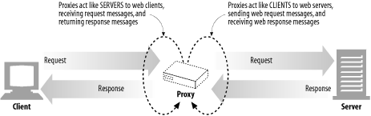
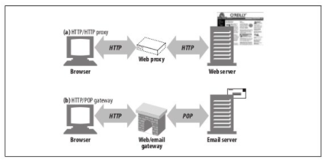
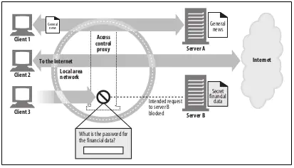
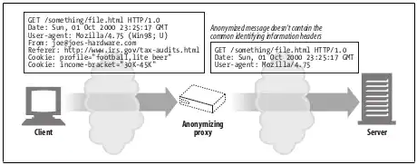
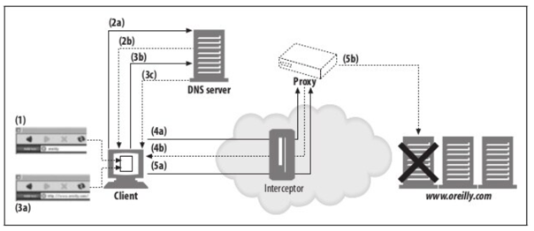
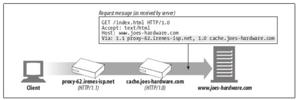

# 프락시

웹 프록시는 서버의 중개자 역할로, 클라이언트와 서버 사이에 위치하여 HTTP 메시지 및 트랜잭션을 중개한다.
트랜잭션을 완료하는 것이 클라이언트라는 점은 변하지 않지만, 프락시 서버가 제공하는 서비스를 이용하게 된다.

프록시 서버는 서버이기도 하고, 클라이언트이기도 하다.
클라이언트의 요청을 받게 되므로 웹 서버처럼 요청과 커넥션을 다루어 응답을 해줘야 한다.
동시에 요청을 서버로 보내기도 하므로 요청을 보내고 응답을 받는 클라이언트처럼 동작한다.



하나의 클라이언트만을 위한 프록시를 개인 프록시라고 하고,
여러 클라이언트를 위한 프록시는 공용 프록시라고 한다.

대부분의 프록시는 공용 프록시이다.
중앙 집중형 프록시를 관리하는 것이 비용적으로 효율이 높고 쉽다.

그리고 캐시 프록시 서버 같은 애플리케이션은 여러 사용자들의 공통된요청에서 이득을 취할 수 있기 떄문에
프록시를 이용하는 유저가 많을수록 유리하다.

개인 프록시는 흔하지는 않지만 꾸준히 사용된다.
어떤 브라우저 제품들은 ISP 서비스 처럼 브라우저의 기능을 확장하거나 개선하는 광고를 운영하기 위해 사용자의 컴퓨터에서 직접 실행한다.

##  프록시와 게이트웨이

프록시는 같은 프로토콜을 사용하는 둘 이상의 애플리케이션을 연결하고,
게이트웨이는 서로 다른 프로토콜을 사용하는 둘 이상의 애플리케이션을 연결한다.
게이트웨이는 클라이언트와 서버가 서로 다른 프로토콜로 말하더라도 
서로 간의 트랜잭션을 완료할 수 있도록 해주는 프로토콜 변환기처럼 동작한다. 



실질적으로 프록시와 게이트웨이의 차이점은 모호하다.
브라우저와 서버는 다른 버전의 HTTP을 구현하기 때문에,
프록시는 때때로 프로토콜 변환을 하기도 한다.
그리고 상용 프록시 서버는 SSL 보안, SOCKETS 방화벽, FTP 등을 지원하기 위해 게이트웨이처럼 동작하기도 한다.

## 왜 프록시를 사용하는가?

프록시 서버는 실용적이고 융용한 것이라면 무슨 일이든 한다.
- 보안 개선
- 성능 향상 
- 비용 절약
- 트래픽 감시

### 접근 제어자

프록시 서버는 많은 웹 서버 및 리소스에 대한 단일 접근 지점을 제공하여 감사 추적에 용이하게 한다.
이로 인해 중앙 집중형 구조에서 접근 제어를 설정할 수 있다.

### 보안 방화벽

프록시 서버는 응용 레벨 프로토콜의 흐름을 네트워크의 한 지점에서 통제한다. 
바이러스를 제거하는 웹이나 이메일 프락시가 사용할 수 있는 훅을 제공한다.

### 웹 캐시

캐시를 제공하여 커뮤니케이션을 줄인다.

### 리버스 프록시

서버인 것처럼 위장하여 공용 컨텐츠에 대한 웹 서버의 성능을 개선하기 위해 사용되고, 이를 흔히 서버 가속기라고 부른다.
리버스 프록시는 콘텐츠 라우팅 기능과 결합되어 분산 네트워크를 만들기 위해 사용될 수 있다.

### 콘텐츠 라우터

프록시 서버는 인터넷 트래픽 조건과 콘텐츠의 종류에 따라 요청을 특정 웹 서버로 유도하는 콘텐츠 라우터로 동작할 수 있다.

### 트랜스코더
콘텐츠를 클라이언트에게 전달히가 전에 본문 포맷을 수정할 수 있다.
이와 같이 데이터의 표현 방식을 변환하는 것을 트랜스코딩이라고 한다.
(e.g. 크기를 줄이기 위해)


### 익명화 프록시

HTTP 메시지에서 신원을 식별할 수 있는 특성들을 제거해서 개인 정보 보호와 익명성 보장에 기여한다.



## 프락시는 어디에 있는가?

어떻게 사용할지에 따라서 프록시를 배치할 수 있다.

### 출구와 프록시

로컬 네트워크와 다른 네트워크 사이의 통신 트래픽을 제어하기 위해 프록시를 로컬 네트워크의 출구에 배치할 수 있다.

### 접근(입구) 프록시

고객으로부터의 모든 요청을 종합적으로 처리하기 위해 프록시는 ISP 접근 지점에 배치될 수 있다.

### 리버스 프록시

리버스 프록시는 네트워크의 가장 끝에 있는 웹 서버들의 바로 앞에 위치하여 웹 서버로 향하는 모든 요청을 처리하고 필요할 떄만 웹서버로 요청을 전달한다.
이를 통해 보안 기능이나 웹서버 캐시 등 성능을 개선할 수 있다.

### 네트워크 교환 프록시

캐시를 이용해 인터넷 교차로의 혼잡을 완화하고 트래픽 흐름으 ㄹ감시하기 위해 충분히 처리 능력이 있는 프록시 서버가 네트워크 교차로에 배치될 수 있다.

## 프록시 계층

프록시들은 프록시 계층이라고 불리는 연쇄적인 구성을 할 수 있다.
서버 쪽에 가까울 수 록 부모(인바운드 프록시)라고 불리는 프록시가 되고, 클라이언트 쪽에 가까울 수 록 자식(아웃바운드 프록시)이라고 불리는 프록시가 된다.

### 부하 균형

자식 프록시는 부하를 분산하기 위해 현재 부모들의 작업량 수준에 근거하여 부모 프록시로 요청을 라우팅할 수 있다.

### 지리적 인접성에 근거한 라우팅 

자식 프록시는 원 서버의 지역을 담당하는 부모 프록시로 요청을 라우팅할 수 있다.

### 프로토콜/타입 라우팅
URI에 근거하여 다른 부모나 원 서버로 라우팅 할 수 있다.

### 유료 서비스 가입자를 위한 라우팅
대형 캐시나 성능 개선을 위한 압축 엔진으로 라우팅될 수 있다.

## 프록시는 어떻게 트래픽을 처리하는가?

클라이언트 트래픽이 프록시로 가도록 만드는 방법은 네 가지가 있다.

### 클라이언트를 수정한다.

클라이언트가 프록시를 사용하도록 설정되어 있다면, HTTP 요청을 프록시로 보낸다. 

### 네트워크를 수정한다.

인터셉스 프록시로 HTTP 트래픽을 가로채어 클라이언트는 모르게 프록시로 보낸다. 
이때, 스위칭과 라우팅 장치가 필요하다.

### DNS 이름 공간을 수정한다.
리버스 프록시는 웹 서버의 이름과 IP 주소를 사용한다.
DNS 이름 테이블을 수정하거나, 동적 DNS 서버를 이용한다.

### 웹 서버를 수정한다.

리다이렉션(305) 명령을 돌려주어서 클라이언트의 요청을 프록시로 리다이렉트 하도록 설정할 수 있다.

## 클라이언트 프락시 설정
현대 브라우저는 프락시를 사용할 수 있도록 설정할 수 있음
브라우저는 프락시를 설정하는 여러가지 방법을 제공

## 프록시 요청의 미묘한 특징들

### 프록시 URI는 서버 URI와 다르다.

클라리언트가 프록시 대신 서버로 요청을 보내면 요청의 URI가 상대 URI에서 절대 URI로 바뀐다.

### 가상 호스팅에서 일어나는 문제

가상으로 호스팅 되는 웹 서버는 여러 웹 사이트가 같은 물리적 웹 서버를 공유해서 요청을 받으면 호스트 명을 알 필요가 있다.

- 프록시에서 완전한 URI를 갖도록하여 해결
- 가상 호스팅 되는 웹서버는 Host 헤더를 요구

### 인터셉트 프록시는 부분 URI를 받는다.

클라이언트는 항상 프록시와 대화하고 있는 것을 알고 있는 것은 아니다.
몇몇 프락시는 클라이언트에게 보이지 않을 수 있기 때문이다.
인터셉트 프락시는 클라이언트에게서 서버로 가는 트래픽을 가로채기 때문에 웹 서버로 보내는 부분 URI를 받아도 원서버로 전달이 가능하다.

### 프록시는 프록시 요청과 서버 요청을 모두 다룰 수 있다.

- 트래픽이 프락시 서버로 리다이렉트 될 수 있는 여러 방법이 존재하기 때문에, 다목적 프락시 서버는 요청 메세지의 완전한 URI와 부분 RUI를 모두 지원해야 한다.
- 완전한 URI가 주어졌다면, 프락시는 그것을 사용해야 한다.
- 부분 URI가 주어졌고, Host 헤더가 있다면, Host 헤더를 이용해 원 서버의 이름과 포트 번호를 알아내야 한다.
- 부분 URI가 주어졌으나 Host 헤더가 없다면, 다음의 방법으로 원 서버를 알아내야 한다.
  - 프락시가 원 서버를 대신하는 대리 프락시라면, 프락시에 실제 서버의 주소와 포트번호가 설정되어 있을 수 있다
  - 이전에 어떤 인터셉트 프락시가 가로챘던 트래픽을 받았고, 그 인터셉트 프락시가 원 IP 주소와 포트번호를 사용할 수 있도록 해두었다면, 그 IP 주소와 포트번호를 사용할 수 있다
  - 모두 실패했다면, 프락시는 원 서버를 알아낼 수 있는 충분한 정보를 갖고 있지 못 한 것이므로 반드시 에러 메세지(보통 사용자에게 Host 헤더를 지원하는 현대적인 웹브라우저로 업그레이드 하라는 것)를 반환해야 한다

## 전송 중 URI 변경

일반적으로 프록시 서버는 가능한 관대하게 기능하고독 해야한다.
HTTP 명세는 일반적인 인터셉트 프록시가 URI가 전달할 때 절대 경로를 고쳐 쓰는 것을 금지한다.
유일한 예외는 빈 경로를 '/'로 교체하는 것 뿐이다.

## URI 클라이언트 자동확장과 호스트 명 분석(Hostname Resolution)

브라우저는 프락시의 존재 여부에 따라 요청 URI를 다르게 분석한다.
- 프락시가 없다면 사용자가 타이핑한 URI를 가지고 그에 대응하는 IP 주소를 찾는다.
- 호스트명 발견하면 그에 대응하는 IP주소들을 연결에 성공할 때 까지 시도한다.
- 호스트명 발견하지 못하면 호스트명의 약어를 타이핑한 것을 보고 자동화된 호스트명의 확장을 제공한다.(`yahoo > www.yahoo.com`)
- 대부분 시스템에서 DNS는 사용자가 호스트 명의 앞 부분만 입력하면 자동으로 도메인을 검색하도록 설정되어 있다.(`oreilly.com host7 -> host7.oreilly.com`)

## 프록시 없는 URI 분석

사용자는 `oreilly`를 브라우저의 URI창에 입력하면, 브라우저는 `oreilly`를 호스트 명으로 사용하고, 
기본 스킴을 `http://`로 기본 포트를 `80`으로, 기본 경로를 `/`로 간주한다. 이것은 실패한다.

브라우저는 호스트 명을 자동으로 확장한 후 DNS에 `www.oreilly.com`의 주소 분해(resolve)를 요청하면, 성공한다.

## 명시적인 프락시를 사용할 때의 URI 분석

명시적 프락시를 사용한다면, 브라우저는 URI 확장을 수행할 수 없다.
이러한 이유로, 몇몇 프락시는 www...com 자동확장이나 지역 도메인 접미사 추가 같은 흉내내려고 시도한다.
그러나 프락시들은 광범위하게 공유되고 있기 때문에 개개인들 각각에 알맞은 도메인 접미사를 알아내는 것은 불가능할 것이다.

## 인터셉트 프록시를 이용한 URI 분석



인터셉터 프록시의 경우, 클라이언트는 웹서버와 연결을 맺었다고 생각하지만 살아 있지 않은 웹서버와 연결이 될 수 있다.
브라우저 수준의 장애 허용을 위해서는 프록시에서 host를 이용한 dns lookup 절차가 필요하다.

## 메시지 추적

프락시가 흔해지면서 서로 다른 스위치와 라우터를 넘나드는 IP 패킷의 흐름을 추적하는 것 못지않게 프락시를 넘나드는 메시지의 흐름을 추적하고 문제점을 찾아내는 것도 필요한 일이 되었다.

### Via 헤더

Via 헤더 필드는 메시지가 지나는 각 중간 노드의 정보(프록시나 게이트웨이)를 Via 목록에 추가되어야 한다.



메시지의 전달을 추적하고, 메시지 루프를 진단하고, 요청을 보내고 드에 대한 응답을 돌려주는 과정에 
관여하는 모든 메시지 발송자들의 프로토콜을 다루는 능력을 알아보기 위해 사용된다.

### Via 문법

Via 헤더 필드는 쉼표로 구분된 경유지(waypoint)의 목록이다. Via 헤더의 형식 구문은 다음과 같다.

- 프로토콜 이름: 중개자가 받은 프로토콜로, HTTP면 생략이 가능하다.
- 프로토콜 버전
- 노드 이름: 중개자의 포트 번호(없다면 프로토콜의 기본 포트)
- 노드: 중개자 노드를 서술하는 선택적인 코멘트

### Via 요청과 응답 경로

요청 메시지와 응답 메시지 모두 프록시를 지나므로 모두 Via 헤더를 가진다.
요청과 응답은 보통 같은 TCP 커넥션을 오가므로, 응답 메세지는 요청과 같은 경로를 되돌아간다.
만약 요청 메시지가 A, B, C,를 지나간다면, 그에 대한 응답 메시지는 C, B, A를 지나간다.
즉, 응답의 Via헤더는 요청 Via헤더와 반대이다.

### Via와 게이트웨이

몇몇 프락시는 서버에게 HTTP가 아닌 프로토콜을 사용할 수 있는 게이트웨이 기능을 제공한다.
Via 헤더는 이러한 프로토콜 변환을 기록하므로 HTTP 애플리케이션은 프락시 연쇄에서 프로토콜 능력과 변환이 있었는지를 알아 챌 수 있다.

### Sever헤더와 Via 헤더

```http request
Server: Apache/1.3.14 (Unix) PHP/4.0.4
Server: Netscape-Enterprise/4.1
Server: Microsoft-IIS/5.0
```

Server 응답 헤더는 원 서버에 의해 사용되는 소프트웨어를 알려준다.
응답 메세지가 프락시를 통과할 때 프락시는 Server 헤더를 수정해서는 안된다.
Server 헤더는 원서버를 위해 존재한다. 대신 프락시는 Via 항목을 추가해야 한다.

### Via가 개인정보 보호와 보안에 미치는 영향

Via문자열 안에 정확한 호스트 명이 들어가기를 원하지 않는 경우, 호스트 명을 그 호스트에 대한 적당한 가명으로 교체할 수 있다.
프락시는 정렬된 일련의 Via 경유지 항목들을 하나로 합칠 수 있다.

- 합치기 전: `Via: 1.0 foo, 1.1 devirus.company.com, 1.1 access-longger.company.com`
- 합친 후: `Via: 1.0 foo, 1.1 concealed-stuff`

여러 경유지들이 모두 같은 조직의 통제하에 있고 호스트가 이미 가명으로 교체되지 않은 이상 그들에 대한 항목들을 합쳐서는 안 된다.
수신된 프로토콜 값이 서로 다른 항목들도 합쳐서는 안된다.

## TRACE 메서드

프락시 서버는 메세지가 전달될 때 메세지를 바꿀 수 있다
헤더가 추가되거나, 변겨오디거나, 삭제될 수 있으며, 본문이 다른 형식으로 변환될 수 있다.
HTTP/1.1의 TRACE 메서드는 요청 메세지를 프락시의 연쇄를 따라가면서 어떤 프락시를 지나가고 어떻게 각 프락시가 요청 메세지를 수정하는지 관찰/추적할 수 있도록 해준다.
TRACE는 프락시 흐름을 디버깅하는데 매우 유용하다.
그러나 대부분 막혀있다.

### Max-Forwards

일반적으로 TREACE 메시지는 중간에 프락시들이 몇 개나 있든 신경쓰지 않고 목적지 서버로의 모든 경로를 여행한다.
TRACE나 OPTIONS 요청의 프락시 홉(hop) 개수를 제한하기 위해 Max-Forwards 헤더를 사용할 수 있다.
무한루프에 빠지지 않는지, 프락시 연쇄를 테스트하거나, 중건ㅇ의 특정 프락시 서버들의 효과를 체크할 때 유용하다.

## 프락시 인증

프락시는 접근 제어 장치로서 제공될 수 있다.
HTTP는 사용자가 유효한 접근 권한자격을 프락시에 제출하지 않는 한 콘텐츠에 대한 요청을 차단하는 프락시 인증이라는 메커니즘을 정의한다.
제한된 콘텐츠에 대한 요청이 도착하면 프록시 서버는 자격 요구를 하는 407 Proxy Authorization Required 상태코드를
클라이언트는 요구되는 자격을 Proxy-Authorization 헤더 필드에 담아서 요청을 다시 보내고
유효하면 통과, 유효하지 않다면 다시 407 응답한다.

## 프락시 상호 운용성
### 지원하지 않는 헤더와 메서드 다루기

프락시 서버는 넘어오는 헤더 필드들을 모두 이해하지 못할 수도 있다.
프락시는 이해할 수 없는 헤더필드는 반드시 그대로 전달해야 하며, 같은 이름의 헤더 필드가 여러개 있는 경우에는 그들의 상대적인 순서도 반드시 유지해야 한다.

### OPTIONS: 어떤 기능을 지원하는지 알아보기

HTTPS OPTIONS 메서드는 서버나 웹 서버의 특정 리소스가 어떤 기능을 지원하는지 클라이언트가 알아볼 수 있게 해준다.
만약 OPTIONS 요청의 URI가 다음과 같이 별표(*)라면, 요청은 서버 전체의 능력에 대해 묻는 것이 된다.

```http request
// 요청
OPTIONS * HTTP/1.1

// 응답
HTTP/1.1 200 OK
Allow: GET, PUT, POST, HEAD, TRACE, OPTIONS
```

성공한다면, OPTIONS 메서드는 서버에서 지원하거나 지정한 리소스에 대해 가능한 선택적인 기능들을 헤더 필드를 포함한 200 OK 응답을 반환한다.
Allow 헤더를 통해 서버가 지원하는 메서드를 열거한다.
