# 6.1 웹 중개자
웹 프락시 서버 : 클라이언트의 입장에서 트랜잭션을 수행하는 중개인
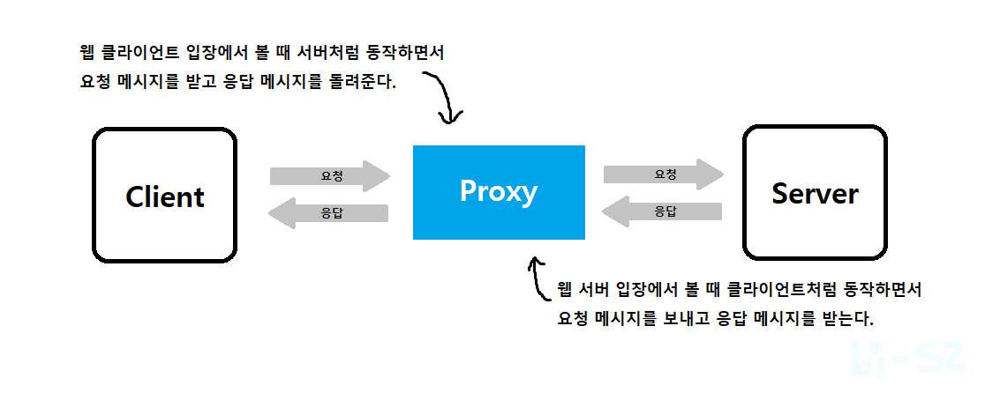
HTTP 프락시 서버는 웹 서버이기도 하고 웹 클라이언트이기도 함
## 6.1.1 개인 프락시와 공유 프락시
### 공용 프락시
여러 클라이언트가 함께 사용하는 프락시

대부분의 프락시는 공용, 중앙 집중형 프락시를 관리하는 게 더 비용효율이 높음

캐시 프락시 서버와 같은 애플리케이션은 프락시를 이용자가 많을수록 유리하다 왜냐하면 여러 사용자들의 공통된 요청에서 이득을 취할 수 있기 때문

### 개인 프락시
하나의 클라이언트만을 위한 프락시

브라우저의 기능을 확장하거나 성능을 개선하거나 무료 ISP 서비스를 위한 광고를 운영하기 위해 작은 프락시를 사용자의 컴퓨터에서 직접 실행

## 6.1.2 프락시 대 게이트웨이
프락시 : 같은 프로토콜을 사용하는 둘 이상의 애플리케이션을 연결

브라우저와 서버는 다른 버전의 HTTP를 구현하기 때문에, 프락시는 때때로 약간의 프로토콜 변환을 하기도 함

게이트웨이 : 서로 다른 프로토콜을 사용하는 둘 이상을 연결

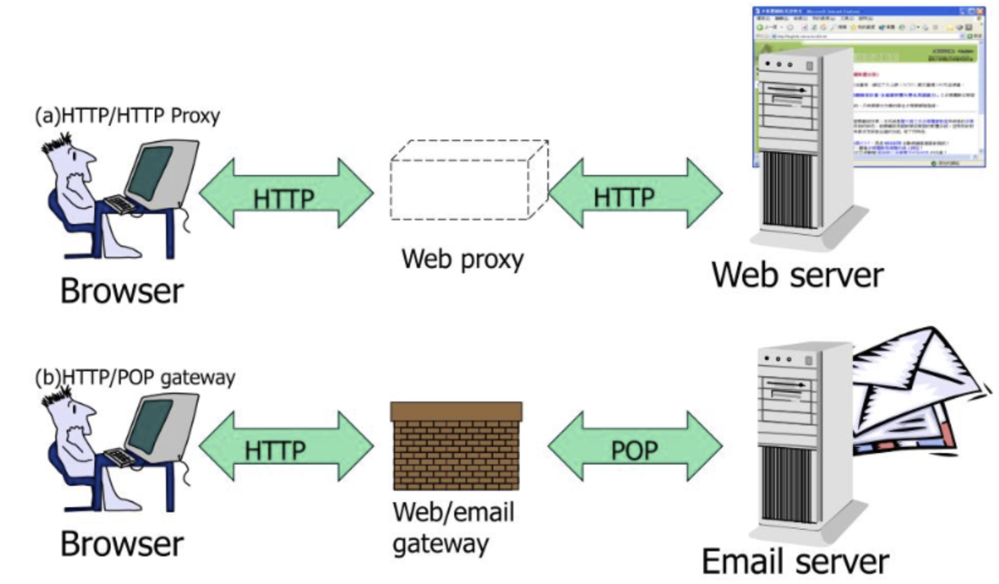

---

# 6.2 왜 프락시를 사용하는가?
보안을 개선하고, 성능을 높여주고, 비용을 절약한다.

### 어린이 필터
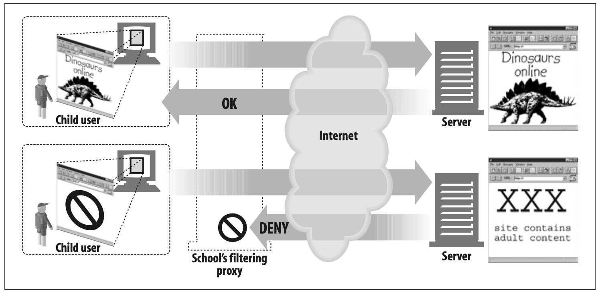
어린이들에게 교육 사이트를 제공하면서 동시에 성인 콘텐츠를 차단하려고 필터링 프락시 사용

### 문서 접근 페이지
많은 웹 서버들과 웹 리소스에 대한 단일한 접근 제어 전략을 구현하고 감사 추적을 하기 위해 사용

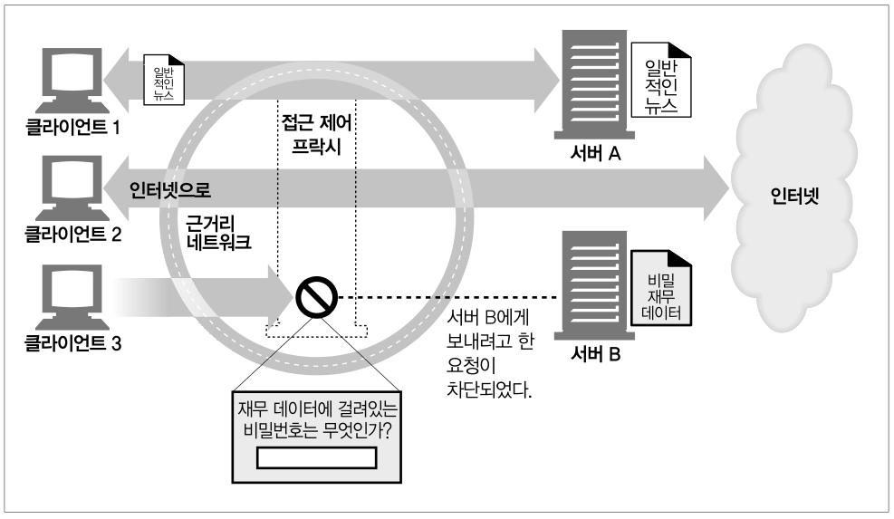

각기 다른 조직에서 관리되는 다양한 종류의 수많은 웹 서버들에 대한 접근 제어를 수시로 갱신할 필요 없이, 중앙 프락시 서버에서 접근 제어를 설정할 수 있다.

- 클라이언트 1에게 제약 없이 서버의 뉴스 페이지에 접근할 수 있도록 허가한다.
- 클라이언트 2에게 제약 없이 인터넷 콘텐츠에 접근할 수 있는 권한을 준다.
- 클라이언트 3이 서버 B에 접근하기 전에 먼저 비밀번호를 요구한다.

### 보안 방화벽
네트워크 보안 엔지니어는 종종 보안을 강화하기 위해 프락시 서버를 사용한다. 

프락시 서버는 조직 안에 들어오거나 나가는 응용 레벨 프로토콜의 흐름을 네트워크의 한 지점에서 통제한다. 

또한 바이러스를 제거하는 웹이나 이메일 프락시가 사용할 수 있는, 트래픽을 세심히 살펴볼 수 있는 후크(hook)를 제공한다.

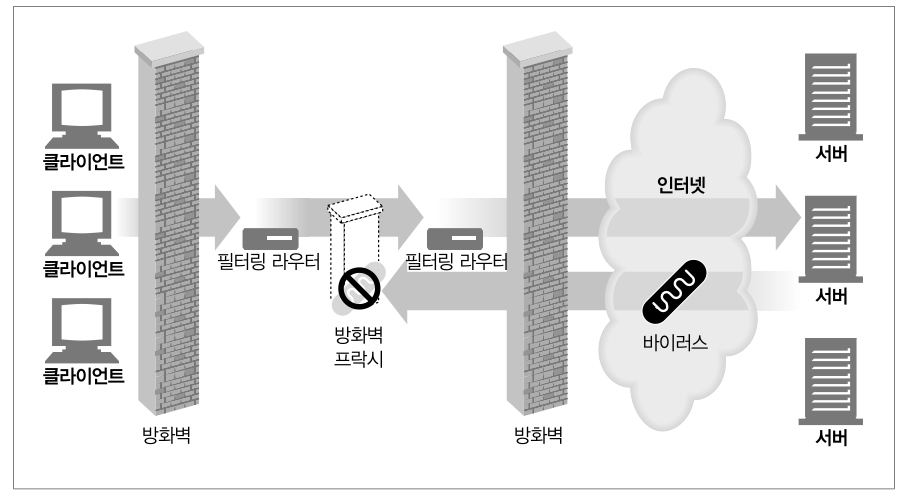

### 웹 캐시
인기 있는 문서의 로컬 사본을 관리하고 해당 문서에 대한 요청이 오면 빠르게 제공하여, 느리고 비싼 인터넷 커뮤니케이션을 줄인다.

### 대리 프락시
대리/리버스 프락시 : 공용 컨텐츠에 대한 느린 웹 서버의 성능을 개선하기 위해 사용됨
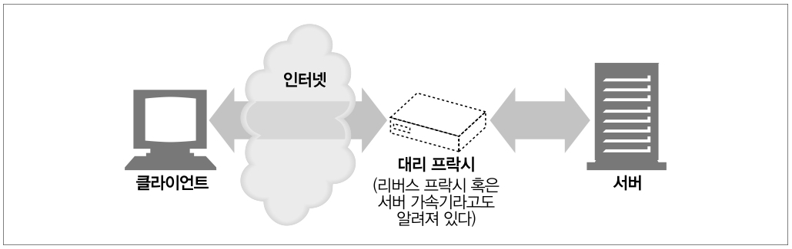

### 콘텐츠 라우터
인터넷 트래픽 조건과 콘텐츠의 종류에 따라 요청을 특정 웹 서버로 유도

예를 들어 사용자나 콘텐츠 제공자가 더 높은 성능을 위해 돈을 지불했다면 콘텐츠 라우터는 요청을 가까운 복제 캐시로 전달할 수 있을 것이다. 

또 사용자가 필터링 서비스에 가입했다면 HTTP 요청이 필터링 프락시를 통과하도록 할 수 있을 것이다. 

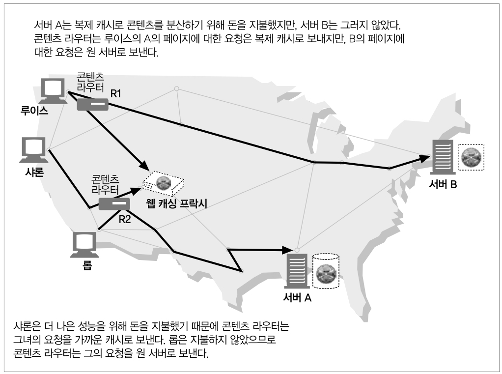

### 트랜스코더
트랜스코딩 : 콘텐츠를 클라이언트에게 전달하기 전에 본문 포맷 수정

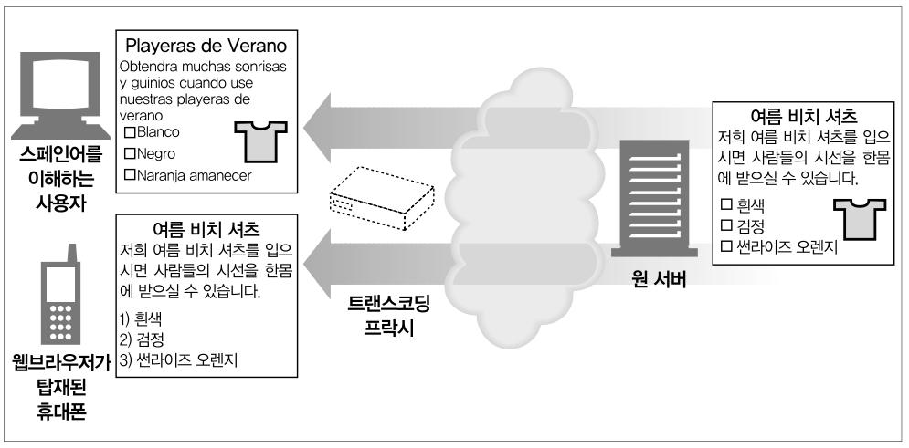

### 익명화 프락시
익명화 프락시는 HTTP 메시지에서 신원을 식별할 수 있는 특성들(예: 클라이언트 IP 주소, From 헤더, Referer 헤더, 쿠키, URI 세션 아이디)을 적극적으로 제거함으로써 개인 정보 보호와 익명성 보장에 기여한다.

- User-Agent 헤더에서 사용자의 컴퓨터와 OS의 종류를 제거한다.
- 사용자의 이메일 주소를 보호하기 위해 From 헤더는 제거된다.
- 어떤 사이트를 거쳐서 방문했는지 알기 어렵게 하기 위해 Referer 헤더는 제거된다.
- 프로필과 신원 정보를 없애기 위해 Cookie 헤더는 제거된다.

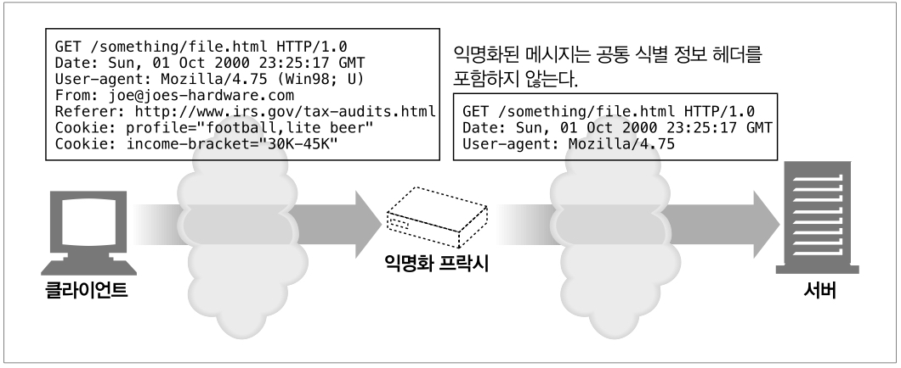

---
# 6.3 프락시는 어디에 있는가?
## 6.3.1 프락시 서버 배치
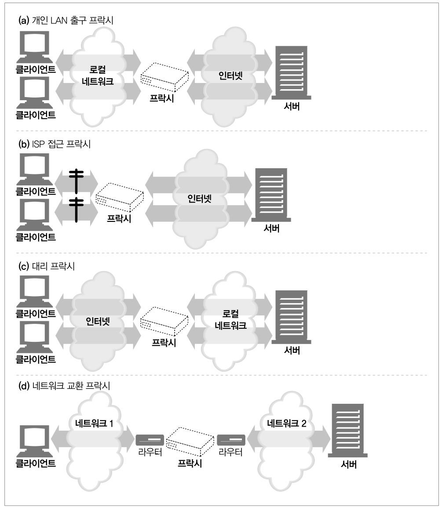
- 출구 프락시 : 로컬 네트워크와 더 큰 인터넷 사이를 오가는 트래픽 제어
- 접근 프락시 : 모든 요청을 종합적으로 처리하기 위해 ISP 접근 지점에 위치
- 대리 프락시 : 네트워크의 가장 끝에 있는 웹 서버들의 바로 앞에 위치하여 모든 요청 처리
- 네트워크 교환 프락시 : 캐시를 이용해 인터넷 교차로의 혼잡을 완화하고 트래픽 흐름 감시

## 6.3.2 프락시 계층
프락시들은 프락시 계층이라고 불리는 연쇄를 구성함

프락시 계층에서 프락시 서버들은 부모-자식 관계를 가짐. 다음번 인바운드 프락시를 부모라고 부르고, 다음번 아웃바운드 프락시는 자식이라고 부름

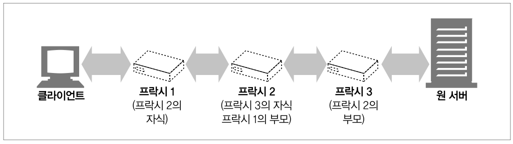

이후 내용 참고 : https://velog.io/@juyeon0526/HTTP-%EC%99%84%EB%B2%BD-%EA%B0%80%EC%9D%B4%EB%93%9C-6%EC%9E%A5-%ED%94%84%EB%9D%BD%EC%8B%9C
