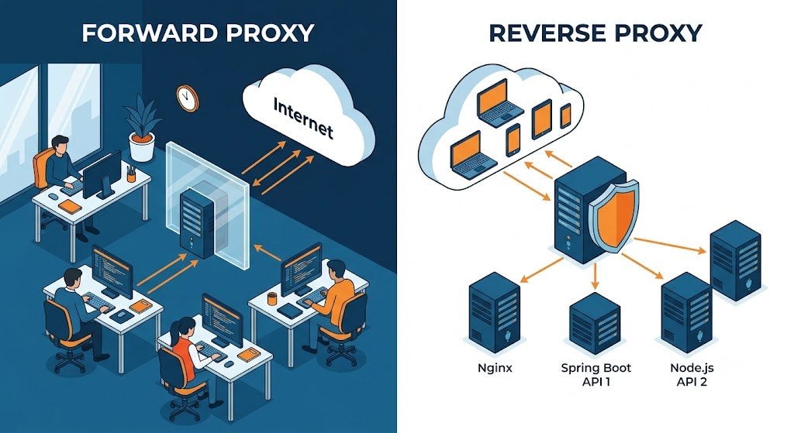
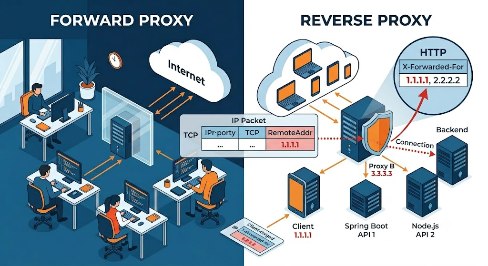
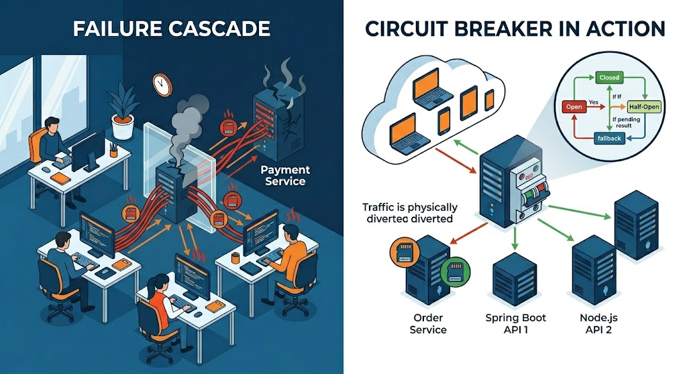

# 백엔드 개발자가 알아야 할 프록시

> 프록시는 너무 다양한 곳에서 쓰여서 오히려 손에 잡히지 않는 개념입니다. 이 글에서는 백엔드 개발자가 실무에서 **반드시 마주치는** 프록시들만 골라, "왜 이게 필요한가"를 중심으로 정리합니다.

---

## 0. 프록시란 무엇인가

프록시(proxy)는 **클라이언트와 서버 사이에 끼어드는 중개자**입니다. 클라이언트는 서버에 직접 말하는 대신 프록시에게 말하고, 프록시가 대신 서버에게 전달합니다.



방향에 따라 두 종류로 나뉩니다.

- **Forward Proxy**: 클라이언트 앞에 서서 "나가는 트래픽"을 대신 보냄. 사내망에서 외부 API를 호출할 때 거치는 회사 프록시가 대표적.
- **Reverse Proxy**: 서버 앞에 서서 "들어오는 트래픽"을 대신 받음. 백엔드 개발자가 가장 자주 접하는 형태로, Nginx가 대표적.

백엔드 개발자에게 중요한 건 압도적으로 **Reverse Proxy** 쪽입니다. 아래 내용은 대부분 이쪽 이야기입니다.

---

## 1. 클라이언트 IP 추적: RemoteAddr vs X-Forwarded-For

프록시를 처음 도입했을 때 가장 먼저 부딪히는 문제입니다. **"분명 클라이언트 IP를 찍었는데 전부 똑같은 IP가 나온다."**



### 왜 RemoteAddr은 프록시 IP가 나오는가

`request.getRemoteAddr()`는 **TCP 커넥션 레벨**의 정보입니다. "지금 내 서버와 직접 소켓을 맺고 있는 상대"의 IP를 반환합니다.

프록시를 거치면 커넥션 구조가 이렇게 됩니다.

```
[클라이언트] --커넥션 A--> [프록시] --커넥션 B--> [내 서버]
```

내 서버는 **커넥션 B**만 알고 있습니다. 클라이언트와 직접 소켓을 맺은 게 아니니까요. 그래서 `getRemoteAddr()`는 프록시 IP를 반환합니다. 버그가 아니라 TCP의 본질입니다.

### X-Forwarded-For는 어떻게 다른가

`X-Forwarded-For`(이하 XFF)는 **HTTP 헤더 레벨**의 정보입니다. 프록시가 "내가 받은 원래 클라이언트가 누구였는지"를 헤더에 적어서 친절하게 전달해주는 값입니다. 프록시를 거칠 때마다 IP가 누적됩니다.

```
클라이언트(1.1.1.1) → 프록시A(2.2.2.2) → 프록시B(3.3.3.3) → 서버

서버가 받는 값:
  X-Forwarded-For: 1.1.1.1, 2.2.2.2   (왼쪽=원 클라이언트, 오른쪽=서버에 가까움)
  RemoteAddr: 3.3.3.3                  (직접 연결된 프록시B)
```

### 핵심: XFF는 위조할 수 있다

여기가 가장 중요합니다. XFF는 그냥 HTTP 헤더라서 **클라이언트가 마음대로 조작**할 수 있습니다.

```
공격자가 직접 보냄:
  X-Forwarded-For: 8.8.8.8   ← 가짜
```

그래서 "XFF 가장 왼쪽 = 클라이언트"라고 맹신하면, IP 차단이나 Rate Limit을 우회당하거나 엉뚱한 사람을 차단하게 됩니다.

### 그럼 클라이언트 IP를 어떻게 특정하나

원칙은 **"위조 불가능한 값에서 출발해, 신뢰할 수 있는 영역만 믿는다"** 입니다.

- `RemoteAddr`(직접 연결, 위조 불가)에서 시작
- 그게 내가 아는 **신뢰 프록시**면 XFF에서 한 칸 왼쪽으로
- 신뢰 목록에 없는 IP가 나오면 그게 진짜 클라이언트

**신뢰 프록시**란 우리가 직접 운영하거나 트래픽이 반드시 거치도록 보장된 장비입니다 (우리 Nginx, 우리 LB, 우리 CDN). 이들이 적는 IP는 실제 소켓에서 본 진짜 값이라 믿을 수 있습니다. 단, **외부에서 백엔드에 직접 접근할 수 없어야** 이 전제가 성립합니다. 백엔드는 사설망에 두고 프록시만 노출하는 이유입니다.

### Spring에서의 처리

직접 파싱하지 말고 검증된 메커니즘에 위임하세요.

```properties
# 기본값은 none → XFF를 무시하고 RemoteAddr이 프록시 IP를 반환
server.forward-headers-strategy=native    # 톰캣 RemoteIpValve가 처리
# 또는 framework  → Spring ForwardedHeaderFilter가 처리
```

설정하면 컨트롤러에서 `getRemoteAddr()`만 호출해도 위조 검증을 거친 실제 클라이언트 IP가 나옵니다. 신뢰 프록시 대역(`internal-proxies`)을 함께 지정하는 것을 잊지 마세요.

---

## 2. 로드 밸런서와 세션 문제

로드 밸런서는 트래픽을 여러 서버로 분산하는 특수한 리버스 프록시입니다. 분산 자체는 좋은데, **상태(state)를 서버 메모리에 두면 문제가 터집니다.**

### 인메모리 세션이 깨지는 이유

Spring의 기본 `HttpSession`은 **각 서버의 JVM 메모리**에 저장됩니다.

```
1차 요청(로그인) → LB → 서버1 (세션A를 서버1 메모리에 생성)
2차 요청          → LB → 서버2 (서버2 메모리엔 세션A 없음 → 로그인 풀림)
```

로드 밸런서가 요청을 다른 서버로 보내는 순간 세션이 사라진 것처럼 보입니다.

### 해결 방법

| 방법 | 설명 | 평가 |
|------|------|------|
| Sticky Session | LB가 같은 클라이언트를 같은 서버로 고정 | 임시방편. 서버 죽으면 세션 유실, 확장성 저하 |
| **세션 외부 저장소** | 세션을 Redis 등에 두고 모든 서버가 공유 | **권장.** 서버가 stateless해져 자유롭게 확장 |
| 토큰 기반(JWT) | 세션 자체를 안 만들고 인증 정보를 토큰에 담음 | 완전 stateless. 서버는 서명만 검증 |

핵심 교훈은 **"확장 가능한 백엔드는 stateless해야 한다"** 입니다. 상태는 서버 메모리가 아니라 외부(Redis, DB) 또는 클라이언트(토큰)에 둡니다.

### Health Check와 Spring Actuator

로드 밸런서는 죽은 서버로 트래픽을 보내지 않으려고 주기적으로 "살아있니?"를 묻습니다. 이게 **Health Check**이고, 호출 대상이 보통 Spring Actuator의 `/actuator/health`입니다.

```
LB → GET /actuator/health → 200 {"status":"UP"} → 트래픽 전송
LB → GET /actuator/health → 503/무응답         → 이 서버 제외
```

쿠버네티스에서는 Liveness(죽으면 재시작) / Readiness(준비 안 됐으면 트래픽 차단) Probe로 나뉘며, Spring Boot는 각각의 엔드포인트를 제공합니다. Actuator의 health는 단순 디버깅용이 아니라 **정상 서버만 골라내는 인프라의 핵심**입니다.

---

## 3. API Gateway

마이크로서비스(MSA) 환경에서 등장하는, **리버스 프록시 + 부가 기능(인증·라우팅·제한·모니터링)** 형태의 단일 진입점입니다.

> 참고: HTTP 명세상 "게이트웨이"는 프로토콜 변환 장치를 뜻하지만, 현대의 API Gateway는 이름만 같을 뿐 사실상 강화된 리버스 프록시에 가깝습니다.

### 왜 MSA에서 필요한가

서비스가 수십 개로 쪼개지면, 클라이언트가 그 주소를 다 알 수도 없고 인증을 서비스마다 구현할 수도 없습니다.

```
클라이언트 → [API Gateway] → /orders/**  → 주문 서비스
                            → /users/**   → 회원 서비스
                            → /payments/**→ 결제 서비스
```

게이트웨이는 **단일 진입점**을 제공하고, 인증·Rate Limiting·로깅 같은 **공통 관심사를 한 곳에 모읍니다.**

### 인증과 인가는 어떻게 나뉘는가

**인증(Authentication)은 게이트웨이에서 1차 처리합니다.**

```
1. 클라이언트가 토큰(JWT)과 함께 요청
2. 게이트웨이가 토큰 서명 검증
3. 토큰에서 사용자 정보 추출
4. 백엔드로 전달할 때 헤더에 실어줌 (예: X-User-Id: 123)
5. 백엔드는 이 헤더를 신뢰하고 사용
```

토큰 방식이면 사용자 정보를 어디에 따로 "저장"하지 않습니다. 정보가 토큰 자체에 들어있고, 게이트웨이는 매 요청마다 토큰을 풀어 헤더로 변환해줄 뿐입니다. 애플리케이션이 사용자 정보가 필요하면 게이트웨이가 내려준 헤더를 읽으면 됩니다.

**보안 경계가 중요합니다.** 백엔드가 `X-User-Id` 헤더를 믿어도 되는 이유는 외부에서 직접 접근할 수 없고 게이트웨이를 통해서만 들어오기 때문입니다. 그래서 게이트웨이는 "클라이언트가 보낸 동일 이름 헤더를 제거(strip)"해야 합니다. (1번의 신뢰 경계와 똑같은 원리입니다.)

**인가(Authorization)는 두 층위로 나뉩니다.**

- **거친 인가**는 게이트웨이에서: `/admin/**`는 ADMIN 롤만 통과 같은 단순 규칙
- **세밀한 인가**는 각 서비스에서: "이 주문은 본인 것만 조회" 같은 비즈니스 규칙은 데이터를 아는 서비스만 판단 가능

권한 정보를 토큰에 담을지(조회 비용↓, 최신성↓) 인가 서비스에서 조회할지(최신성↑, 비용↑)는 트레이드오프이며 정답은 없습니다.

---

## 4. Circuit Breaker (회로 차단기)



MSA에서 **장애 전파를 막는** 핵심 패턴입니다. 전기 두꺼비집에서 따온 개념입니다.

### 왜 필요한가

서비스 A가 서비스 B를 호출하는데 B가 느리거나 죽으면, A는 응답을 기다리며 스레드를 붙잡습니다. 요청이 계속 들어오면 A의 스레드가 고갈되고, 결국 **A까지 죽습니다.** 한 서비스의 장애가 연쇄적으로 전체를 무너뜨리는 게 **cascading failure**입니다.

### 동작: 3가지 상태

```
Closed(정상) --실패율 임계치 초과--> Open(차단)
Open(차단)   --일정 시간 경과--> Half-Open(시험)
Half-Open    --성공--> Closed  /  --실패--> Open
```

- **Closed**: 정상. 요청을 B로 보내며 실패 횟수를 셈
- **Open**: 실패율이 임계치를 넘으면 차단. B를 호출조차 안 하고 즉시 실패하거나 대체 응답(fallback) 반환 → B를 쉬게 하고 A의 스레드도 보호
- **Half-Open**: 일정 시간 후 일부 요청만 시험 → 회복됐으면 Closed, 아니면 다시 Open

Java에서는 **Resilience4j**(과거 Netflix Hystrix)가 표준입니다.

```java
@CircuitBreaker(name = "paymentService", fallbackMethod = "fallback")
public PaymentResult pay(Order order) {
    return paymentClient.call(order);
}
public PaymentResult fallback(Order order, Throwable t) {
    return PaymentResult.pending();  // 대체 응답
}
```

---

## 5. Service Mesh (서비스 메시)

API Gateway가 **외부↔내부(North-South)** 트래픽을 다룬다면, 서비스 메시는 **서비스 간 내부(East-West)** 트래픽을 다룹니다.

### 왜 필요한가

MSA에서 서비스끼리 호출이 얽히면 호출마다 재시도·타임아웃·서킷 브레이커·암호화·추적이 필요합니다. 이걸 모든 서비스 코드에 일일이 구현하면, 언어마다 중복되고 정책 하나 바꾸려면 전부 재배포해야 합니다.

### 사이드카 패턴

핵심 아이디어는 **네트워크 처리 로직을 앱에서 분리해 별도 프록시로 빼는 것**입니다. 각 서비스 옆에 프록시(Envoy)를 하나씩 붙입니다. 이게 사이드카입니다.

```
서비스 A 앱 → (localhost) → 사이드카 A → 네트워크 → 사이드카 B → 서비스 B 앱
```

서비스 코드는 그냥 localhost로 호출만 합니다. 재시도·암호화·라우팅·추적은 전부 사이드카가 처리합니다. **애플리케이션은 네트워크에 대해 아무것도 몰라도 됩니다.**

### 두 개의 평면

- **Data Plane**: 실제 트래픽이 흐르는 곳. 사이드카 프록시들
- **Control Plane**: 사이드카들을 관리하는 두뇌. 정책·설정·인증서를 모든 사이드카에 배포 (Istio의 istiod)

운영자가 "A→B는 타임아웃 3초, 재시도 2회"를 컨트롤 플레인에 한 번 설정하면, **코드 수정도 재배포도 없이** 모든 사이드카에 적용됩니다. 대표 구현은 Istio + Envoy, 더 가벼운 Linkerd가 있습니다.

---

## 6. Nginx 리버스 프록시 실무

백엔드 개발자가 가장 직접 다루게 되는 도구입니다. 뼈대는 `upstream`(백엔드 그룹)과 `proxy_pass`(전달)입니다.

```nginx
upstream backend {
    server 127.0.0.1:8080;
    keepalive 32;
}
server {
    listen 80;
    server_name example.com;
    location / {
        proxy_pass http://backend;
        proxy_set_header Host              $host;
        proxy_set_header X-Real-IP         $remote_addr;
        proxy_set_header X-Forwarded-For   $proxy_add_x_forwarded_for;
        proxy_set_header X-Forwarded-Proto $scheme;
    }
}
```

### 반드시 알아야 할 포인트

**헤더 전달** — 1번에서 다룬 IP 추적이 여기서 결정됩니다. `$proxy_add_x_forwarded_for`는 기존 XFF에 Nginx가 본 IP를 이어붙여 사슬을 유지합니다. `X-Forwarded-Proto`를 빠뜨리면 SSL 종료 후 백엔드가 http로 착각해 무한 리다이렉트가 생깁니다.

**타임아웃** — `proxy_read_timeout 60s`는 "60초 안에 응답 완료"가 아니라 "60초 동안 데이터가 안 오면 끊음"입니다(작업 간 간격). 504 Gateway Timeout이 나면 이 값을 조정하되, 오래 걸리는 엔드포인트는 해당 location만 따로 늘립니다.

**keepalive** — 백엔드와의 커넥션 재사용으로 성능에 직결됩니다. `proxy_http_version 1.1`과 `proxy_set_header Connection ""`을 함께 설정해야 동작합니다. 빠뜨리면 매 요청 TCP를 새로 맺습니다.

**버퍼링** — 기본은 켜짐(느린 클라이언트로부터 백엔드 보호). 단 SSE/스트리밍은 `proxy_buffering off`로 꺼야 실시간 전달이 됩니다.

**WebSocket** — 프로토콜 업그레이드를 위해 `Upgrade`/`Connection "upgrade"` 헤더가 별도로 필요합니다.

### 운영

```bash
nginx -t          # 문법 검증 (필수)
nginx -s reload   # 무중단 재적용 (restart 금지)
```

설정 변경 시 항상 `nginx -t`로 검증 후 reload 합니다. 또 access log에 `$request_time`(전체)과 `$upstream_response_time`(백엔드만)을 함께 남기면 병목이 Nginx인지 백엔드인지 바로 구분됩니다.

---

## 마치며: 관통하는 한 가지 원칙

여기까지의 내용을 하나로 꿰는 개념이 있습니다. **신뢰 경계(trust boundary)** 입니다.

- 클라이언트 IP를 믿을 수 있는 이유 → 신뢰 프록시가 적은 값이라서
- 백엔드가 `X-User-Id`를 믿을 수 있는 이유 → 게이트웨이를 통해서만 들어와서
- 사이드카가 mTLS로 보호하는 이유 → 내부 통신도 검증하기 위해

공통점은 **"외부에서 직접 들어올 수 없고, 우리가 통제하는 경로로만 진입한다"** 는 보장입니다. 프록시는 결국 이 경계를 만들고 관리하는 장치이며, 백엔드 개발자가 프록시를 이해한다는 건 **내 시스템의 신뢰 경계가 어디인지 안다는 것**과 같습니다.
